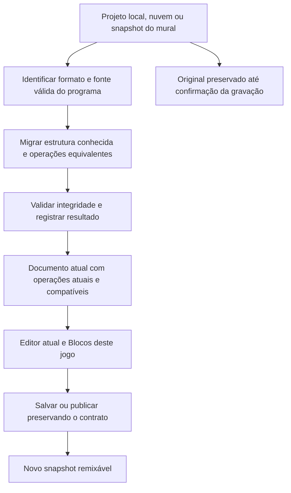

# Evolução dos blocos do Jogo 2D

**Proposta para decisão.** Reorganizar a linguagem visual, oferecer um caminho principal de autoria e converter automaticamente documentos antigos para o formato atual ao abrir, importar ou remixar. Preservar as regras dos jogos por meio de migrações equivalentes e instruções de compatibilidade. Regravar as aulas afetadas depois de estabilizar a experiência.

O formato atual deve conseguir representar um jogo antigo integralmente. Abrir um documento novo não significa executar regras novas no lugar das antigas. Uma conversão de estrutura pode ser automática; uma mudança de comportamento precisa de outra operação explícita ou de uma migração cuja equivalência seja conhecida.

O estudo considera autoria infantil em Blocos, evolução para Ponte/Código, projetos locais, nuvem, publicação, player público, remix e republicação. A faixa etária exata, a habilidade de leitura e as dificuldades observadas das crianças ainda precisam entrar na validação de usabilidade. As conclusões editoriais são hipóteses fundamentadas no catálogo e no funcionamento do programa, não resultados de testes com crianças.

**1. Evidências e alcance**

O levantamento do catálogo é completo: 298 definições, incluindo 7 blocos já ocultos por compatibilidade. As 291 definições visíveis aparecem uma vez cada em 25 categorias; não foram encontrados tipos visíveis sem categoria nem duplicações de posição nessa árvore.

| Fonte | Tipos de todas as extensões/núcleo | Tipos do Jogo 2D |
|---|---:|---:|
| Corre Dino | 45 | 33 |
| O jogo do meu jeito | 4 | 4 |
| Desafio primeiro jogo | 46 | 35 |
| União sem duplicatas | 68 | 55 |

Os arquivos são objetos JSON com uma lista `blocks`. Eles registram disponibilidade declarada, não frequência de utilização. Não contêm versões da interface, localização ensinada, campos preenchidos, combinações de blocos ou snapshots completos. Os quatro tipos do segundo arquivo também não demonstram que todos os jogos desse curso usam somente quatro blocos.

Os 35 exemplos oficiais foram convertidos de IR para estado Blockly com o conversor existente. Neles aparecem 216 dos 298 tipos. Os 82 restantes não podem ser chamados de desnecessários: podem atender variações, projetos publicados, conteúdo externo ou testes de admins. A presença nos exemplos também não mede popularidade real.

Foi feita inspeção funcional direcionada das famílias com ambiguidade e das fronteiras de persistência/remix. Foram executados 17 testes existentes de compatibilidade e codecs no Studio e 21 testes de progressão/remix no member-shell: 38 passaram. Isso estabelece uma referência parcial do estado atual; não valida uma reforma ainda não implementada.

Referência de implementação: Jogo 2D `0.80.0`, presente no commit `d4ec54e0`. O estudo não modificou arquivos de implementação nem os testes preexistentes. Os anexos contêm o [inventário em CSV](jogo-2d-2026-09-13/inventory.csv), os [dados em JSON](jogo-2d-2026-09-13/inventory.json) e o [extrator reproduzível](jogo-2d-2026-09-13/inventory.ts).

Não houve consulta aos bancos/snapshots reais de produção ou staging nem observação das gravações. Portanto, não há evidência para afirmar que um tipo tem uso externo zero ou para garantir cobertura de todos os jogos publicados. A proposta define como obter essa cobertura antes da implantação.

**2. Diagnóstico: o problema ultrapassa o número de categorias**

Há cinco causas que precisam ser tratadas juntas:

- **Localização imprevisível:** preparar o palco em Aparência; explosão genérica dentro do Kit espaço; configuração da caixa de colisão distante da visualização dessa caixa; leitura de posição separada da mudança de posição.
- **Nomes que escondem o efeito:** Atualizar grupo significa mover; Mostrar fim de jogo desenha uma mensagem, sem encerrar a simulação; transparência recebe um percentual que na implementação significa opacidade.
- **Mistura de níveis de abstração:** operações de velocidade e desenho convivem com controladores completos, tipos de inimigo, campanhas vetoriais e kits de jogos específicos.
- **Diferenças temporais pouco visíveis:** registrar um evento uma vez, testar uma condição agora e percorrer colisões a cada quadro exigem modos de uso diferentes.
- **Excesso de parâmetros simultâneos:** algumas definições de inimigo têm dez campos, incluindo várias fontes de aparência; animações apresentam nome, limites de quadros e velocidade ao mesmo tempo.

Reduzir 25 categorias a poucas listas muito longas apenas transfere o esforço. Também não seria produtivo criar um grande bloco universal com muitos menus e opções escondidas. A orientação oficial do Blockly favorece abstrações adequadas às tarefas, entradas que aceitem cálculo quando necessário e cautela com mecanismos de configuração pouco intuitivos para iniciantes. Essa orientação é um fundamento de projeto, não uma medição do público do Studio. [Blockly — Block design](https://docs.blockly.com/guides/design/blocks/).

**3. Decisão arquitetural e alternativas**

| Alternativa | Vantagem | Custo e limitação | Decisão |
|---|---|---|---|
| Catálogo atual com ajuda melhor | Entrega rápida, pouca transição das aulas | Mantém inconsistências e sobreposição | Usar como etapa inicial |
| Dois editores/motores completos, antigo e novo | Isolamento de mudanças profundas | Duplica manutenção, testes e caminhos de remix | Não adotar para esta reforma |
| Formato atual único, catálogo reorganizado, migrações e instruções antigas reconhecidas | Criança edita no Studio atual; preserva jogos e código | Exige contratos e cobertura de persistência | **Recomendado** |

A apresentação antiga das aulas pode existir temporariamente enquanto vídeos são substituídos. Não precisa virar um produto permanente nem determinar o motor usado por todo projeto antigo. A meta de produto é uma experiência principal, com exceções de compatibilidade restritas aos documentos que precisam delas.

Mover categorias e mudar textos de apresentação são operações distintas de alterar a gramática persistida. No Blockly, a definição do bloco, o gerador e a referência na toolbox são componentes separados; os dados de cada bloco têm sua própria serialização. [Blockly — Custom blocks overview](https://docs.blockly.com/guides/create-custom-blocks/overview/), [Blockly — Save and load](https://docs.blockly.com/guides/configure/serialization/).

Não mover capacidades para a extensão Jogo 2D Avançado como forma de organizar a paleta. Ela possui outro contrato e outra disponibilidade pedagógica. “Mais opções” dentro do Jogo 2D é uma decisão de apresentação, não instalação de outro motor.

**4. Organização proposta**

O inventário propõe 14 famílias, com subseções de um nível. Esse número é uma consequência do agrupamento inicial, não uma meta de usabilidade. Tempo fica separado de Sorteios; controles continuam separados de colisões. Mapas, mundos e fases ficam próximos, com suas diferenças preservadas.

| Família | Subseções e fronteira |
|---|---|
| Jogo e telas | Preparar área do jogo; resolução e janela; tela atual; menus; pausar e reiniciar; acessibilidade |
| Sprites | Criar com imagem, figura ou texto; trocar aparência; animações; texto e números; dados |
| Movimento | Posição e tamanho; velocidade e gravidade; direção e distância; controles de movimento; plataforma; bordas e rebatidas |
| Controles | Teclas; ações do jogo; mouse/toque; clicar em sprites e grupos |
| Colisões | Perguntar se encosta; reagir ao começar; percorrer contatos; impedir passagem; área de contato |
| Grupos | Criar e adicionar; percorrer; mover; desenhar e ordenar; remover e limpar |
| Vida e placar | Vida e dano; invencibilidade; pontuação e outros indicadores; texto fixo na tela |
| Som | Efeitos prontos; notas; melodias prontas; arquivos de som e música; volume |
| Desenho e efeitos | Definir figuras; formas básicas; partículas; clarão, tremor e cobertura; inspeção |
| Tempo | A cada quadro; intervalos; atrasos; recarga |
| Sorteios | Número inteiro; chance; posição aleatória na tela |
| Cenários | Fundos; mapas; mundos e câmera; fases e campanhas |
| Inimigos | Tipos; comportamentos; nascimento; atualização; dano e derrota; animações |
| Kits prontos | Espaço; Dino; Gorilas; Equilibrista; Balão |

Por exemplo, em Cenários: **mapa** é a grade/arte; **mundo** é a área física com terreno e câmera; **fase** adiciona entrada e ciclo de progressão; **tela** é um estado de interface, localizado em Jogo e telas. Entrar numa fase e reiniciá-la continuam sendo comandos distintos.

Manter “sprite” como termo compartilhado com o código e explicá-lo como “personagem ou objeto do jogo”, incluindo moedas, tiros, números e respostas. Na ajuda inicial, apresentar tile como peça do mapa e HUD como indicador na tela. O nome da categoria precisa fazer sentido antes de conhecer essas siglas.

Movimento recebe 47 tipos no mapeamento inicial, Cenários 40 e Kits 42, antes das retiradas propostas. Esses números tornam as subseções obrigatórias. Não devem virar listas planas. O piloto precisa testar quanto a criança percorre e quantas alternativas examina, além do número de categorias.

Na experiência de uma criança, o currículo continua filtrando a oferta. Na família aberta, mostrar primeiro uma seleção editorial estável e permitir expandir as opções já disponíveis. Não reordenar automaticamente por frequência de uso durante uma aula. Blocos conquistados não podem desaparecer quando a organização muda.

Os kits conservam suas mecânicas específicas. Efeitos genéricos passam a ter uma localização principal apropriada, com atalhos predefinidos nos kits quando úteis. Um atalho referencia o mesmo tipo de bloco e os mesmos dados de catálogo; não cria outra implementação.

“Ao iniciar”, “Quando acontecer” e “Enquanto estiver rodando” continuam sendo áreas de execução do projeto. Elas não são categorias concorrentes dessa organização. A ajuda deve indicar onde uma operação é usada e o que ela faz por chamada.

**5. Resultado da triagem dos 298 tipos**

| Encaminhamento | Quantidade | Interpretação |
|---|---:|---|
| Manter e reorganizar | 216 | Capacidade útil ou sem evidência suficiente para retirada |
| Ajustar | 64 | Rever nome, ajuda, campos, combinação recomendada ou contrato futuro |
| Consolidar em opção predefinida | 7 | Sons específicos já atendidos pelo seletor de efeitos |
| Retirar da oferta padrão para nova autoria | 3 | Formas redundantes ou com alcance confuso |
| Retirar somente após oferecer substituto | 1 | Colisão circular precisa continuar expressável |
| Manter compatibilidade já existente | 7 | Tipos históricos ocultos permanecem reconhecidos |

São **11 candidatos a deixar a oferta padrão**, e não 11 funções para apagar do motor. O anexo informa o encaminhamento, destino sugerido, motivo, cursos e exemplos associados a cada tipo. “Ajustar” não significa 64 alterações obrigatórias de execução. Na maior parte dos casos a primeira intervenção é editorial.

Nenhum dos 298 tipos foi classificado como código morto com autorização técnica para exclusão definitiva. Tipos e funções acessíveis por projetos ou JavaScript constituem API pública, mesmo que não haja referências em exemplos locais.

**6. Consolidações que fazem sentido**

| Tipos atuais | Nova autoria | Tratamento do legado |
|---|---|---|
| `play_shoot`, `play_explosion`, `play_jump`, `play_dino_hurt`, `play_collect`, `play_whistle`, `play_boom` | `play_fx` com opção predefinida | Conversão candidata a automática, após equivalência de geração, parsing e contexto; manter leitores antigos |
| `collides` | Pergunta `touches`, ligada ao `se` ou à variável | Converter atribuição apenas preservando declaração, escopo, identificadores e avaliação única |
| `circle_collides` | Nova pergunta de colisão circular | Só retirar após existir substituto completo na Ponte e no editor |
| `score` | Variáveis e incremento já existentes | A variável antiga continua válida; não criar sistema paralelo de pontuação |
| `stop_music` | Preferir `stop_track`, com nome claro sobre parar a música | Não substituir automaticamente: o primeiro para apenas melodia sintetizada; o segundo para também música de arquivo |

Os sons têm evidência concreta: `playFx` despacha para os helpers existentes; o gerador de `playBoom` já emite `playExplosion`. Nos três inventários, a consolidação afeta explicitamente os blocos de pulo, tiro e explosão.

Os desbloqueios atuais são listas de tipos e são preservados historicamente. Uma consolidação não pode apagar a conquista antiga ou assumir que um aluno recebeu automaticamente todas as opções de um bloco mais abrangente. Durante a transição, manter o acesso aos blocos já conquistados; os cursos novos passam a conceder os tipos novos. Qualquer concessão adicional deve ser uma decisão explícita do currículo. A seção do próprio projeto, descrita adiante, evita perder a capacidade de editar um remix convertido.

**7. O que deve continuar separado**

| Família | Motivo |
|---|---|
| Texto desenhado / sprite com texto | Mensagem na tela e objeto interativo têm ciclos e propriedades diferentes |
| Definir velocidade / aplicar velocidade / aplicar gravidade | Alterar parâmetros, mudar posição e mudar velocidade são operações diferentes |
| Evento de primeiro contato / condição de contato / varredura de grupo | Frequência e quantidade de execuções são diferentes |
| Colisão retangular / circular / bloquear passagem | Detectar contato e resolver física não são a mesma operação |
| Plataforma na tela / plataforma sobre terreno / plataforma clássica | Chão, controles e responsabilidade pela gravidade diferem |
| Entrar na fase / reiniciar a fase | Um preserva alterações; o outro restaura conteúdo registrado |
| Definir tamanho / multiplicar tamanho | Uma medida é absoluta; a outra acumula quando repetida |
| Movimento em quatro direções / voo / nado / nave | Movimento direto, inércia, impulso e resistência produzem jogos diferentes |
| Imagem / figura por código / folha animada | Fontes visuais distintas, com configuração e usos próprios |

Os controladores prontos podem reduzir o trabalho da criança. Isso não autoriza mudar helpers históricos para começar a aplicar gravidade, desenhar ou colidir implicitamente. O controlador clássico já tem responsabilidades próprias; uma ajuda que diga genericamente que nenhum controlador aplica gravidade também precisa refletir essa exceção.

**8. Ajustes prioritários de clareza e semântica**

| Situação atual verificada | Ajuste proposto | Prioridade |
|---|---|---|
| “Transparência … 100%” torna o sprite totalmente opaco | “Deixar o sprite … % visível”; manter 100 como visível | P0 |
| “Mostrar fim de jogo” só escreve e anuncia uma mensagem | “Escrever mensagem de fim de jogo”; receita separada de vitória/derrota | P0 |
| `cooldown_ready` retorna uma resposta e já inicia a recarga | Nome/ajuda imediatos; novo comando com corpo e ação identificada | P0 |
| Perguntas sobre a banana apagam o projétil; a de prédio também abre cratera e aceita saída da tela | Explicitar no legado; projetar resolução do arremesso separada da leitura de resultado | P0 |
| “Atualizar grupo” apenas aplica movimento | Nomear “Mover os sprites do grupo usando suas velocidades” | P0 |
| Preparar palco com resolução fixa e ocupar a janela têm nomes parecidos | Distinguir área lógica e tamanho na janela, com preview de coordenadas | P0 |
| Trocar tela não interrompe automaticamente eventos ou temporizadores | Ajuda e receitas com condição da tela atual; preservar execução existente | P0 |
| “Volume” só afeta arquivos de áudio | Nomear o alcance; volume geral exigiria uma nova operação | P0 |
| Gravidade e deslocamento dependem de ordem | Ajuda mostra sequência válida; diagnóstico contextual explica combinações conhecidas | P0 |
| Inimigos apresentam dez campos, inclusive várias aparências | Priorizar comportamento e aparência; testar campos secundários explícitos sem descartar valores conectados | P1 |
| Animação nomeada também expõe todos os parâmetros manuais | Aproveitar preenchimento já existente; modo compacto só com preservação de entradas personalizadas | P1 |
| Texto pixel literal e placar pixel têm formatos distintos | Avaliar consolidação depois de suportar expressão e layout equivalentes | P2 |

Uma execução isolada do runtime confirmou `setOpacity(sprite, 100) → opacity = 1`, `setOpacity(sprite, 0) → opacity = 0` e duas chamadas de `cooldownReady` no mesmo quadro retornando `true`, depois `false`. Portanto, as questões de opacidade e consumo da recarga não dependem apenas da interpretação do nome. O gerador já usa o `__id` da expressão, quando disponível, para separar recargas; isso precisa ser preservado na conversão. A chave padrão compartilhada se aplica a chamadas sem chave, e não a todo par de blocos atuais.

Não converter predicados com efeito colateral em perguntas puras mantendo o mesmo identificador: um jogo pode depender do efeito. O formato atual precisa continuar representando esse comportamento, ainda que o novo catálogo ofereça uma construção mais clara.

**9. Inclusões e alternativas a novos blocos**

Três inclusões têm justificativa suficiente para especificação e protótipo. Elas não precisam ser entregues todas na primeira etapa.

| Proposta | Problema resolvido | Contrato mínimo | Prioridade |
|---|---|---|---|
| “Os sprites … e … encostam em círculo?” | A colisão circular hoje força uma atribuição de variável | Booleano sem efeitos; mesma geometria; suporte Blocos ⇄ IR ⇄ Código | P1, junto da consolidação |
| “Para o sprite …, executar a ação … no máximo a cada … segundos: fazer” | A operação que autoriza a ação está escondida numa pergunta que consome recarga | Comando com corpo; identidade de ação preservada; relógio da partida, pausa e reinício definidos; recarga iniciada ao aceitar a execução | P1, substituto de autoria |
| “Remover o sprite … do jogo” | Tirar de um grupo não expressa destruição completa de um objeto | Desativar desenho, atualização, clique e colisão; remover vínculos; liberar trabalho pendente; chamadas repetidas seguras | P1/P2, custo maior |

Remoção completa não pode ser um apelido para a rotina interna `_disposeSprite`, que hoje apenas cancela um trabalho de redesenho de imagem. Também precisa funcionar com referências em mais de um grupo e operações antigas que ainda recebam aquele objeto. O MakeCode Arcade oferece uma operação explícita de destruição que encerra colisões; é uma referência útil de clareza do contrato, não uma implementação transferível ao Studio. [MakeCode Arcade — destroy](https://arcade.makecode.com/reference/sprites/sprite/destroy).

Outras ideias devem aguardar validação: duplicar sprite; mover por deslocamento; esconder/mostrar; eventos de fim de recarga; bloco de resultado do arremesso de Gorilas. Algumas podem ser compostas com recursos existentes, enquanto outras exigem decidir cuidadosamente se afetam desenho, física e interação.

Não acrescentar um bloco específico para “sprite de número”. Texto/número, leitura de dados e clique já estão implementados. Também não há justificativa atual para um motor de quiz separado, um tipo de sprite “resposta” ou um bloco por operação de pontuação.

Para reduzir a dificuldade de combinar blocos, oferecer **receitas editáveis**: cair e desenhar, pegar um item e pontuar, perder uma vida com invencibilidade, mostrar vitória/derrota, gerar números e montar alternativas de uma pergunta. Elas inserem blocos comuns, respeitam os desbloqueios e mostram o que acontece. A criança pode desmontar a composição; não fica presa a uma caixa fechada.

O Studio já tem galeria e 35 exemplos, incluindo Chuva de números e Quiz de números. A melhoria seria conectar tarefas pequenas a exemplos e composições, sem criar uma segunda galeria concorrente. Referências educacionais do Blockly valorizam autoria e a passagem para código; os exemplos sugeridos devem apoiar a exploração, sem transformar toda atividade em preenchimento de campos. [Blockly — Educational applications](https://docs.blockly.com/guides/design/education/).

**10. Busca, ajuda e regras para novos blocos**

A busca existente deve receber sinônimos editoriais e termos de intenção: andar, cair, pular, bater, encostar, sumir, número, resposta. Deve reconhecer nomes antigos. Não é necessário acrescentar uma chamada de IA para essa tarefa.

Cada bloco deve ter um propósito curto, efeito por chamada, frequência recomendada, entradas e unidades, exemplo mínimo e distinção dos vizinhos confusos. A ajuda precisa ser acessível por toque e teclado; não depender apenas de hover. A cor auxilia, mas a forma e o texto precisam continuar suficientes.

Busca, paleta, administração, tutor e ajuda precisam ler a mesma descrição editorial. Hoje `palettePathOf` entrega um caminho global. Com apresentação temporária por curso e ferramentas do próprio projeto, o caminho efetivo passa a depender do contexto. O tutor não pode continuar enviando a criança para uma categoria que não está aberta naquela experiência.

Critério de entrada para um bloco novo: tarefa concreta recorrente, ausência de alternativa simples já disponível, contrato consistente, compreensão verificável, integração com a Ponte e exemplo completo. Evitar blocos adicionados apenas para corresponder a cada função do runtime.

**11. Compatibilidade: o que realmente precisa durar**

| Camada | O que preservar |
|---|---|
| Documento | Assets, nomes, modo, arquivos, estrutura persistida e informações de origem necessárias |
| Blockly | Tipo, campos, valores internos de menus, conexões, mutações, variáveis, corpos, IDs e blocos desconectados relevantes |
| IR | Operações históricas, declaração e escopo de variáveis, ordem e condições |
| JavaScript | Código manual, nomes públicos das funções, argumentos, retornos e efeitos |
| Runtime | Ordem de atualização, relógio, colisões, física, desenho, ações, áudio e reinício |
| Autoria | Capacidade de editar, duplicar, recolocar e ampliar as operações utilizadas pelo jogo |
| Mural e nuvem | Publicar, executar, copiar, salvar, restaurar e republicar sem perder a informação de compatibilidade |

Há uma base útil: sete tipos ocultos continuam registrados; existem migrações das áreas de comportamento e um fixture de curso com game-2d 0.19.0; o migrador atual evita reescrever projetos da Ponte. Isso reduz o trabalho inicial, mas não representa uma infraestrutura completa de migração de qualquer reforma.

O campo `installedExtensions[].version` **não seleciona um runtime histórico no player público atual**. `renderProjectToPreviewDocAsync` extrai os IDs e encontra as extensões do catálogo atual. Salvar uma versão no JSON, sozinho, não congela física ou funções. Qualquer mecanismo futuro de seleção de contrato precisa chegar ao player, preview, exportação e captura.

Para esta reforma, priorizar um runtime atual que preserve a API anterior. Métodos novos podem coexistir com os antigos. Um motor separado por geração só se justifica se uma evolução futura mudar profundamente a semântica de atualização/objetos; ele não é pré-requisito para mudar categorias e corrigir rótulos.

**12. Conversão automática ao abrir, importar e copiar**

O fluxo recomendado é automático para versões antigas conhecidas. A criança não deve escolher “v1 ou v2”. A migração atualiza a estrutura do documento e normaliza operações comprovadamente equivalentes; quando não houver substituição equivalente, mantém a operação antiga dentro da estrutura atual.

Requisitos técnicos da migração:

1. **Versões explícitas.** Distinguir formato do documento, revisão da apresentação e contrato de execução quando necessário. A versão da IR e a versão do armazenamento já existentes não devem ser reutilizadas como sinônimo de todas essas coisas. Metadados novos são propostas, ainda não existem no contrato `Project`.
2. **Legado sem versão.** Identificar pela estrutura suportada e aplicar uma referência histórica conhecida; não usar data de criação como substituto. Um remix criado hoje pode conter código antigo.
3. **Uma sequência central.** Etapas determinísticas entre versões, com origem/destino, versão dos migradores e resultado. Reabrir o mesmo projeto não repete mudanças, cria blocos ou troca nomes novamente.
4. **Validação antes de perdas.** Verificar limites do payload, reconhecer o esquema antigo e migrar antes que um filtro do catálogo novo descarte tipos antigos. O registro de tipos aceitos precisa incluir compatibilidade.
5. **Fonte correta.** Respeitar modo e autoridade de código. Na Ponte com código mais recente, preservar os arquivos; não regenerar a partir de IR/Blockly defasados. A função existente `snapshotProjectWithCurrentAuthority` já estabelece esse cuidado.
6. **Conversão por regras conhecidas.** Preservar ordem, escopo, padrões históricos omitidos, unidades, parâmetros e ligações. Não usar substituição textual no JavaScript. Transformações que dependam de valores ou código não reconhecido mantêm a operação antiga.
7. **Validação realista.** No carregamento, verificar estrutura, referências, integridade e requisitos. Equivalência comportamental das regras de migração deve ser estabelecida previamente por testes; não é possível provar automaticamente qualquer JavaScript arbitrário a cada abertura.
8. **Gravação confirmada.** Manter a versão anterior recuperável e só promover a nova após persistência bem-sucedida. Se falhar a gravação, o original permanece íntegro; não marcar a migração como concluída nem mandar um documento parcial à nuvem.
9. **Concorrência e versões futuras.** Usar revisão do documento para impedir autosave de uma aba antiga sobre a conversão. Um cliente antigo deve recusar gravação de formato mais novo que não compreende, sem eliminar campos para conseguir salvá-lo.
10. **Recuperação com limites.** Guardar a revisão anterior e o resultado técnico da migração; reaproveitar assets e limitar retenção para não duplicar indefinidamente arquivos de som e imagem.

Uma transformação que expande um bloco em vários precisa considerar os limites de quantidade e profundidade do documento. Se um projeto válido ficaria impossível de armazenar ou abrir após a expansão, conservar a representação de compatibilidade. Não ultrapassar os limites indiscriminadamente nem descartar parte do programa.

No projeto local, a identidade permanece e o conteúdo passa à estrutura atual. No player público, adaptações podem acontecer em memória: jogar não reescreve o snapshot publicado. No remix, a nova identidade é criada depois de preparar uma cópia íntegra. A republicação produz outro snapshot, mantendo o original.

Categorias e rótulos, sozinhos, não exigem reescrever a lógica de cada jogo. A revisão de apresentação permite abrir na organização atual. Essa distinção evita uma migração de programa desnecessária sempre que uma categoria muda.

**13. Mural e “Fazer minha versão”**

O fluxo atual baixa o snapshot de `/api/studio/play/:id`, verifica acesso ao modo Pro e às extensões e chama `importProjectSnapshot`, que cria outro projeto. O arquivo publicado original permanece intacto. A checagem de acesso **não é uma comparação dos tipos de bloco do snapshot com `allowBlocks`**; ela opera sobre `pro` e `extensions`.

Depois, o editor recebe a lista de blocos conquistados do destinatário. Portanto, é possível que uma operação do projeto seja reconhecida e executada, mas não esteja na paleta oferecida para inserir novamente. Uma reforma que esconda mais tipos precisa resolver isso deliberadamente.

Recomendação: **Blocos deste jogo** oferece as ferramentas compatíveis necessárias para editar aquele documento, inclusive tipos históricos ou substitutos produzidos pela migração. O conjunto vem de estruturas validadas do próprio jogo, considerando todas as áreas, funções e blocos desconectados preservados. Não altera os desbloqueios globais nem autoriza extensões/modos que a conta não possui.

O conjunto inicial dessa seção deve permanecer acessível mesmo depois de a criança apagar a última instância de um bloco, para poder recolocá-lo. Tipos usados posteriormente podem ampliar esse conjunto dentro do projeto. Duplicação local, remix de remix e restauração transportam essa informação. Não confiar em uma lista arbitrária do JSON para liberar permissões de produto.

Para operações que foram convertidas, a seção oferece o resultado atual e mantém o reconhecimento do legado. Para operações sem equivalente, mostra o bloco histórico com explicação clara, sem exigir que a criança entre em um “editor antigo”. A identificação interna de compatibilidade não precisa ocupar o fluxo infantil.

Há também uma lacuna de integridade no caminho atual: `importProjectFromJSON` aceita avisos de partes descartadas; `handleRemix` ignora a lista retornada e mostra sucesso. O cenário ocorre se um snapshot trouxer conteúdo rejeitado pelo saneamento. Não foi constatada uma perda real em produção, mas o caminho de código permite esse resultado.

O remix precisa de uma validação que distinga adaptações sem perda de perdas de programa, blocos, extensões ou assets necessários. Perda de conteúdo essencial impede confirmar a cópia. O original continua jogável e disponível; a interface informa o problema concreto. Não resolver recusas apagando os blocos desconhecidos.

Exemplo de aceitação: um jogo antigo usa “Tocar som de tiro”. A criança clica em Fazer minha versão. A cópia recebe estrutura atual; se a conversão equivalente estiver certificada, usa “Tocar efeito [tiro]”. Ela consegue trocar o disparo, inserir a operação de novo, salvar, abrir em outro aparelho, publicar e permitir outro remix. O original continua usando seu snapshot e o mesmo comportamento.

**14. Fronteiras que precisam transportar a compatibilidade**

| Fronteira | Situação observada / trabalho necessário |
|---|---|
| `core/project.ts` | Definir metadados de documento e edição no contrato público |
| `state/projectStore.ts` | Integrar reconhecimento, validação, migração, importação e autoridade do programa |
| `state/persistence.ts` | Registro de metadados usa lista explícita de campos; incluir e restaurar os novos |
| `projects/importSnapshot.ts` | Diferenciar abertura, remix e restauração; validar antes de confirmar nova identidade |
| `projects/compatibility.ts` | Evoluir a migração atual em uma sequência central, sem puxar Blockly para o player |
| Publicação em `member-shell/routes/studio.ts` | `sanitizePlayableProject` reconstrói o objeto com campos explícitos; metadados novos seriam descartados sem alteração |
| Player e preview | Usar as mesmas decisões de contrato, sem reescrever automaticamente código manual |
| Nuvem | Transportar metadados na partição correta, considerar hashes/revisões e recusar downgrades |
| Clipboard, duplicação e desfazer | Preservar dados e contextos; IDs únicos onde necessário, sem alterar IDs explícitos do programa arbitrariamente |
| Exportação/importação | JSON continua editável; artefato executável deve carregar o runtime adequado; testar os formatos realmente oferecidos |
| Catálogo, busca, tutor e admin | Uma fonte editorial; caminhos efetivos por contexto; reconhecimento dos IDs antigos |
| Currículo | Preservar concessões anteriores e mapear explicitamente blocos adotados pelas aulas novas |

Adicionar uma propriedade ao objeto em memória não garante que ela sobreviva a todos esses caminhos. A publicação e o armazenamento local demonstram dois pontos concretos de possível descarte. Essa cobertura é parte da implementação, não uma revisão opcional posterior.

**15. Regravação dos cursos e sequência de adoção**

| Cenário | Estratégia |
|---|---|
| Sem regravação no curto prazo | Melhorar ajuda e busca; conservar a apresentação das aulas; pilotar a reorganização com admins |
| Regravação das aulas afetadas | **Melhor relação entre benefício e esforço para começar.** Estabilizar nomes/caminhos e regravar os trechos que realmente ensinam operações alteradas |
| Regravação completa | Oportunidade de ensinar uma progressão mais consistente e as diferenças de execução; mesma exigência de compatibilidade dos jogos |

O inventário indica revisão de busca/localização em todos os cursos. Corre Dino usa categorias espalhadas e som de pulo específico. Desafio usa sons específicos de tiro/explosão, quadros, grupos e colisões. O jogo do meu jeito concentra imagem, folha de quadros, animação e criação em grupo. A lista não permite estimar quantidade de vídeos nem horas de gravação.

Primeiro estabilizar vocabulário, comportamento e apresentação em piloto. Depois produzir os exemplos finais, comparar com cada gravação e montar uma matriz aula → trecho → bloco/caminho → ação editorial. Regravar o conteúdo afetado e coordenar o lançamento de curso, catálogo, ajuda e tutor. Regravar antes de validar a organização aumenta a chance de repetir esse trabalho.

Durante a coexistência de aulas antigas, adiar renomeações e conversões visuais que invalidem instruções ainda publicadas, ou apresentar o bloco histórico naquele contexto. A migração estrutural pode acontecer mesmo assim, porque o formato atual aceita operações históricas. A apresentação temporária deixa de ser necessária após a substituição das aulas; a compatibilidade dos projetos permanece.

**16. Plano de entrega por dependências**

| Etapa | Entrega | Condição para avançar |
|---|---|---|
| A — Referência e cobertura | Inventário real de snapshots de produção/staging, fixtures, identificação das aulas afetadas e contratos de migração | Todos os tipos/versionamentos encontrados têm tratamento definido |
| B — Integridade | Migração automática estrutural, preservação de autoridade, recuperação e transporte de metadados | Abrir/copiar/salvar/republicar não descarta programa ou recursos |
| C — Clareza | Rótulos prioritários, ajuda, busca e seção Blocos deste jogo | Crianças e admins conseguem distinguir operações críticas |
| D — Organização | Famílias/subseções, atalhos de kits e catálogo compartilhado com tutor/admin | Melhoria de descoberta observada; nenhuma perda de acesso conquistado |
| E — Consolidação e inclusões | Sons, variáveis/colisões, pergunta circular e demais inclusões aprovadas | Equivalência por regra; cobertura da Ponte; exemplos completos |
| F — Cursos e lançamento | Gravações atualizadas, piloto de coortes, acompanhamento e recuperação operacional | Critérios técnicos e pedagógicos atendidos |

Não há base para uma estimativa confiável em dias sem o volume de snapshots, o inventário das gravações e a quantidade de regras que exigem adaptação. A maior complexidade está nas etapas B e E; mudar a árvore de categorias é uma parcela pequena do trabalho.

**17. Matriz mínima de validação**

| Eixo | Casos necessários |
|---|---|
| Origem | Curso antigo; Estúdio livre; projeto de admin; galeria; JSON externo; snapshot público; nuvem |
| Autoridade | Blocos sincronizados; IR histórica; Ponte com edição manual; Ponte com código mais recente; código não reconhecido |
| Destinatário | Autor original; outra criança com menos blocos; outra criança com mais blocos; admin; conta sem extensão exigida |
| Operação | Abrir; salvar; fechar/reabrir; duplicar; remixar; remixar remix; publicar; jogar; republicar; exportar/importar; restaurar |
| Dados | Imagens, fontes, áudio e metadados; texto dinâmico; grupos compartilhados; figuras; mapas e fases |
| Execução | Pausa/reinício; ordem de eventos; temporizadores; contato contínuo; remoção dentro de callback; desenho e clique com câmera |
| Falha | Quota de armazenamento; migração interrompida; snapshot inválido; tipo desconhecido; versão futura; duas abas; conflito entre aparelhos |
| Usabilidade | Mouse, toque e teclado; nome antigo na busca; localização dita pelo tutor; recolocar bloco apagado; explicações curtas |

Critérios técnicos: nenhuma perda silenciosa de programa/assets; migração idempotente; original publicado inalterado; código manual preservado; nenhuma redução de ferramentas conquistadas; nenhuma autorização extra de extensão/modo; nenhum fallback novo para código cru em transformações de blocos suportados; cópia editável e republicável.

Esses critérios devem ser exercitados com fixtures históricas e projetos representativos, não apenas com testes que confirmam que um campo `version` foi acrescentado. Comparar comportamento determinístico quando possível: mesmos eventos, entradas e sorteios controlados; mesma sequência de efeitos. Alterações de ordem, unidade, gravidade, defaults e escopo precisam de testes próprios.

Para usabilidade, fazer duas rodadas exploratórias pequenas, incluindo iniciantes e alunos dos cursos atuais. Tarefas: encontrar um bloco de movimento; distinguir velocidade e deslocamento; gerar um número clicável; resolver uma colisão; fazer vitória/derrota; modificar um remix antigo. Alternar a ordem das interfaces para reduzir efeito de aprendizado. Registrar tempo até encontrar, escolha correta na primeira tentativa, pedidos de ajuda e conclusão da tarefa.

Como metas provisórias de decisão, buscar queda de pelo menos 25% no tempo mediano de descoberta e ausência de regressão na conclusão das tarefas, além de 80% de escolha correta nos pares críticos. São critérios propostos para o piloto, não resultados existentes nem uma demonstração estatística universal. O tamanho e os cortes devem ser ajustados à idade e à linha de base observada.

**18. Decisões recomendadas**

- Adotar um formato atual capaz de representar todas as operações históricas suportadas.
- Converter automaticamente ao abrir/importar/remixar, com gravação íntegra e recuperável.
- Usar migrações equivalentes para simplificações; manter instruções antigas quando os efeitos diferirem.
- Proteger a autoria do remix por meio de Blocos deste jogo e verificação de perdas antes de confirmar a cópia.
- Reorganizar por famílias e subseções; validar a proposta de 14 famílias, sem tratar a contagem como objetivo principal.
- Priorizar os ajustes semânticos de nomes e ajuda antes de regravar.
- Consolidar os 11 candidatos da oferta apenas com substitutos e compatibilidade completos; não apagar sua API.
- Especificar as três inclusões justificadas e entregar conforme custo e validação; aproveitar exemplos e receitas para as demais dificuldades.
- Regravar primeiro as aulas afetadas, com curso, interface, tutor e documentação lançados em conjunto.

**19. Referências locais e externas**

As evidências locais foram consultadas em 13/09/2026. As recomendações internacionais abaixo orientam o desenho, mas não substituem a validação com as crianças do Sistema Zero.

| Fonte | Evidência |
|---|---|
| [Catálogo Jogo 2D](../packages/studio/src/official-extensions/game-2d/blocks.ts) e arquivos `blockCatalog*.ts` | Tipos, rótulos, campos e categorias |
| [Exemplos oficiais](../packages/studio/src/official-extensions/game-2d/exampleCatalog.ts) | Corpus local de 35 exemplos |
| [Projeto](../packages/studio/src/core/project.ts), [persistência](../packages/studio/src/state/persistence.ts), [projectStore](../packages/studio/src/state/projectStore.ts) | Formato, saneamento e gravação |
| [Compatibilidade](../packages/studio/src/projects/compatibility.ts) e [fixture/teste histórico](../packages/studio/src/projects/legacyCompatibility.test.ts) | Migração existente e preservação da Ponte |
| [Autoridade da Ponte](../packages/studio/src/state/bridgeAuthority.ts) | Código recente prevalece sobre derivados antigos |
| [Player](../packages/studio/src/preview/renderProject.ts) | Resolução de runtime pelo ID atual da extensão |
| [Remix no mural](../packages/community-kids/src/components/kids/kids-space-view-client.tsx) e [importação](../packages/studio/src/projects/importSnapshot.ts) | Fluxo de cópia e tratamento do resultado |
| [Progressão e remix](../packages/member-shell/src/lib/studio-tier.ts) | Acesso por extensão/modo; currículo da paleta |
| [Publicação](../packages/member-shell/src/routes/studio.ts) | Saneamento e snapshot publicado |
| [Concessões dos cursos](../packages/members/src/application/studio-unlocks/get-studio-unlocks.service.ts) | Preservação histórica dos blocos conquistados |
| [Mapa da paleta](../packages/studio/src/blockly/paletteMap.ts) e [busca](../packages/studio/src/blockly/searchCategory.ts) | Caminho global atual e busca existente |
| [Áudio](../packages/studio/src/official-extensions/game-2d/runtime/audio.ts), [utilitários](../packages/studio/src/official-extensions/game-2d/runtime/utilities.ts), [Gorilas](../packages/studio/src/official-extensions/game-2d/runtime/arcadeKitsGorillas.ts), [sprites](../packages/studio/src/official-extensions/game-2d/runtime/sprites.ts) | Equivalências, efeitos colaterais e limites das APIs |
| Blockly, [Block design](https://docs.blockly.com/guides/design/blocks/), atualizado em 31/03/2026 | Abstração, entradas e diferenças entre construções |
| Blockly, [Educational applications](https://docs.blockly.com/guides/design/education/), atualizado em 31/03/2026 | Ajuda e continuidade do aprendizado |
| Blockly, [Custom blocks overview](https://docs.blockly.com/guides/create-custom-blocks/overview/) e [Save and load](https://docs.blockly.com/guides/configure/serialization/) | Separação entre apresentação, geradores e serialização |
| Pasternak, Fenichel e Marshall, [Tips for Creating a Block Language with Blockly](https://developers.google.com/blockly/publications/papers/TipsForCreatingABlockLanguage.pdf), IEEE Blocks and Beyond, 2017 | Público, escopo e vocabulário; referência histórica, sem presumir APIs atuais |
| Microsoft, [Sprites](https://arcade.makecode.com/reference/sprites), [destroy](https://arcade.makecode.com/reference/sprites/sprite/destroy), [on Update](https://arcade.makecode.com/reference/game/on-update) | Referência de contratos de sprite e atualização; o motor do Studio tem suas próprias responsabilidades |

Os caminhos completos dos três JSONs fornecidos estão registrados no anexo JSON. Para atualizar o inventário local, executar `bun .audits/jogo-2d-2026-09-13/inventory.ts` na raiz. O extrator grava somente os anexos da auditoria. Os testes usados como referência foram os arquivos `legacyCompatibility.test.ts`, `moldCompatibility.test.ts`, `textSpriteCodec.test.ts` e `member-shell/tests/studio-tier.test.ts`.
