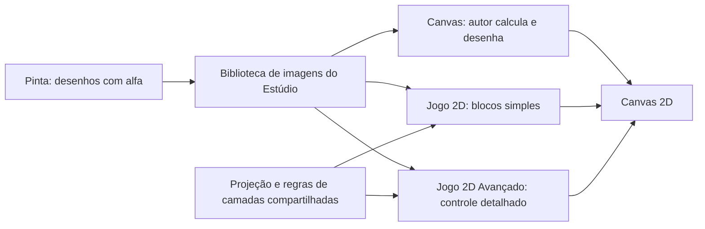

# Estúdio: profundidade em 2D, camadas de cenário e transparência

Relatório de análise e proposta — 1º de outubro de 2026. Base local da análise: commit `5ca6b61b`, com as alterações preexistentes do workspace preservadas. Escopo: Canvas, Jogo 2D, Jogo 2D Avançado e o caminho Pinta → Estúdio.

**Atualização após a aprovação:** a implementação das camadas, pista plana em perspectiva e visualização da transparência foi adicionada ao workspace, com três exemplos equivalentes de **Descida da Neve**. Os parágrafos abaixo registram o diagnóstico anterior à mudança. A entrega e suas verificações estão no [plano de implementação](../docs/superpowers/plans/2026-10-01-camadas-perspectiva-neve.md).

**É possível produzir o efeito desejado mantendo o desenho em Canvas 2D.** Os blocos básicos já permitem construir uma versão manual. As extensões têm boa parte da infraestrutura, mas ainda precisam de facilidades próprias para representar distância, projetar os objetos na tela e tratar as colisões desse tipo de jogo.

**Várias camadas transparentes também são possíveis hoje.** O Pinta já preserva áreas vazias como transparentes. O principal ponto de confusão identificado é que “Pôr o cenário atrás de tudo” seleciona um único fundo. Repetir esse bloco troca o fundo; não cria uma pilha de camadas. Já “Desenhar o cenário” permite compor várias imagens na ordem dos blocos.

**A referência foi identificada como Dumb Ways to Die 4.** Pesquisei imagens na internet, examinei duas imagens promocionais publicadas na ficha oficial do jogo e consultei as informações da desenvolvedora. Também consegui inspecionar os storyboards, que são quadros de prévia do vídeo indicado. O trecho de descida na neve aparece aproximadamente em 3min40s–3min55s e 8min20s–8min40s. A reprodução contínua do vídeo não ficou disponível; as conclusões sobre a técnica interna são inferências visuais, não uma auditoria do código do jogo. Fontes: [vídeo indicado](https://www.youtube.com/watch?v=SyMsQcqgCyk), [ficha oficial e imagens no Google Play](https://play.google.com/store/apps/details?id=au.com.metrotrains.dwtd4&hl=en) e [apresentação oficial da versão 4](https://www.dumbwaystodie.com/post/dumb-ways-to-die-4-the-beans-are-back).

O jogo reúne desafios curtos que mudam de cena, controles e objetivo. A ficha oficial descreve ações como tocar, deslizar e agitar, além de desafios que ficam mais difíceis e moedas usadas para desbloquear áreas. Essa estrutura de minijogos é independente do efeito de profundidade: podemos usar a mesma linguagem visual em uma fase longa de esqui, corrida ou exploração. [Descrição publicada pela desenvolvedora](https://play.google.com/store/apps/details?id=au.com.metrotrains.dwtd4&hl=en).

Nos quadros da neve, o personagem ocupa o primeiro plano, a pista converge para uma região distante e as bandeiras aparecem em posições e tamanhos diferentes ao longo da pista. Isso é compatível com uma **perspectiva simulada**, frequentemente chamada de pseudo-3D ou 2,5D. Os quadros não permitem garantir se o aplicativo original usa sprites, uma câmera 3D com arte plana ou uma combinação. Para reproduzir o resultado no Estúdio, Canvas 2D é suficiente.

**Quatro recursos diferentes podem dar sensação de profundidade.** Convém separá-los para escolher os blocos certos.

| Recurso | O que acontece na imagem | Resolve qual necessidade |
|---|---|---|
| Rolagem com câmera 2D | Uma janela se desloca por um mundo maior; os objetos mantêm o tamanho | Revelar outros trechos de um mapa |
| Paralaxe | Fundos distantes se deslocam menos que os próximos | Dar profundidade a montanhas, árvores, nuvens e decoração |
| Zoom | O enquadramento inteiro é ampliado ou reduzido | Aproximar ou afastar uma cena, por um intervalo limitado |
| Perspectiva por distância | Cada objeto muda de posição e tamanho conforme sua distância | Avançar em direção ao horizonte e encontrar novos obstáculos |

Uma ampliação de uma imagem pode simular uma aproximação curta. Para percorrer uma montanha continuamente, precisamos representar outros trechos e objetos ao longo do caminho. A imagem original não contém automaticamente aquilo que fica depois de sua borda. Transparência e paralaxe ajudam a compor essa paisagem, mas não substituem a projeção por distância.

**A mecânica recomendada separa o mundo do desenho na tela.** Cada bandeira, árvore ou obstáculo guarda uma posição lateral `X`, uma distância ao longo da pista `Z` e um tamanho original. A posição do jogador ao longo da pista aumenta. A cada quadro, calculamos a distância relativa e projetamos o objeto para coordenadas 2D.

Para uma pista inicialmente plana, uma projeção possível é:

```text
distância = Z do objeto − Z da câmera
escala = distância focal / distância
x na tela = centro da tela + (X do objeto − X da câmera) × escala
base na tela = horizonte + altura da câmera × escala
largura desenhada = largura original × escala
altura desenhada = altura original × escala
```

Essa é uma proposta matemática para o Estúdio, não uma fórmula extraída do jogo. A distância precisa estar à frente de um limite mínimo antes da divisão. O sprite fica ancorado na base: desenhamos a imagem em `x − largura/2` e `base − altura`. Desenhamos os objetos distantes primeiro e os próximos por último.

Por exemplo, com distância focal 240, altura da câmera 100, centro horizontal 480, horizonte 180 e um objeto em X=100, de 40×80 unidades:

| Distância | Escala | Centro X na tela | Base Y na tela | Tamanho desenhado |
|---:|---:|---:|---:|---:|
| 480 | 0,5 | 530 | 230 | 20×40 |
| 240 | 1 | 580 | 280 | 40×80 |
| 120 | 2 | 680 | 380 | 80×160 |

O objeto cresce e se afasta do horizonte ao se aproximar. O personagem pode permanecer perto da parte inferior da tela, movendo-se para os lados, enquanto o mundo avança. Para voltar ou explorar livremente, a mesma lógica pode atualizar X e Z em ambos os sentidos; o primeiro exemplo didático pode começar com avanço automático.

O chão exige uma decisão separada. Na primeira versão, neve de cor lisa, contorno da pista, marcas no chão e objetos projetados bastam. Curvas e elevações posteriores podem usar uma sequência de segmentos, cada um com posição e largura, desenhados como trapézios. Uma textura de chão em perspectiva exigiria subdivisão em faixas ou outra técnica de mapeamento: `translate` e `scale` sozinhos não transformam uma imagem retangular em um chão com perspectiva. O Canvas permite recorte e redimensionamento de imagens, inclusive por regiões da fonte. [Documentação de drawImage](https://developer.mozilla.org/en-US/docs/Web/API/CanvasRenderingContext2D/drawImage).

**O que o Estúdio já oferece foi conferido nos blocos e nos runtimes.**

| Capacidade | Canvas sem extensão | Jogo 2D | Jogo 2D Avançado |
|---|---|---|---|
| Compor imagens com transparência | Sim, em ordem de desenho | Sim, com desenho por quadro | Sim, no gancho de desenho |
| Fundo fixo automático | Autor monta | Um cenário selecionado | Um cenário selecionado |
| Mundo maior que a tela | Autor calcula a câmera | Câmera X/Y pronta | Câmera X/Y pronta, inclusive seguindo mapa |
| Paralaxe de imagens do usuário | Autor calcula os deslocamentos | Autor calcula; há câmera e exemplos/efeitos específicos | Blocos próprios para câmera e rolagem por velocidade |
| Alterar tamanho e posição | Argumentos dos blocos Canvas | Tamanho/posição de sprites | Propriedades e desenho de entidades/aparências |
| Ordenação visual por profundidade | Autor controla a ordem | Grupo ordenado pela base Y | Desenho ordenado pela base Y |
| Perspectiva X/Z automática | Não; pode calcular com blocos comuns | Não encontrei contrato/blocos próprios | Não encontrei contrato/blocos próprios |
| Colisão considerando distância Z | Autor implementa | Precisa de lógica adicional | Precisa de lógica adicional |

“Desenhar por profundidade” nas extensões significa ordenar pela base vertical `y + altura`. Isso ajuda em jogos vistos de cima, quando o personagem passa atrás de uma árvore. Não cria um eixo Z nem altera o tamanho do objeto com a distância. Também não há zoom na câmera X/Y examinada: os deslocamentos são feitos por translação.

**Sem extensão, já há peças suficientes para uma primeira versão.** A categoria Canvas contém criação de tela, laço de animação, desenho de imagem com X/Y/largura/altura, formas, traçados, recorte, salvar/restaurar estado, translação, escala, transparência, teclado e ponteiro. Variáveis, operações matemáticas, condições e listas completam a lógica. A conversão desses blocos para código e de volta foi exercitada nos testes selecionados.

O fluxo manual seria: preparar as imagens e a tela; guardar os dados dos objetos; atualizar o progresso; limpar o quadro; desenhar céu e neve; calcular e desenhar os objetos visíveis na ordem correta; desenhar o personagem e o placar. A coordenada Z seria uma variável do projeto. Não é necessário instalar uma extensão para ter uma variável de distância.

Para manter a versão inicial compreensível, recomendo poucos obstáculos, uma lista ordenada pela posição na pista e um único sentido de avanço. Isso evita exigir um sistema genérico de ordenação logo no primeiro exemplo. Novos trechos podem ser pré-definidos ou gerados conforme o progresso, com descarte ou reaproveitamento dos que ficaram para trás.

Os blocos Canvas atuais permitem escala e posicionamento; o bloco específico de imagem expõe a imagem inteira, sem os quatro parâmetros adicionais de recorte da fonte. Um bloco “Desenhar parte da imagem” seria útil para terrenos texturizados por faixas e outros usos, mas não é requisito para começar com pista lisa e sprites.

No modo manual, o autor também precisa controlar carregamento, ordem de desenho, pausa, reinício, colisões e avanço pelo tempo. O gerador normal já prepara/cacheia as imagens conhecidas dos blocos Canvas; uma solução nova deve preservar esse caminho. Evitar carregar ou rasterizar novamente o SVG a cada quadro é especialmente importante quando houver muitos objetos.

**Na extensão Jogo 2D, proponho um conjunto pequeno de blocos de perspectiva.** Os nomes abaixo são sugestões, não blocos existentes:

- “Criar pista em perspectiva [pista]”.
- “Na pista [pista], colocar [sprite] na posição lateral [X] e distância [Z]”.
- “Avançar na pista [pista] com velocidade [valor]”.
- “Desenhar a pista [pista]”.
- “Quando alcançar [obstáculo]” e “a distância percorrida na pista”.

O runtime calcularia projeção, visibilidade e ordem de desenho. Horizonte, altura da câmera e distância de visão poderiam ter valores iniciais adequados e controles opcionais. A criança começaria pensando em “lado”, “distância” e “velocidade”; a Ponte mostraria chamadas legíveis para os mesmos conceitos.

A extensão já tem sprites, grupos, imagens, teclado, toque, câmera, eventos e um relógio com atualização lógica de 60 passos por segundo. A pista deve acompanhar esse ciclo de vida para pausar e reiniciar corretamente, sem introduzir um segundo laço independente. Não basta aplicar “Multiplicar o tamanho” repetidamente: o desenho precisa sempre partir do tamanho original, para não crescer de forma acumulativa.

**Na extensão Jogo 2D Avançado, a proposta deve dar controle sobre atualização e desenho.** Reutilizar a matemática da projeção, mas oferecer configurações de câmera, alcance, posição X/Z, segmentos de pista e funções que devolvam posição e escala projetadas. Isso permite montar esqui, corrida, trilha e outros jogos com as mesmas peças.

O runtime avançado já separa atualização com delta de tempo, desenho do mundo e desenho do HUD. Também possui reaproveitamento de entidades e paralaxe. A projeção deve acontecer no passe de desenho escolhido, sem receber novamente a translação da câmera X/Y. O placar continua no passe de HUD. Reinício, mudança de fase, pausa e eventual simulação fixa precisam usar os contratos existentes.

**Colisão precisa continuar representando o jogo, não apenas a imagem projetada.** Um obstáculo distante pode aparecer sobre parte do personagem na tela e ainda estar longe dele. Para a pista, comparar a posição lateral e o intervalo longitudinal de encontro. Em alta velocidade, verificar também o intervalo percorrido desde a atualização anterior, evitando atravessar uma bandeira sem detectar o encontro. A posição/tamanho projetados não devem sobrescrever silenciosamente os dados físicos de entidades já usadas pelos sistemas atuais.

Ordenação por Z, descarte de objetos fora da visão, limite de objetos ativos, carregamento prévio, tamanho máximo de projeção e proteção na divisão por distância são responsabilidades do recurso. No primeiro incremento, pista plana e obstáculos simples. Curvas, elevação, bifurcações e texturas projetadas são ampliações com custo próprio.

**A hipótese do fundo branco no Pinta foi testada e não se confirmou no export vetorial.** Um cenário vetorial nasce com `shapes: []`. O export SVG escreve as formas, sem inserir um retângulo branco atrás. A ponte envia esse SVG ao Estúdio; quando precisa usar PNG, o rasterizador desenha em um canvas inicialmente transparente, sem preenchê-lo de branco.

Fiz uma verificação adicional ao ler o código: criei um cenário com um retângulo branco e uma região vazia, passei pelo `buildStudioPayload` real e rasterizei o SVG exportado com Canvas nativo. O pixel vazio ficou em RGBA `[0, 0, 0, 0]`; o pixel pintado de branco ficou em `[255, 255, 255, 255]`. Portanto, a distinção solicitada já existe nesse caminho.

O branco visto durante a edição vem do contêiner `bg-white` e do fundo CSS do SVG `bg-white/60` em `VectorStage.tsx`. Esse fundo visual não é uma forma do desenho e não entra no export. Em pixel art, o índice transparente também gera alfa zero; uma cor branca pintada permanece opaca.

Uma imagem importada com fundo branco embutido ou um retângulo branco desenhado cobrindo a tela é outra situação: esse branco é conteúdo real. Não recomendo converter “todo branco em transparente”, pois isso apagaria neve, nuvens e detalhes intencionais.

**O sintoma das camadas tem três explicações concretas a distinguir.** Não tive acesso ao projeto específico usado na tentativa, então não atribuo uma delas definitivamente a ele.

| Situação | Comportamento atual | Como resolver |
|---|---|---|
| Vários “Pôr o cenário atrás de tudo” | Cada chamada escreve o mesmo `_backdropName`; a última fica selecionada | Usar desenho por quadro para composição ou criar um recurso explícito de camadas |
| Vários “Desenhar o cenário” | As imagens são desenhadas em sequência; partes opacas da última cobrem as anteriores | Deixar vazias as regiões pelas quais o fundo deve aparecer e ordenar os blocos |
| Um preenchimento de fundo depois das imagens | O preenchimento cobre tudo o que foi desenhado antes | Pintar a base antes das camadas e dos personagens |

As duas primeiras situações foram reproduzidas com os runtimes reais e imagens/contexto instrumentados. No Jogo 2D: configurar A, depois B, e limpar gerou `limpar → desenhar B`; desenhar manualmente A e B gerou `desenhar A → desenhar B`. No Avançado, o quadro automático também usou apenas B, e o caminho manual desenhou ambas.

O mecanismo padrão de composição do Canvas permite que as partes transparentes mostrem o conteúdo desenhado anteriormente. Diminuir a opacidade da imagem inteira cria uma mistura translúcida; não equivale a deixar apenas as regiões vazias transparentes. [Composição no Canvas](https://developer.mozilla.org/en-US/docs/Web/API/CanvasRenderingContext2D/globalCompositeOperation).

**Como montar as camadas hoje, antes de qualquer mudança no produto:**

```text
Jogo 2D — dentro de “A cada quadro do jogo”:
  Limpar a tela
  Desenhar o cenário “céu”
  Desenhar o cenário “montanhas”
  Desenhar o cenário “árvores de trás”
  Desenhar o personagem
  Desenhar o cenário “galhos da frente”
  Desenhar o placar
```

“Montanhas”, “árvores” e “galhos” precisam ter áreas vazias nos lugares em que se deseja enxergar o que está atrás. O céu pode ser totalmente opaco. Cada imagem deve ser um asset separado no Estúdio: organizar formas em camadas dentro de um único desenho do Pinta não cria automaticamente camadas independentes no runtime.

As imagens devem compartilhar tamanho, proporção e enquadramento de referência; por exemplo, todas em 960×540, preservando a tela inteira de cada desenho. Os blocos de cenário usam ajuste para **cobrir** a tela, centralizando e cortando o excedente. Imagens com proporções diferentes podem receber escalas e recortes diferentes, desalinhando uma árvore em relação ao chão. Para posição, tamanho e deslocamento próprios, usar desenho de imagem ou o recurso de camadas proposto.

No Avançado, colocar a composição em “Desenhar o jogo”: primeiro uma base opaca, depois os cenários, personagens e primeiro plano; usar “Desenhar por cima (HUD)” para o placar. É possível empregar uma imagem opaca de céu como primeira camada ou pintar uma cor de base antes das imagens manuais.

Há uma diferença relevante entre os motores: o `clear()` do Jogo 2D limpa antes de repintar o fundo. O `render()` do Avançado, no estado de jogo, entrega aos ganchos a responsabilidade pelo quadro e não faz uma limpeza geral automática antes do cenário. Isso foi confirmado pela instrumentação. Se todas as camadas forem parcialmente transparentes e nenhuma base cobrir a tela inteira, podem permanecer pixels de quadros anteriores. A solução de camadas deve definir explicitamente quem limpa/pinta a base a cada quadro, sem alterar globalmente projetos que usam persistência do desenho de propósito.

No Avançado, para paralaxe, já existem “Pintar o fundo preso à câmera (fator x … y …)” e “Pintar o fundo rolando”. O primeiro acompanha a câmera; o segundo usa velocidade. É possível desenhar várias imagens transparentes com esses blocos. Eles repetem a imagem para cobrir a tela, então a arte precisa tolerar a repetição. O estado da rolagem atual é indexado pelo nome da imagem; camadas independentes que reutilizem o mesmo asset precisarão de identidades próprias no novo recurso.

**A mudança prioritária no Pinta é mostrar a transparência com clareza.** Recomendo uma opção de visualização do papel: “Transparência”, com xadrez, “Branco” e “Escuro”. Para novos desenhos de cenário destinados à composição, o xadrez seria o modo inicial proposto. Branco e escuro continuam úteis para trabalhar com linhas e formas claras. Essa opção altera a visualização do editor, não o conteúdo exportado.

O CSS do xadrez já existe como `.pin-checkerboard`, mas o palco vetorial usa papel branco explicitamente. A implementação deve ajustar tanto o contêiner quanto o fundo do próprio SVG; colocar xadrez atrás e manter `bg-white/60` continuaria confundindo a leitura. Miniaturas e prévias também devem permitir perceber o alfa. Uma indicação curta, como “Áreas vazias são transparentes”, explicaria o comportamento.

Para pintar um fundo branco de verdade, a criança pode desenhar um retângulo branco atrás das outras formas. Se houver um comando “Preencher fundo”, ele deve criar conteúdo explícito, persistido e desfeito pelo histórico. Não é necessária uma migração que remova brancos de desenhos existentes.

**Para facilitar as camadas nas extensões, recomendo um recurso explícito e compatível.** Manter o bloco de cenário único com a semântica atual e adicionar blocos para criar, configurar e remover camadas com nome próprio.

Exemplos de linguagem proposta: “Criar camada [montanhas] com o desenho [serra]”, “Mover camada [montanhas]”, “Na camada [montanhas], acompanhar a câmera em [20%]”, “Pôr camada [galhos] na frente dos personagens” e “Esconder camada [neblina]”. Cada camada teria identificador próprio, ordem, posição, escala, opacidade, visibilidade, modo de repetição e referência à imagem.

As coordenadas precisam ter um significado explícito: camada presa à tela, camada ligada ao mundo ou camada de paralaxe. O ajuste da imagem também precisa ser escolhido: tamanho do desenho, cobrir, caber ou repetir. Não é necessário mostrar todas as opções no primeiro bloco; os ajustes podem ficar em blocos separados.

Registrar duas vezes a mesma camada deve atualizar essa camada, sem duplicá-la a cada execução. Camadas distintas podem usar a mesma imagem com velocidades e posições diferentes. Carregamento, reinício e remoção do bloco no editor precisam eliminar registros antigos. A coleção de camadas de fundo é desenhada antes do mundo, a de primeiro plano depois do mundo e o HUD por último.

**A arquitetura recomendada compartilha matemática e contratos, preservando os três níveis de autoria.**



O núcleo de projeção pode ser puro: recebe dados do mundo/câmera e devolve geometria visível. O módulo de composição define ordem e transformações; cada runtime adapta essas regras ao seu carregador, relógio e ciclo de vida. A versão sem extensão continua podendo expressar a mesma matemática com blocos comuns, sem depender de `SZGame2D` ou `SZGameKit`.

Novos blocos exigem mais do que a função de desenho: catálogo, toolbox, contratos de encaixe e tipos, IR, conversão Blocos ↔ IR ↔ Código, parser da Ponte, runtime público, validação de projetos, documentação e exemplos. A orientação arquitetural atual pede codecs por domínio; não ampliar as fachadas grandes com mais lógica inline. Preview, player público e export precisam produzir o mesmo resultado.

**Foram consideradas três abordagens.**

| Abordagem | Ganho | Limite | Recomendação |
|---|---|---|---|
| Exemplos e orientações com o que já existe | Entrega rápida; ensina os fundamentos; resolve camadas em vários casos | Perspectiva manual fica trabalhosa para iniciantes | Fazer primeiro |
| Camadas explícitas e perspectiva em Canvas 2D nas extensões | Atende os três caminhos de autoria com arte do Pinta | Exige novos contratos, colisão e integração com os dois motores | Caminho recomendado para o produto |
| Uma cena 3D com imagens planas | Facilita câmera livre, relevo complexo e oclusão espacial | Amplia bastante o escopo e a carga conceitual para um recurso de Jogo 2D | Reservar para requisitos futuros de câmera/mundo 3D |

Não proponho transformar automaticamente o bloco atual de cenário único em “adicionar camada”: projetos que o usam para trocar de ambiente poderiam começar a acumular fundos. Também não proponho um “zoom infinito” sobre uma única imagem: ele não resolve a geração de conteúdo nem o encontro com objetos.

**Uma sequência de entrega com resultados verificáveis:**

1. **Clareza e uso atual — porte pequeno.** Visualização da transparência no Pinta; explicação explícita da substituição no cenário fixo; exemplo de três camadas, personagem e primeiro plano. Entrega: o autor distingue branco pintado de área vazia e compõe fundos usando os blocos atuais.
2. **Camadas explícitas — porte médio.** Coleção com identidade, ordem, coordenadas, movimento, paralaxe e comportamento de base. Reutilizar os recursos já disponíveis no Avançado. Entrega: o mesmo desenho pode aparecer em duas camadas independentes e a edição/reexecução não acumula registros.
3. **Perspectiva básica — porte maior.** Projeção compartilhada, pista plana, objetos em X/Z, encontro/colisão, controle lateral e horizonte configurável. Entrega: três exemplos equivalentes — Canvas sem extensão, Jogo 2D e Avançado — usando arte original do Pinta.
4. **Extensões da pista — avaliar após a versão básica.** Curvas, morros, caminhos alternativos, segmentos texturizados e variedade de biomas. Entrega orientada pelos jogos que os alunos realmente quiserem criar.

Esses portes são relativos, não uma estimativa de dias. A principal complexidade da terceira etapa está na integração consistente de desenho, colisão, pausa/reinício e Ponte, mais do que na fórmula de perspectiva.

**Critérios de aceitação para uma implementação futura:**

- Área vazia continua transparente após salvar, reabrir, exportar SVG/PNG e usar no Estúdio; branco desenhado continua branco.
- Céu, montanhas, árvores, personagem e primeiro plano aparecem na ordem definida, inclusive em diferentes proporções de tela.
- Camadas com alfa não deixam rastros involuntários; mudança de cenário não mantém pixels antigos.
- Objetos distantes aparecem menores; aproximam-se suavemente; desaparecem após passar pela câmera sem divisão por zero ou salto de tamanho.
- A colisão acontece ao alcançar a distância do objeto; alta velocidade não pula obstáculos.
- A mesma imagem pode alimentar duas camadas com estado independente.
- Pausa e reinício funcionam nos dois motores; placar permanece fixo; coordenadas projetadas não recebem duas transformações de câmera.
- Blocos novos sobrevivem ao percurso Blocos → Código → Blocos e à reabertura do projeto.
- Editor, player e export se comportam igualmente; verificar visualmente em navegador real e dispositivos móveis com um conjunto limitado e outro mais carregado de objetos.

**Evidências locais e limites da análise.** Executei 94 testes do Estúdio e 55 do Pinta, todos aprovados. Foram selecionadas as suítes `canvasPipeline`, `canvasNewBlocks`, `backdrop` dos dois motores, `vector/svg`, `export/studioBridge` e `pixel/render`. Os testes com DOM simulado verificam contratos e chamadas, não pixels de uma tela de navegador. A amostra de alfa foi rasterizada adicionalmente com Canvas nativo. Não houve teste visual do editor completo nesta sessão, pois o navegador de inspeção estava indisponível. A reprodução instrumentada está em [verify.ts](../.tmp/dumb-ways-analysis/verify.ts), executada com `bun .tmp/dumb-ways-analysis/verify.ts` a partir da raiz.

| Área examinada | Evidência no código |
|---|---|
| Estrutura e fronteiras do Estúdio | [Mapa arquitetural](../packages/studio/docs/architecture.md) |
| Blocos Canvas e emissão do desenho | [canvas.ts](../packages/studio/src/blockly/blocks/canvas.ts), [canvasStatementToCode.ts](../packages/studio/src/codecs/web/canvasStatementToCode.ts) |
| Cenário único, desenho por quadro e limpeza | [Jogo 2D: stage.ts](../packages/studio/src/official-extensions/game-2d/runtime/stage.ts), [Avançado: visualEffects.ts](../packages/studio/src/official-extensions/game-2d-advanced/runtime/visualEffects.ts) |
| Câmera X/Y, tamanho e ordenação | [utilities.ts](../packages/studio/src/official-extensions/game-2d/runtime/utilities.ts), [worldGroups.ts](../packages/studio/src/official-extensions/game-2d/runtime/worldGroups.ts) |
| Composição do quadro, HUD e propriedades do Avançado | [runtime.ts](../packages/studio/src/official-extensions/game-2d-advanced/runtime.ts) |
| Blocos de paralaxe já existentes | [definitions05.ts](../packages/studio/src/official-extensions/game-2d-advanced/blocks/definitions05.ts), [definitions06.ts](../packages/studio/src/official-extensions/game-2d-advanced/blocks/definitions06.ts) |
| Criação vazia do cenário vetorial | [projectConfig.ts](../packages/pinta/src/core/projectConfig.ts) |
| Papel branco somente na interface | [VectorStage.tsx](../packages/pinta/src/components/editor/vector/VectorStage.tsx), [pinta.css](../packages/pinta/src/styles/pinta.css) |
| Exportação e transparência | [svg.ts](../packages/pinta/src/vector/svg.ts), [portableSvg.ts](../packages/pinta/src/vector/portableSvg.ts), [rasterize.ts](../packages/pinta/src/vector/rasterize.ts), [studioBridge.ts](../packages/pinta/src/export/studioBridge.ts), [pixel/render.ts](../packages/pinta/src/pixel/render.ts) |

A recomendação é preservar o alfa que já funciona, tornar sua visualização explícita e oferecer camadas com uma semântica clara. Depois, acrescentar perspectiva como recurso próprio das duas extensões, apoiado por um exemplo manual com Canvas. Isso permite reproduzir a sensação de avançar pela paisagem sem exigir que o aluno modele um mundo em 3D.
