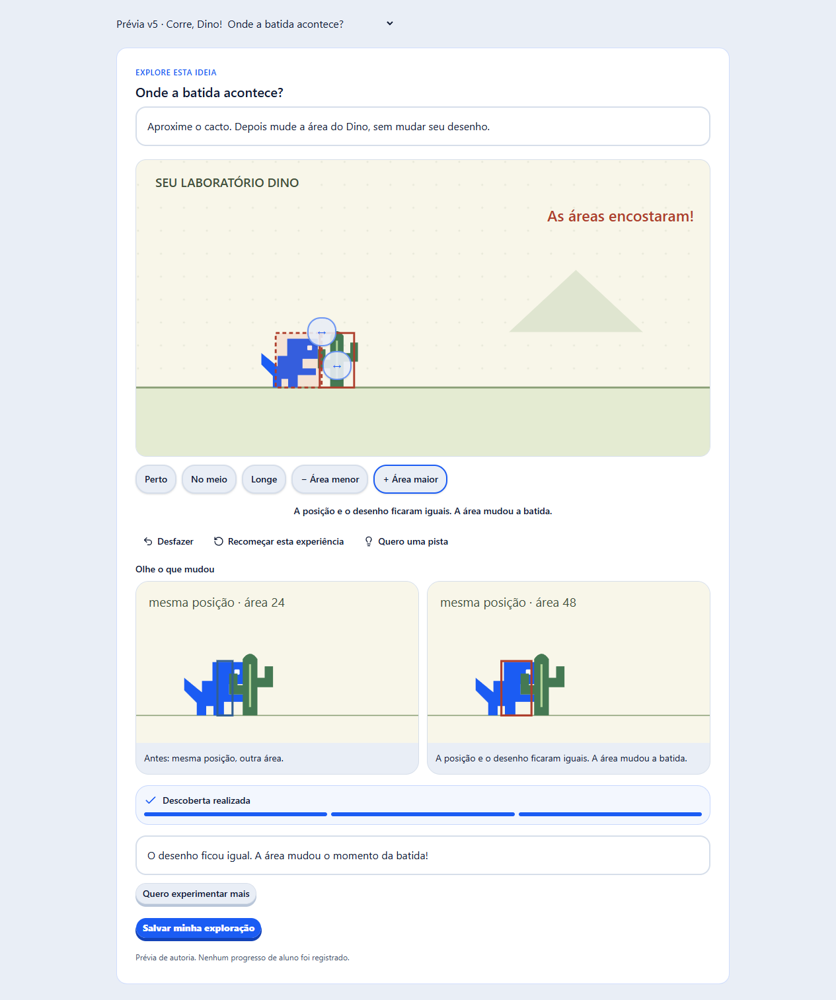

# Revisão completa da entrega Kids v5 — 12/09/2026

Revisão de código, conteúdo, critérios e experiência da [proposta v5](../../plans/2026-09-12-exploracao-direta-aulas-kids-proposta-v5.md), incluindo as regressões das aulas legadas. Foram identificados seis grupos de problemas e aplicadas correções com testes de regressão. Os testes novos reproduziram as falhas antes das correções.

Base examinada: `c3f79880`, mais as correções desta revisão. Como a implementação v6 começou simultaneamente no workspace, a verificação final usa uma cópia isolada dessa base em `.cache/aulas-v5-review`, com as correções reaplicadas e dependências instaladas pelo lockfile. Os resultados abaixo não atestam o código v6 em construção. As alterações da v6 foram preservadas; nos arquivos compartilhados com esse trabalho, foram acrescentados apenas os ajustes da resolução de pistas, sua regressão e formatação.

## Achados corrigidos

### R1 · P2 — O ensaio podia liberar a seção sem cumprir todas as atividades

Em uma seção com vídeo e exploração obrigatórios, o botão de simular a confirmação externa dispensava também a exploração. Além disso, uma seção com objeto de conclusão presente, mas vazio, aparecia concluída. O professor podia aprovar um percurso que o aluno não conseguiria repetir.

A confirmação agora registra somente os blocos externos aplicáveis. Exploração, quiz, objetivos do projeto e ação da plataforma conservam critérios independentes. Uma seção sem critério mostra a pendência de autoria.

Código: [lesson-rehearsal.tsx](../../../packages/admin/src/components/editor/lesson-rehearsal.tsx). Regressão: [lesson-rehearsal.test.tsx](../../../packages/admin/tests/lesson-rehearsal.test.tsx), com vídeo + descoberta, ação de avatar e seção ainda em edição.

### R2 · P2 — Uma solicitação antiga podia retomar áudio depois de outra mídia

O foco de mídia aguardava a pausa dos outros players sem identificar qual solicitação continuava válida. Com uma resposta assíncrona atrasada, a narração podia começar depois que outro vídeo já havia solicitado o foco, ou depois do fechamento da exploração.

Cada solicitação agora tem versão e proprietário ativo. Desmontar ou silenciar a exploração cancela solicitações pendentes. O som confere a propriedade do foco também após a retomada assíncrona do contexto de áudio.

Código: [lesson-media-focus.ts](../../../packages/member-shell/src/lib/lesson-media-focus.ts) e [learning-exploration.tsx](../../../packages/member-shell/src/components/learning-exploration.tsx). Regressões: [lesson-media-focus.test.ts](../../../packages/member-shell/tests/lesson-media-focus.test.ts), cobrindo concorrência, desmontagem, silêncio, nova aquisição e falha ao pausar outro player.

### R3 · P2 — Um cacto antigo podia contar como uma descoberta nova

Na exploração do estado da partida, a contagem acumulada de cactos podia satisfazer a descoberta de nascimento na tela atual. Bastava mudar de tela e avançar um intervalo insuficiente para nascer outro cacto.

O avaliador agora exige um nascimento no avanço observado. Os testes verificam tanto a entrada na partida quanto a volta à tela inicial, sem transferir a evidência de nascimento de uma tela para outra.

Código e regressão: [exploration-model.ts](../../../packages/core/src/learning/exploration-model.ts) e [exploration.test.ts](../../../packages/core/src/learning/exploration.test.ts).

### R4 · P2 — A comparação de colisão podia misturar duas experiências

Depois de um primeiro contraste de área, mover o cacto e produzir outro contraste substituía apenas uma imagem. A interface podia afirmar que a posição havia ficado igual mostrando posições de tentativas diferentes. A compactação do registro também podia apagar um contraste novo quando a descoberta já estava concluída.

As duas imagens são renovadas juntas. A compactação só reúne ajustes consecutivos quando o ajuste anterior não produziu descoberta nem alterou uma observação. A regressão repete contrastes, muda a posição e verifica posição, área e contato dos dois lados depois da compactação.

Código e regressão: [exploration-model.ts](../../../packages/core/src/learning/exploration-model.ts) e [exploration.test.ts](../../../packages/core/src/learning/exploration.test.ts).

### R5 · P2 — Cactos fora da pista pareciam parar na borda

Nas cenas de sorteio e aceleração, o desenho limitava a coordenada do cacto à borda mesmo quando o modelo continuava deslocando o objeto. A imagem transmitia um comportamento diferente do movimento que a criança estava explorando.

A cena agora usa a posição do modelo, deixa de desenhar os cactos que saíram e informa quantos estão fora da pista. O indicador de nascimento na aceleração também foi ajustado para a posição fixa dessa missão; a faixa sorteada permanece na missão de sorteio.

Código: [exploration-stage.tsx](../../../packages/member-shell/src/components/exploration-stage.tsx). Regressão: [lesson-exploration.test.tsx](../../../packages/community-kids/tests/lesson-exploration.test.tsx), acompanhando o cacto de `x=500` até `x=-100`.

### R6 · P3 — Pistas padrão não entravam na contagem do professor

Se a autoria deixasse a lista de pistas vazia, a exploração exibia as pistas curadas da missão, mas enviava zero pistas usadas. A API também aceitava apenas a quantidade escrita na autoria. O relatório docente podia subestimar a ajuda consultada. Os manifestos do piloto já possuem pistas explícitas; o problema afetava essa possibilidade de autoria.

Uma função compartilhada resolve as pistas efetivamente disponíveis. A interface usa essa lista para apresentação e evidência, e a API usa a mesma lista para validar progresso e tentativas. Pistas próprias continuam substituindo as padrão, e quantidades acima das disponíveis são recusadas.

Código: [learning/index.ts](../../../packages/core/src/learning/index.ts), [learning-exploration.tsx](../../../packages/member-shell/src/components/learning-exploration.tsx) e [learning.service.ts](../../../packages/members/src/application/learning/learning.service.ts). Regressões na [interface](../../../packages/community-kids/tests/lesson-exploration.test.tsx) e na [API](../../../packages/members/tests/integration/learning.test.ts).

## Abrangência da revisão

| Área | Conferência |
| --- | --- |
| Conteúdo e percurso | Manifestos e roteiros das 13 aulas; 14 missões; exploração/criação intercaladas na aula 3; mesmo projeto com objetivos independentes; entrega e Mural separados. |
| Modelo e evidência | Transições, condições de descoberta, tempo acumulado, sorteio, contraste, desfazer, reset, recuperação, compactação e limites do registro. |
| Aluno | Gestos e alternativas por toque/teclado; salvamento e falha/reenvio; manipulação durante requisição; isolamento por perfil e revisão; modos de orientação/criação. |
| Autoria e professor | Tipos de bloco, configuração de critérios, avisos editoriais, ensaio local, importação por rascunho e apresentação das evidências. O relatório filtra progresso pela revisão atual; a suspeita de misturar progresso antigo não se confirmou. |
| Quiz e entrega | Rascunho, novas tentativas, questões já acertadas, gabaritos restritos, galeria, cópias imutáveis e confirmação distinta para publicar no Mural. |
| Vídeo e caderno | Foco de mídia, critérios de vídeo e material, referência ao caderno na página do curso, leitor por páginas, cancelamento de renderização e tratamento de PDF. |
| Legado | Adaptação sem substituir seções autoradas, identidade dos blocos, vídeo de 90% no caso aplicável, entrega e quiz independentes, material sem quiz, ações de perfil e galeria. |
| Fronteiras e acesso | Perfil/conta/revisão, recusa de evidência e proprietários inválidos, rotas de arquivos e ilustrações fixas, restrições de imagens em conteúdo de alunos. |

A composição continua livre: o professor pode alternar exploração e criação conforme o conteúdo. O piloto não introduz uma sequência universal nem faz uma descoberta no modelo aprovar automaticamente o projeto do Estúdio.

## Verificação final

**294 testes passaram, sem falhas, com 1.528 asserções.** Foram acrescentados nove testes de regressão nesta revisão. Os [comandos e resultados por pacote](v5-evidencias/review-verification.json) permitem repetir a rodada a partir da cópia isolada.

| Pacote | Testes | Asserções |
| --- | ---: | ---: |
| Core | 80 | 702 |
| Members | 90 | 418 |
| Admin | 10 | 51 |
| Community Kids | 44 | 146 |
| Member-shell | 45 | 138 |
| Estúdio | 25 | 73 |
| **Total** | **294** | **1.528** |

`bun run typecheck` passou, sem erros, nos seis pacotes: Core, Members, Member-shell, Admin, Community Kids e Community, após o último ajuste.

Biome passou nos 12 arquivos de código/teste alterados pela revisão. `git diff --check` passou na cópia isolada. O validador do catálogo conferiu 27 aulas, 111 seções, 145 clipes planejados, 27 etapas de projeto e 35 objetivos estruturais. No Corre Dino, continuam 13 aulas, 62 seções, 14 missões e 78 clipes planejados.

Os testes HTTP utilizam repositórios de teste. Não foi executado build de produção nem uma nova rodada contra banco real nesta revisão.

## Conferência no navegador

As correções foram abertas na prévia isolada, com componentes reais e CSS Kids. Na colisão, foram produzidos contrastes sucessivos após mover o cacto: as duas imagens mantiveram a mesma posição e mostraram a mudança de área e contato. A captura foi inspecionada visualmente.

Na cena de sorteio, dois avanços de dois segundos retiraram o cacto da área visível e exibiram “1 cacto fora da pista”, sem objeto preso à borda e sem transbordamento horizontal.

Em 1280 px, o componente de seções manteve aproximadamente 356 px de orientação e 832 px de ferramenta. Em 768 px, alternar Ver exemplo/Criar preservou o valor digitado. A ferramenta dessa prévia é um substituto para verificar montagem e estado; essa conferência não representa o Estúdio completo autenticado nem um tablet físico. O seletor de missões pertence apenas ao ambiente de conferência.

## Limites e situação da entrega

Os seis problemas confirmados nesta revisão foram corrigidos localmente. As verificações não demonstram ausência de qualquer outro defeito nem comprovam aprendizagem com crianças.

- A implementação v6 simultânea fica fora destes resultados e precisa de sua própria revisão quando estiver consolidada.
- O ensaio do admin permanece local; a prévia do Pinta pode reiniciar ao remontar. Isso não descreve a persistência autenticada do Pinta.
- O registro de exploração permanece limitado em tamanho e ações, com aviso explícito para começar outro registro. As comparações e artes continuam curadas por missão.
- A verificação estrutural do projeto, a reprodução do modelo de exploração e a execução real do jogo são evidências diferentes. Não foi criado um avaliador universal de execução do Estúdio.
- A análise local de tempo de reprodução do registro é um diagnóstico técnico; não substitui medição no dispositivo da criança. Os dados históricos de pesquisa não devem ser usados como medição do modelo corrigido.
- Permanecem a gravação/vinculação de mídias, a homologação autenticada do curso completo, o uso em dispositivos físicos e a observação com crianças antes da liberação gradual.

Não houve publicação, migração de banco ou implantação em produção nesta revisão. O [relatório original da entrega](piloto-v5-2026-09-12.md) conserva a evidência da rodada anterior; este documento registra os achados e a verificação adicionais.
