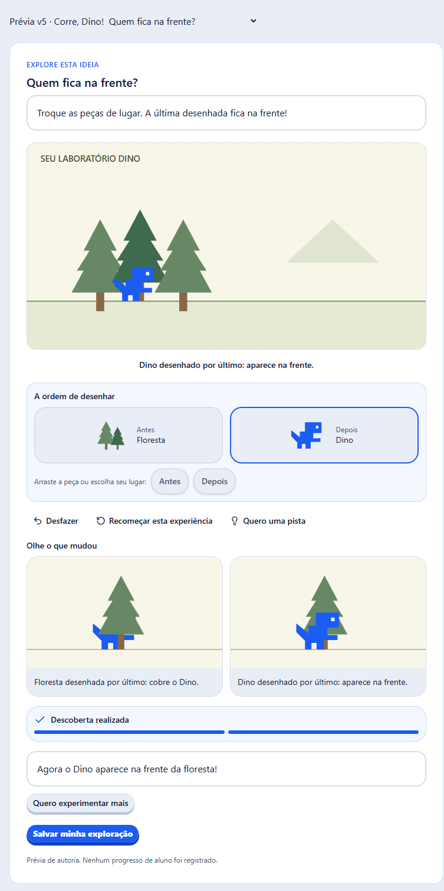

# Verificação da implementação Kids v5 — 12/09/2026

A implementação local da [proposta v5](../../plans/2026-09-12-exploracao-direta-aulas-kids-proposta-v5.md) inclui código, conteúdo revisado e verificações técnicas. As 13 aulas do Corre Dino ainda dependem de gravação/vinculação de mídia, homologação do curso autenticado e publicação gradual. Não houve publicação de aulas nem migração do banco nesta revisão.

## Entrega no código

- 14 missões de manipulação direta: existir/desenhar, camadas, gravidade, impulso, som do salto, nascimento, limpeza, estado, controles, reinício, contato, pontos, sorteio e aceleração. Alças, peças e alternativas por botões permitem experimentar sem depender de precisão, reflexo ou áudio.
- Descobertas derivadas de ações reproduzíveis, comparação, pistas progressivas, desfazer, reiniciar e continuar explorando. A criança pode continuar manipulando enquanto a tentativa é salva; uma resposta atrasada não apaga alterações posteriores.
- Composição livre das seções, incluindo objetivos independentes em trechos do mesmo projeto. A aula 3 alterna duas explorações com dois trechos no mesmo Estúdio. Concluir uma exploração não aprova o projeto.
- Admin com missões agrupadas, condição inicial de impulso nas duas missões de movimento, áudio opcional, resumo pedagógico, avisos editoriais e uma fonte de obrigatoriedade por seção. Prévia livre e ensaio local do percurso usam os avaliadores da aplicação.
- Painel docente com descobertas, contrastes, montagem específica da missão, pistas e revisão. A evidência da exploração é identificada como originada no cliente, mesmo quando o servidor reproduz o registro para conferir o resultado.
- Criação em duas colunas quando há espaço útil; em largura menor, modos Ver exemplo/Criar preservam a instância e o rascunho. A largura real da divisória do tema entra no cálculo, e as barras laterais recolhem por padrão no notebook, respeitando a escolha salva do perfil.
- Quiz com ilustrações revisadas nas aulas 2, 3 e 10, respostas recuperáveis por perfil/revisão e conservação das questões já acertadas durante nova tentativa. Convite ao Mural explicitamente opcional no piloto, separado do envio ao professor e da confirmação de publicar.
- Caderno acessível novamente pela página do curso e alternativa por páginas sem WebGL, com zoom e extração de texto quando o PDF o contém. Leitura e download conservam os critérios próprios do material. Vídeo e narração coordenam o foco de áudio.

O estudo da execução real do Estúdio está em [Observação de comportamento](../../plans/2026-09-12-estudio-observacao-de-comportamento-v5.md). O piloto mantém verificações estruturais com nomes precisos e teste orientado pela criança. Não foi acrescentado um avaliador universal de execução.

## Conteúdo

Corre Dino: **13 aulas, 62 seções, 14 missões e 78 clipes planejados**. Aula 3 passa a ter seis seções. Os manifestos preservam um único Estúdio e não impõem uma ordem universal de exploração/criação. O fechamento da aula 13 distingue entrega e publicação.

O validador do catálogo conferiu **27 aulas, 111 seções, 145 clipes planejados, 27 etapas de projeto e 35 objetivos estruturais**. O formato de importação permanece v4; o contrato da atividade nova é `exploration` v2. Avaliadores antigos continuam disponíveis.

Clipes planejados e URLs opcionais de narração não são gravações prontas. Importação e publicação continuam usando o rascunho compartilhado e sua conferência de mídias.

## Verificação automatizada

| Área | Resultado | Abrangência |
| --- | --- | --- |
| Core | 47 testes, 548 asserções | 27 manifestos, caminhos válidos das 14 missões, ações inválidas, contrastes, física, tempo acumulado, sorteio, limite, versão, reset e histórico longo |
| Members — percurso | 44 testes, 234 asserções | Importação, tentativa v2, isolamento por perfil/revisão, progresso recuperável, legado, vídeo 90%, material, quiz, histórico e referência ao caderno |
| Members — ações e galeria | 6 testes, 48 asserções | Avatar/quarto/tema salvos, padrão recusado, perfil/revisão, seleção sem conclusão e confirmação de cópias imutáveis |
| Kids — player | 41 testes, 131 asserções | Seções, foco, instância do projeto, alternância de modos, falha/retry, rascunho por perfil, quiz e vídeo; os 4 testes de exploração foram repetidos após o ajuste final das conexões |
| Kids — galeria | 1 teste, 11 asserções | Escolha de desenhos, falha de confirmação e preservação da seleção/identidade da tentativa |
| Admin | 8 testes, 44 asserções | Critérios, tipos de bloco, relatório anterior e ensaio intercalado com objetivos independentes, retomada e falha simulada, sem requisições reais |
| Member-shell | 37 testes, 112 asserções | Limites e isolamento das rotas, foco de mídia, preferências do livro, ilustrações, texto alternativo e restrições do conteúdo de alunos |
| Estúdio | 25 testes, 73 asserções | Eventos reais de gravidade/salto e diálogo existente de publicação com capa, título e resumo |

O percurso HTTP adicional confirma exploração A → criação A → exploração B → criação B com um único bloco Estúdio. A segunda criação não aproveita a conclusão do objetivo anterior. O servidor mantém o avanço após releitura e recusa entrega antecipada. Os testes de HTTP usam os repositórios de teste; não representam uma nova execução de migração ou banco real.

Checagem de tipos sem erros em **core, members, member-shell, admin, community-kids e community**. Biome e `git diff --check` conferidos nos arquivos alterados. Não foi executado build de produção nesta rodada.

Um teste de tempo compara passos de 0,04 s com avanços maiores em nascimento, estado e pontuação. As mesmas descobertas e contagens resultam do mesmo tempo acumulado. A verificação de pontuação parada é reiniciada na mudança de tela, sem transferir tempo de observação do início para o fim.

## Navegador

Prévia local com os componentes reais e CSS Kids: as 14 missões foram renderizadas e chegaram à conclusão. Também foram exercitados conexão por arraste, alça de área por arraste/setas e alternativas por botões. O arraste revelou uma instrução que voltava a pedir conexão depois do encaixe; o tratamento do clique posterior foi corrigido e reconferido.

Esta captura é da prévia isolada: o seletor de missões pertence ao ambiente de conferência e o contexto visual completo do aluno/Zappy não está montado.

No componente de seções, a largura de 1280 px resultou em aproximadamente **356 px de orientação e 832 px de ferramenta**; em 1366 px, **382 px e 892 px**. Não houve transbordamento horizontal nesses percursos. Em 768 px, Ver exemplo/Criar preservou o valor digitado no projeto de teste. Essa conferência usa uma ferramenta substituta para observar montagem e estado; não equivale à homologação visual do Estúdio completo autenticado em um tablet físico.

O leitor por páginas foi conferido com um PDF real de duas páginas: renderização em Canvas 2D, navegação, texto extraído e reconhecimento da abertura somente após a página ficar disponível. O arquivo e o servidor usados nessa prévia são locais; a autorização do PDF continua nas rotas existentes.

## Limites e próxima etapa

- O ensaio do admin é local e termina ao fechar a prévia. Retomada é simulada dentro desse ensaio. O percurso verificado reutiliza Estúdio; a prévia do Pinta ainda recomeça de sua semente ao remontar. Isso não altera a persistência autenticada do Pinta.
- Artes e regras são curadas por missão. O editor não oferece cenas arbitrárias nem um roteiro universal de demonstração. Narração depende de áudio revisado pelo professor.
- O registro de exploração tem limite de tamanho e de ações. Ao atingir esse limite, a interface preserva o registro e oferece começar outro; não descarta silenciosamente as descobertas. Sessões segmentadas contínuas são uma evolução possível.
- Os gestos têm destinos e alternativas acessíveis; fios e peças ainda não têm toda a animação de acompanhamento/antecipação de encaixe de um editor visual completo.
- As comparações mostram os contrastes previstos pela missão. Não oferecem escolha livre de qualquer par de tentativas nem reprodução do projeto real do aluno.
- A rodada atual não incluiu homologação autenticada completa de todas as aulas, dispositivos físicos, teste com crianças ou implantação em produção. Mídias, projeto inicial, permissões e continuidade entre aulas devem ser conferidos ao preparar o curso no ambiente de teste.

Próxima etapa de produção: professor revisa as prévias e grava/vincula as mídias; o curso é conferido em ambiente de teste; uma rodada qualitativa com 6–8 crianças orienta os últimos ajustes antes da liberação gradual. As aulas existentes permanecem no fluxo compatível durante a migração editorial.
