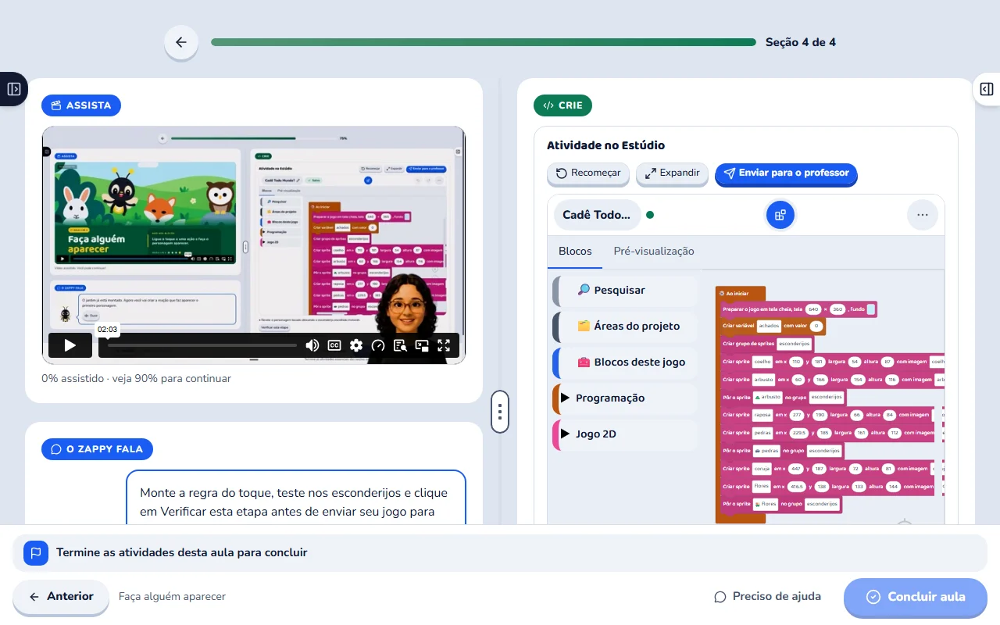

# Cadê Todo Mundo: direção de copy e provas visuais

Data: 02/10/2026. Estado: **direção aprovada e desenvolvida em código local, não publicada**. Ver [implementação e pendências](implementacao.md). A redação aplicada está em `packages/funnel/src/content/presente.ts` e nos componentes `packages/funnel/src/components/referrals/`.

Este documento desenvolve a [proposta de embaixadores e campanhas](proposta-embaixadores-e-campanhas.md). As [evidências e limites](pesquisa-embaixadores-e-campanhas-2026-10-02.md) ficam separados da redação. Os trechos de copy abaixo são exemplos desenvolvidos para orientar a próxima etapa; ainda não constituem todas as variantes finais, mensagens de sistema e telas implementadas.

As condições confirmadas são: sete dias de curso contados do cadastro, prazo da campanha independente e link de evento sem comprovação de presença. Novos resgates também recebem a visita ao Mural prevista na política local. Não apresentar toda a Comunidade como gratuita.

## 1. Posicionamento

### Para a família convidada

**Resultado central:** o filho montar as regras de um jogo de procurar personagens, fazendo os esconderijos desaparecerem e contando os achados.

**Mecanismo:** projeto preparado, orientação gravada, experimentos e montagem com blocos dentro da atividade. A criança pode acompanhar a explicação, pausar, testar e conferir o resultado.

**Consequência para a família:** ter uma experiência concreta de criação no tempo de computador que já permite e algo específico para conversar com o filho sobre o que ele fez. Isso é uma possibilidade da experiência, não garantia de autonomia ou mudança de hábitos.

**Promessa proposta:** “Seu filho pode aprender a fazer um jogo de procurar personagens funcionar.”

**Desenvolvimento da promessa:** “No Cadê Todo Mundo, ele encontra o jardim e os personagens preparados, acompanha a orientação e monta as regras que fazem os esconderijos sumirem e cada descoberta entrar na contagem. Sua família recebe sete dias de acesso para conhecer essa experiência, gratuitamente.”

### Para o embaixador

**Resultado central:** conseguir oferecer a outra família uma primeira experiência de criação no Sistema Zero.

**Mecanismo:** inscrição pela conta de responsável, link próprio, página que explica o presente, cadastro feito pela família convidada e painel de acompanhamento.

**Consequência:** indicar algo que consegue compreender e mostrar, com clareza sobre o que está oferecendo. Eventual bônus é secundário, condicionado às regras vigentes.

**Promessa proposta:** “Ofereça a outra família um começo para criar com tecnologia.”

**Desenvolvimento da promessa:** “Pelo seu link, ela recebe sete dias de acesso ao Cadê Todo Mundo, sem custo e sem cartão. Você mostra o convite; a página apresenta a experiência e orienta o responsável para começar com a criança.”

## 2. Identidade visual e experiência de leitura

Usar a mesma composição das ofertas: cabeçalho navy, marca oficial, títulos Baloo 2, corpo Nunito, botões azuis em pílula com relevo, cartões claros e cores de apoio nas mesmas funções. Aproveitar `kids-oferta.css`, as receitas de `comunidade-oferta.css`, os enquadramentos de `ComunidadeVisual` e o rodapé institucional Kids.

As páginas atuais de bolsa e embaixador usam o tema Kids, mas não a composição visual completa das ofertas. A proposta é integrá-las de fato a esse desenho, não apenas trocar uma cor ou acrescentar o logotipo.

Cada bloco demonstrativo segue esta sequência:

1. Uma situação que o responsável reconhece.
2. A explicação de como a atividade acontece.
3. Uma imagem ou sequência que comprova a funcionalidade.
4. Uma legenda dizendo o que observar.
5. A consequência prática para a criança ou a rotina da família.

Print não entra como decoração de fundo. Texto pequeno precisa de ampliação, e sequências devem ser legíveis no celular. Não forçar carrossel automático. No topo, priorizar uma imagem relevante; carregar as demais conforme a leitura avança. Manter as dimensões dos arquivos para evitar deslocamentos de conteúdo.

O rodapé deve ser o mesmo componente das ofertas, fora do escopo de regras de imagem e parágrafo que possam alterar a logo e os espaçamentos. A proposta inclui os estados de confirmação, erro e campanha encerrada, não apenas a landing ativa.

## 3. Página do convidado: estrutura completa

O visitante pode chegar frio por anúncio, por um amigo ou por uma palestra. O contexto muda a abertura; a experiência oferecida continua a mesma.

| Ordem | Seção e função | Demonstração | Próximo passo |
| --- | --- | --- | --- |
| 1 | Contexto do convite, promessa, prazo e gratuidade. | Aula com atividade ou jogo do curso em destaque. | “Quero o acesso gratuito”. |
| 2 | Mostrar o que o filho fará no jogo. | Esconderijo antes/depois e contador. | Continuar a demonstração. |
| 3 | Explicar o que já vem preparado e o que cabe à criança. | Projeto inicial e regra trabalhada no curso. | Entender a possibilidade de começar. |
| 4 | Mostrar aula e atividade juntas. | Vídeo ao lado da montagem no Estúdio. | Ver como acontece a prática. |
| 5 | Relacionar a experiência à rotina. | Vídeo pausado e retomada da atividade. | Reconhecer como encaixar o curso. |
| 6 | Explicar as etapas até a conclusão. | Experimento, montagem, contagem e certificado. | Saber o que esperar. |
| 7 | Orientar a participação do adulto e a ajuda disponível. | Primeiro acesso, botão “Preciso de ajuda” na aula e conversa nos Recados. | Reduzir insegurança prática. |
| 8 | Mostrar a publicação do jogo e a participação no Mural durante sete dias, com visita depois. | Mural, publicação e link público do jogo. | Compartilhar a criação e entender o que permanece depois. |
| 9 | Explicar quem oferece o curso e por que ele é gratuito. | Apresentação real da pessoa responsável pelo ensino, se já documentada. | Construir confiança sem números inventados. |
| 10 | Reunir as condições do presente. | Quadro simples: curso por sete dias, visita ao Mural, assinatura separada. | Aceitar o convite com clareza. |
| 11 | Responder às dúvidas práticas. | Print apropriado perto das respostas de uso. | Resolver a dificuldade específica. |
| 12 | Cadastro do responsável e fechamento. | Formulário curto; confirmação orienta entrada. | Começar o curso. |

CTAs intermediários podem repetir a mesma ação depois da demonstração e do resumo do presente. Eles levam ao mesmo formulário, sem criar cadastros independentes. Um visitante já convencido pode usar o CTA inicial; ninguém precisa rolar a página inteira para se cadastrar.

### Abertura comum: exemplo de redação

**Seu filho pode aprender a fazer um jogo de procurar personagens funcionar.**

No Cadê Todo Mundo, o jardim e os personagens já estão preparados. Seu filho acompanha a orientação e monta as regras que fazem os esconderijos desaparecerem e o jogo contar cada descoberta. Ele testa o que montou e consegue ver o efeito na própria brincadeira.

Sua família recebe sete dias de acesso ao curso, gratuitamente. É uma oportunidade para conhecer o Sistema Zero e experimentar uma atividade de criação dentro do tempo de computador que vocês já permitem.

**Botão:** Quero o acesso gratuito.

**Condições junto do botão:** Sete dias a partir do cadastro. Sem cartão e sem assinatura automática. Para fazer as atividades, use um computador com internet, mouse e teclado.

Nota editorial: acrescentar a faixa etária depois da conferência entre a indicação atual e a recomendação da Comunidade. Não esconder equipamento e prazo no final da página.

### Contextos de abertura

| Origem | Texto de contexto proposto | Cuidado |
| --- | --- | --- |
| Pessoa | “Um convite de {nome público do embaixador} para sua família.” | Nome público autorizado; não expor e-mail ou nome completo por padrão. |
| Anúncio | “Uma experiência gratuita de criação no Sistema Zero.” | O anúncio e a landing precisam apresentar o mesmo curso. |
| Palestra | “Um convite da palestra {nome do evento} para continuar a experiência em casa.” | Sem afirmar que o visitante esteve presente ou foi validado. |

Campanha com data definida acrescenta: “Cadastre-se até {data e hora, horário de Brasília}. Seus sete dias de curso começam quando você concluir o cadastro.” A data deve vir do serviço, não de um texto colado em cada página.

### Demonstração: exemplo de argumento

**Um toque no esconderijo. Um personagem encontrado. Uma regra que seu filho montou.**

No começo, seu filho experimenta a brincadeira de procurar os personagens no jardim. Depois, acompanha como construir a reação do jogo: ao tocar em um esconderijo, ele precisa desaparecer para revelar quem estava atrás.

É nesse ponto que a programação fica visível. Seu filho monta o comando e testa. Se o esconderijo continuar no lugar, há algo para conferir. Quando a regra funciona, o personagem aparece. Na atividade seguinte, ele trabalha a contagem para o jogo registrar cada achado.

Você pode pedir que ele mostre o que mudou e explique qual comando fez aquilo acontecer. Assim, a conversa sobre o tempo no computador ganha um exemplo que vocês conseguem ver juntos.

**Prova:** sequência `regra-desligada` → `regra-ligada`, seguida de `contador`.

**Legenda proposta:** “A reação muda quando a regra muda. Na atividade, seu filho compara os resultados e testa o que montou.”

### O começo preparado: exemplo de argumento

**O jardim está pronto para ele começar pelas regras.**

Uma tela vazia pode deixar a criança sem saber por onde seguir. Neste curso, ela encontra o cenário e os personagens preparados e recebe uma tarefa definida: fazer o jogo responder aos toques e contar os achados.

Isso permite concentrar a atenção em uma parte da criação de cada vez. Seu filho pode conhecer os blocos usados na atividade, acompanhar a montagem e testar o resultado. Ele não precisa desenhar os personagens para realizar esse primeiro projeto.

**Prova necessária:** projeto inicial do Cadê Todo Mundo. A captura genérica “materiais” hoje mostra conteúdo vindo do Pinta; não utilizá-la como se fosse o conjunto inicial deste curso.

### Plataforma integrada: exemplo de argumento

**A explicação fica ao lado do que seu filho está construindo.**

Na tela da aula, seu filho acompanha o vídeo e encontra a atividade ao lado. Ele pode observar um passo, pausar a explicação e fazer a ação no projeto. Se precisar rever, volta ao trecho antes de continuar.

Para você, isso deixa mais claro o que está acontecendo: a orientação e o trabalho da criança aparecem no mesmo lugar. Para ele, há um caminho concreto entre ouvir a explicação e experimentar o que acabou de conhecer.

**Prova existente:** `tela-aula-estudio.webp`.

A imagem acima é uma captura real já usada na oferta. A versão final precisa conferir se corresponde à aula e às permissões que o novo convidado encontra.

### Rotina e autonomia: exemplo de argumento

**Vocês escolhem quando começar dentro dos sete dias de acesso.**

As aulas são gravadas. Você pode combinar com seu filho um momento no computador e acompanhar o primeiro acesso, para que ele conheça os controles e entenda como seguir a atividade.

Depois, observe de que ajuda ele precisa. Algumas crianças avançam com a orientação da tela; outras pedem companhia para ler, encontrar um botão ou retomar uma etapa. Pausar e rever a explicação permite trabalhar esse começo com mais calma, dentro do período de acesso ao curso.

Não é necessário ampliar o tempo de tela que sua família já permite para dar um propósito a parte dele. A proposta é reservar um momento desse tempo para construir, testar e conversar sobre o que foi feito.

**Prova:** vídeo pausado e atividade, sem prometer duração de sessão ou conclusão em um número fixo de minutos.

### Mural: exemplo de argumento

**Ele cria o jogo. Depois, pode convidar a família para jogar.**

Durante os sete dias do presente, seu filho pode publicar no Mural o jogo criado no Cadê Todo Mundo?, seguindo as atividades e a orientação da aula 2. Também pode jogar, comentar e reagir às criações das outras crianças. Depois de publicar, recebe um link para convidar familiares e amigos para jogar, sem que eles precisem de uma conta.

Ao fim dos sete dias, o curso e as ações de publicar, comentar e reagir deixam de estar liberados pelo convite. A conta conserva a visita para ver e jogar enquanto existir. O link do jogo publicado continua funcionando enquanto a publicação estiver disponível. Ferramentas de criação livre e cópias de jogos dependem dos acessos e etapas da Comunidade e não fazem parte do presente.

**Prova pendente:** Mural aberto com conta que tenha somente os direitos do presente.

### Gratuidade e continuidade: exemplo de argumento

**Uma primeira experiência para sua família conhecer nosso jeito de ensinar.**

Queremos que você veja como seu filho participa de uma atividade de criação no Sistema Zero. Por isso, este convite oferece o Cadê Todo Mundo gratuitamente por sete dias. Você cadastra a sua conta de responsável e começa com a criança.

O cadastro não pede cartão nem cria uma assinatura. Se depois sua família quiser continuar com os cursos e recursos da Comunidade dos Criadores, você poderá conhecer a proposta e decidir pela contratação. Os direitos deste presente seguem as condições informadas aqui.

Uma pequena seção posterior pode mostrar que existe continuidade. Ela deve ser identificada como assinatura separada; Pinta, Estúdio livre, Clube e outros cursos não entram como lista de entregáveis gratuitos.

## 4. Perguntas práticas da família

Título proposto: **Antes de começar com seu filho**.

O conjunto abaixo resolve decisões diferentes. Não juntar programação e desenho numa pergunta, nem confundir prazo de campanha com prazo de curso. Na página, respostas podem ser expansíveis, com navegação e imagens acessíveis. Cada print só entra quando explica a resposta.

### O que meu filho vai fazer nesse curso?

Ele vai trabalhar em um jogo de procurar personagens escondidos. O jardim e os personagens já estão preparados. Seu filho acompanha as orientações para fazer um esconderijo sumir quando recebe um toque e, depois, para o jogo contar os personagens encontrados. Ao testar, ele confere se a regra que montou produz o efeito esperado.

Prova: jogo, reação ao toque e contador.

### Ele precisa saber programar?

O curso apresenta os comandos usados nessa atividade e mostra como montá-los com blocos. Seu filho começa com um projeto preparado e uma tarefa definida, em vez de precisar escrever um programa inteiro. No primeiro acesso, vale acompanhá-lo para conhecer os controles e observar a ajuda de que precisa.

Prova: orientação junto da montagem da regra.

### Ele precisa saber desenhar?

Para este projeto, os personagens e o cenário já estão preparados. A atividade se concentra em fazer a brincadeira funcionar com as regras que ele monta. Por isso, saber desenhar não é um requisito para realizar o Cadê Todo Mundo. O presente também não é um curso de desenho nem libera o Pinta para uso livre.

Prova: captura dos materiais iniciais deste curso, ainda a conferir.

### As aulas têm horário marcado?

As aulas são gravadas e ficam disponíveis durante os sete dias de acesso. Você combina com seu filho quando usar o computador, e ele pode pausar ou rever a explicação enquanto faz a atividade. O prazo começa no cadastro pelo link, não na primeira aula; vale escolher um momento em que vocês consigam começar em breve.

Prova: vídeo e prazo de acesso da matrícula de teste.

### Preciso ficar ao lado dele o tempo todo?

Recomendamos acompanhar o primeiro acesso. Depois, observe como seu filho lida com a leitura, os controles e as instruções. A tela reúne explicação e atividade, mas cada criança pode precisar de um tipo de apoio. Se ele se perder em um passo, você pode ajudá-lo a localizar a orientação e rever aquele trecho com ele, sem ter de saber programar para fazer essa companhia inicial.

Prova: aula aberta; não usar print como prova de que qualquer criança aprende sozinha.

### Dá para fazer pelo celular?

Você pode conhecer o convite e fazer o cadastro pelo celular. Para as atividades de criação, a orientação é usar um computador com internet, mouse e teclado. Depois de se cadastrar, entre nessa mesma conta no computador e crie ou selecione o perfil da criança para abrir o curso.

Prova: orientação de acesso após cadastro. Confirmar os controles efetivos no teste funcional.

### Quando começam os sete dias?

Os sete dias começam quando seu cadastro pelo link é registrado para liberar o presente. Entrar depois ou recuperar a senha não reinicia o prazo. Se a campanha tiver uma data de encerramento, ela define até quando novas famílias podem resgatar; quem já resgatou mantém seu próprio período de acesso.

Prova: data de acesso apresentada pelo servidor, sem data fictícia em imagem comercial.

### Vou ser cobrado depois?

Esse cadastro não pede cartão e não cria uma assinatura. Quando os sete dias terminam, termina o acesso ao curso oferecido por este presente. Uma assinatura da Comunidade depende de uma contratação separada feita por você. A visita ao Mural continua disponível nas condições descritas nesta página.

Prova: resumo das condições; não é necessário acrescentar um print sem função explicativa.

### Já tenho conta. Preciso criar outra?

Use o e-mail da sua conta atual. O acesso é concedido à mesma conta, e você entra com a sua senha. Se esse e-mail já recebeu o presente anteriormente, um novo link não reinicia o prazo; a página orientará você a recuperar ou consultar o acesso existente.

Prova: estado de conta existente na confirmação, sem expor dados de teste reais.

### O que acontece quando o acesso ao curso termina?

As aulas desse presente deixam de estar disponíveis ao fim dos sete dias. Sua família continua podendo ver e jogar no Mural enquanto a conta existir. Se quiser conhecer a continuidade com a Comunidade dos Criadores, você pode consultar a oferta específica e decidir. Não há contratação automática.

Nota editorial: explicar recuperação de projetos e acesso ao certificado após expiração somente depois de conferir os direitos desse tipo de matrícula. Não copiar condições da assinatura para preencher essa resposta.

### E se meu filho tiver uma dúvida na atividade?

Durante os sete dias de acesso ao curso, seu filho pode pedir orientação pelo botão “Preciso de ajuda”, no rodapé de cada aula. Ao clicar, abre um campo para contar em que parte ficou com dúvida. Se ele precisar de companhia para escrever, vocês podem fazer isso juntos.

Ajude-o a contar o que tentou e o que aconteceu na tela. Por exemplo: “Cliquei no arbusto, mas o personagem não apareceu. O que preciso conferir?”. Depois, é só clicar em “Enviar ao professor”. A plataforma envia junto a identificação da aula e da etapa em que ele está, para o professor saber de onde veio a dúvida.

A resposta chega nos Recados, dentro da própria plataforma. É ali que vocês acompanham a orientação e continuam a conversa se ainda tiverem dúvidas. Esse atendimento acontece por mensagens e pode haver espera pela resposta.

Você não precisa saber programar para participar desse momento. Pode ajudá-lo a mostrar onde parou, rever um trecho da explicação e organizar a pergunta. A dúvida sobre a atividade vai para o professor; você pode acompanhar seu filho sem ter que descobrir a resposta por conta própria.

**Evidência editorial, 03/10/2026:** `LearningService.help` usa o acesso à aula por matrícula ativa do curso (`CheckAccessService.requireById`), aceitando a matrícula específica do presente durante sua validade. O envio inclui aula e seção; `TeacherThreadsService` permite ler e responder às conversas do próprio aluno. `lesson-sections.tsx` apresenta “Preciso de ajuda”, “Enviar ao professor” e a confirmação de resposta nos Recados. Conferência pelo código local e pelo print existente, sem ensaio integrado com conta de resgate. Não foi definido prazo de resposta. A copy compartilhada está em `packages/funnel/src/content/presente.ts`.

## 5. Página do embaixador: completa e útil no retorno

A página tem dois momentos. Antes da adesão, constrói o motivo para indicar. Depois da adesão, começa pelo link e pelas ações, e mantém a apresentação completa abaixo, com atalhos. O embaixador não precisa reler uma landing inteira a cada compartilhamento.

| Ordem editorial | O que desenvolver | Prova ou recurso |
| --- | --- | --- |
| 1 | O benefício que a indicação oferece à outra família. | Aula e jogo do curso. |
| 2 | O que a criança convidada vai construir e aprender a observar. | Reação ao toque e contador. |
| 3 | Por que esse começo é acessível a um iniciante. | Projeto preparado e orientação ao lado. |
| 4 | Como a família começa pelo convite. | Prévia da landing e da confirmação. |
| 5 | Como aderir e compartilhar. | Conta de responsável, link público e mensagem editável. |
| 6 | O que dizer para alguém que ainda não conhece o Sistema Zero. | Exemplos de convite em linguagem pessoal. |
| 7 | Quais condições devem acompanhar a indicação. | Sete dias, cartão, Mural e assinatura separada. |
| 8 | Agradecimento por indicação que vira assinatura. | Regra vigente, valor dinâmico, etapas e pagamento manual. |
| 9 | Acompanhamento no painel. | Contagens e bônus próprios, sem dados da criança indicada. |
| 10 | Dúvidas práticas e chamada final. | Cadastro ou acesso ao painel, conforme o estado. |

### Abertura: exemplo de redação

**Ofereça a outra família um começo para criar com tecnologia.**

Talvez você conheça uma criança que goste de jogos e tenha curiosidade de descobrir como eles funcionam. Pelo seu convite, a família dela pode conhecer o Cadê Todo Mundo: um curso em que a criança monta as regras de uma brincadeira de procurar personagens.

O acesso ao curso é gratuito por sete dias, a partir do cadastro. Você recebe um link próprio para compartilhar, e a família encontra uma página que mostra a experiência e explica como começar. O cadastro é feito pelo responsável, sem cartão.

**Botão para quem está autenticado:** Quero participar como embaixador.

**Botão para quem está fora da conta:** Entrar na minha conta de responsável.

Nota editorial: a página pública pode apresentar o programa; a adesão continua pertencendo à conta do adulto. Não abrir inscrição infantil ou criar um cadastro duplicado de usuário no funil.

### Argumento de indicação: exemplo de redação

**Você pode mostrar o que está oferecendo antes de enviar o convite.**

Na demonstração abaixo, o esconderijo desaparece quando recebe um toque. É uma das reações que a criança aprende a montar no Cadê Todo Mundo. Depois, ela trabalha a contagem dos personagens encontrados e testa o jogo.

Esse é o presente que sua indicação leva à outra família: uma experiência guiada, com uma atividade definida e sete dias para acessá-la. Você pode abrir a página do convite e conferir como o curso é apresentado. Assim, sabe exatamente o que a pessoa vai receber quando usar seu link.

**Prova:** sequência real do curso e botão “Ver a página que a família recebe”.

### Compartilhamento: exemplo de redação

**Escolha uma família para quem essa experiência faça sentido.**

Pode ser alguém que já comentou que o filho gosta de jogos ou que está procurando uma atividade criativa no computador. Você copia seu link e escreve do seu jeito. Se preferir, pode usar a mensagem sugerida como ponto de partida.

A página explica o curso, o prazo e o cadastro. Você não precisa recolher dados da criança, conduzir a inscrição ou ensinar a programação. A família decide se quer aceitar o convite e faz o cadastro diretamente no Sistema Zero.

**Mensagem proposta:**

> Oi, lembrei de vocês por causa de um curso do Sistema Zero. No Cadê Todo Mundo, a criança monta as regras de um jogo de procurar personagens, com o jardim já preparado e orientação passo a passo. Pelo meu link, vocês recebem sete dias de acesso a partir do cadastro, sem custo e sem cartão. Aqui dá para ver a atividade e conferir se combina com seu filho: {link público}.

Se houver bônus no programa, incluir informação acessível sobre essa relação, sem apresentar uma indicação remunerada como avaliação independente. Uma frase possível, sujeita à revisão das regras do programa: “Se vocês decidirem assinar a Comunidade depois, minha indicação pode gerar um agradecimento para mim. O presente continua gratuito.”

A mensagem é sugestão editável, não depoimento automático. Não escrever “meu filho adorou”, “mudou a rotina aqui” ou outra experiência que talvez não tenha acontecido com quem compartilha.

### Bônus: exemplo de redação

**Se a indicação virar uma assinatura, há um agradecimento para você.**

O presente para a família é gratuito. Se ela decidir contratar a Comunidade dos Criadores e a assinatura atender às regras do programa, sua indicação poderá gerar um bônus de {valor vigente}, pago por Pix depois da verificação de elegibilidade.

Você acompanha as etapas no seu painel e cadastra sua chave Pix para receber quando houver um bônus liberado. O pagamento é feito pela equipe. É um agradecimento por uma indicação elegível, e não uma renda garantida por compartilhar links ou cadastrar famílias.

Nota editorial: a espera atual inclui garantia e margem operacional configurada. Não prometer “cai no oitavo dia” ou outra data de pagamento não contratada. O valor e os estados precisam vir do backend. As condições devem estar disponíveis mesmo antes do primeiro bônus.

### Organização do painel para quem retorna

No topo: saudação, link público, “Copiar link”, “Copiar mensagem” e “Ver página do convidado”. A geração de QR Code pode ser oferecida junto do link, principalmente para eventos no admin. Abaixo: resgates, situação dos bônus e chave Pix quando necessária.

Na sequência: apresentação completa do presente, explicações de indicação e dúvidas. Links de navegação permitem ir diretamente a essas seções. A identificação “Seu painel particular” deve distinguir esse endereço do link público.

O envio de um convite por e-mail permanece secundário. A interface deve indicar que se destina ao responsável e que a plataforma enviará aquele convite. Não converter a ferramenta em disparo automático de WhatsApp ou importação de contatos.

### Perguntas práticas do embaixador

| Pergunta | Direção da resposta |
| --- | --- |
| Quem pode participar como embaixador? | Pais e responsáveis pela entrada da Área dos pais; admin pode convidar pessoas manualmente. Conferir elegibilidade antes de prometer restrição a assinantes. |
| Preciso produzir conteúdo ou ter seguidores? | O fluxo se baseia em compartilhar um link com famílias para quem a atividade faça sentido; não estabelecer meta que o produto não exige. |
| Qual endereço devo compartilhar? | O link público do presente. O painel particular permite administrar sua indicação e deve ficar com você. Mostrar ambos com rótulos inequívocos. |
| Tenho que cadastrar a família? | Ela preenche seus próprios dados de responsável. O embaixador compartilha o convite. |
| O que a família recebe? | Curso e participação no Mural por sete dias; visita depois. Mostrar a publicação da atividade e o link público, sem prometer ferramentas livres. |
| Quando recebo um bônus? | Depois de conversão elegível e validação; explicar status, chave Pix e processamento manual com a regra vigente. |
| Posso continuar indicando depois? | Enquanto seu link e o programa estiverem ativos; o prazo de cada resgate é próprio. Não confundir com data de uma campanha institucional. |
| Onde acompanho minhas indicações? | Contagens e bônus no painel, sem dados privados das crianças. |

As respostas finais precisam desenvolver o raciocínio em parágrafos, como os exemplos acima. A tabela é roteiro editorial, não texto para publicar como tópicos soltos.

## 6. Plano de prints

Todos os arquivos existentes abaixo pertencem a `packages/funnel/public/img/comunidade-dos-criadores/`. Reutilização exige conferir a captura no contexto gratuito; existência de um arquivo não certifica suas permissões.

| Código | Argumento | Material | Situação e cuidado |
| --- | --- | --- | --- |
| V01 | Orientação junto da prática. | `tela-aula-estudio.webp` | Existe e foi inspecionado. Conferir revisão da aula no ambiente de destino. |
| V02 | O que acontece quando a regra muda. | `tela-regra-desligada.webp` e `tela-regra-ligada.webp` | Arquivos mapeados. Reaproveitar após conferir correspondência com a atividade. |
| V03 | Contar os personagens encontrados. | `tela-contador.webp` | Existe no mapa; conferir a etapa e a legenda. |
| V04 | Pausar e rever. | `tela-pausa.webp` | Existe no mapa; não usar como prova de autonomia garantida. |
| V05 | Jardim e personagens preparados. | Nova captura do projeto inicial do curso. | Necessária. A imagem genérica de materiais contém outro contexto. |
| V06 | Reconhecer a conclusão. | `tela-certificado.webp` | Existe e foi inspecionado. Conferir curso, versão, regra de conclusão e período de acesso. |
| V07 | Publicar o jogo, comentar e reagir durante sete dias; ver e jogar depois. | `tela-mural.webp`; complementar com publicação da aula 2 e link público. | Captura atual reutilizada. Cópia de jogos e ferramentas livres não estão incluídas. |
| V08 | Enviar a dúvida na aula e acompanhar a orientação por mensagem. | `tela-ajuda.webp` e `tela-recados-conversa.webp` | Acesso por matrícula do curso conferido no código. FAQ usa o print do campo de ajuda; a conversa continua nos Recados. Sem promessa de resposta imediata. |
| V09 | Entrar depois de resgatar. | Nova confirmação, login e seleção/criação do perfil. | Capturar depois de implementar o fluxo revisado. |
| V10 | Indicar com clareza. | Novo painel do embaixador com link público e prévia. | Capturar com conta de teste; ocultar token privado e chave Pix. |
| V11 | Acompanhar a criança. | Captura da Área dos pais com direitos do presente. | Não reutilizar benefícios exclusivos de assinatura como promessa de presente. |
| V12 | Conhecer o que existe depois. | Prints atuais de Pinta, Jornada e demais ferramentas. | Usar apenas em bloco identificado como continuidade pela assinatura. |

Em cada página, repetir somente as imagens que precisam cumprir outra função clara. As duas páginas podem usar o mesmo conjunto de provas do curso, com texto dirigido a quem recebe ou a quem indica. Rodapé e perguntas práticas mantêm o mesmo padrão visual das ofertas.

Na preparação das telas, usar contas e projetos de demonstração, sem expor dados de crianças ou famílias. Se for necessário desenhar uma prévia de recurso ainda não capturado, identificá-la como prévia interna; não publicá-la como comprovação do produto atual.

## 7. Cadastro, confirmação e campanha encerrada

### Formulário proposto

Título: **Crie seu acesso para começar com seu filho**.

Texto: “Informe seus dados de responsável. O perfil da criança é criado dentro da plataforma. Se você já tem conta, use o mesmo e-mail.”

Campos: nome e e-mail do responsável. O telefone hoje é opcional; recomendo retirá-lo deste primeiro formulário se não houver finalidade operacional definida. Não exigir telefone para entregar um acesso que usa e-mail.

Botão: **Liberar meu acesso gratuito**.

Texto próximo: “Cadê Todo Mundo por sete dias a partir do cadastro. Sem cartão e sem assinatura automática. A visita ao Mural continua disponível enquanto a conta existir.”

Links visíveis para condições do presente e privacidade. Comunicações de acesso devem ser distinguidas de novidades comerciais opcionais; eventual preferência de marketing precisa ter função e registro próprios, não ficar escondida na liberação do curso.

### Confirmação proposta

Título: **Seu acesso ao curso está liberado**.

Texto de referência: “Agora você pode entrar no Sistema Zero e começar o Cadê Todo Mundo com seu filho. O acesso ao curso vai até {data e hora}. Para fazer as atividades, use um computador com internet, mouse e teclado.”

Orientação de acesso para conta nova e existente pode ser enviada pelo canal verificado. A resposta pública não deve revelar o estado sensível de uma conta só pelo e-mail informado. Um botão seguro pode levar ao login com a instrução: “Entre com sua senha ou use a opção de recuperar acesso”.

Quando o envio de e-mail for confirmado apenas como aceito pelo serviço, não dizer que ele chegou à caixa. Se houver falha, explicar o caminho de recuperação. O acesso concedido e o envio são estados diferentes.

### Encerramento da campanha

Título: **O período para receber este convite terminou**.

Texto: “Esta campanha já encerrou os novos cadastros. Se você recebeu o presente antes do encerramento, seu acesso segue o prazo informado no cadastro.”

Botão principal: **Entrar na minha conta**.

Uma alternativa secundária pode apresentar o Sistema Zero. Não redirecionar silenciosamente para pagamento nem simular que o presente continua disponível. Uma nova campanha recebe sua própria edição e período.

## 8. Revisão editorial antes de implementar

- Cada página apresenta um motivo concreto para agir e explica os termos perto da ação.
- Os exemplos diferenciam o que a criança recebe pronto e o que ela monta.
- Não há promessa de resultado escolar, autonomia universal, profissão ou renda futura.
- Gratuidade não é confundida com assinatura nem com ferramentas liberadas de imediato.
- O contexto de palestra não finge comprovação de participação.
- O programa de embaixadores explica o agradecimento sem apresentar compartilhamento como renda garantida.
- Perguntas de natureza diferente têm respostas próprias.
- Prints sustentam funcionalidades; não são prova isolada de aprendizado ou satisfação.
- Ajuda, faixa etária, perfis e permanência de projetos após expiração ainda exigem a conferência indicada.
- O próximo trabalho é fechar a copy completa com essas condições e implementar o fluxo aprovado; nenhuma dessas páginas foi alterada por este documento.
