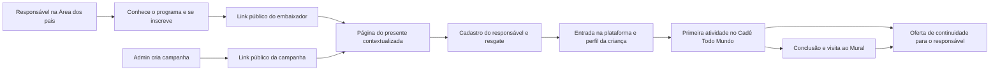

# Cadê Todo Mundo: proposta para embaixadores e campanhas

Data: 02/10/2026. Estado: **proposta para revisão, sem implementação**.

Base: código local, documentos do produto, capturas existentes e pesquisa pública. Não foram consultados dados de produção, campanhas reais, custos de mídia ou resultados comerciais. As recomendações de conversão são hipóteses, não resultados medidos.

Leitura complementar: [pesquisa e evidências](pesquisa-embaixadores-e-campanhas-2026-10-02.md) e [direção de copy, páginas e provas visuais](direcao-copy-e-provas.md).

## 1. Recomendação

Evoluir a funcionalidade para **Convites e campanhas**, com duas origens distintas para o mesmo presente:

- **Embaixador:** uma pessoa, normalmente responsável por um aluno, com cadastro próprio, link de indicação, painel e eventual bônus pelas assinaturas elegíveis.
- **Campanha:** uma ação do Sistema Zero, como anúncio ou palestra, com nome, contexto, período de resgate, link e relatório próprios. Não precisa de pessoa fictícia, e-mail de embaixador, chave Pix ou bônus.

O curso concedido e a tecnologia de resgate podem ser compartilhados. Identidade, regras de distribuição, comunicação e remuneração precisam distinguir os dois casos.

Recomendo duas experiências editoriais completas: **a página do embaixador vende a vontade e a segurança de indicar; a página do convidado vende a vontade de começar o curso**. Ambas terão o mesmo acabamento visual das ofertas. Para quem já é embaixador, o link e as ações ficam no início, antes da apresentação longa.

O resultado esperado do sistema deve ser uma família que consegue entrar e começar a experiência. Cadastro, isoladamente, é uma etapa intermediária.

## 2. O que já existe e deve ser aproveitado

| Área | Evidência local | Implicação |
| --- | --- | --- |
| Cadastro pelo responsável | A Área dos pais já tem autoinscrição e retomada de embaixador. | Melhorar a apresentação e a descoberta dessa entrada; não recriar a inscrição do zero. |
| Cadastro administrativo | O admin cria embaixador com nome e e-mail e pode reenviar link ou desativar. | Manter para exceções; dar destaque maior a campanhas no uso administrativo. |
| Link de indicação | `/bolsa/[codigo]` resolve quem indicou e concede o presente. | Reutilizar o mecanismo para pessoas e campanhas com contratos explícitos. |
| Painel particular | `/embaixador/[token]` permite compartilhar, convidar por e-mail, acompanhar contagens e cadastrar Pix. | É um painel privado. Seu endereço não é o link a entregar às famílias. |
| Presente atual | Novos resgates concedem Cadê Todo Mundo por sete dias e visita ao Mural enquanto a conta existir. | Mostrar ambos com clareza. O prazo de campanha é outra regra. |
| Concessão segura | Disponibilidade do curso, resgate único por e-mail, retomada por etapas e prevenção de execução duplicada. | Preservar essas garantias ao acrescentar campanhas. |
| Bônus | Existe controle de conversão em assinatura, maturação e Pix manual. | A documentação inicial que diz “sem ganho financeiro” ficou desatualizada. O código e a UI já preveem bônus. |
| Prints e identidade | As ofertas já usam capturas reais e componentes visuais próprios. | Reaproveitar linguagem visual e provas adequadas ao acesso gratuito. |
| Atribuição do funil | Há sanitização de UTMs nas jornadas comerciais. | Reutilizar o padrão; o formulário atual de bolsa ainda não transporta esses campos. |

Fontes locais e caminhos exatos estão na [matriz de evidências](pesquisa-embaixadores-e-campanhas-2026-10-02.md#evidencias-locais).

## 3. Problemas encontrados, por impacto

### Prioridade alta: campanha ainda não é um conceito do sistema

O banco aceita dono do código do tipo `ambassador` ou `account`. Não há cadastro de campanha com período de aceitação. O formulário do admin pede dados de uma pessoa, e a landing anuncia “Um convite especial de {nome}”. Cadastrar uma palestra como embaixador produziria frases estranhas e levaria a ação para a estrutura de painel e bônus de pessoas.

Também não basta acrescentar uma data no frontend. A validade precisa ser conferida pelo serviço no envio do cadastro, inclusive se alguém mantiver a página aberta além do encerramento.

**Correção proposta:** entidade de campanha e origem tipada, utilizando o resgate existente. A campanha tem linguagem institucional e não gera bônus.

### Prioridade alta: a página promete uma experiência que quase não demonstra

A página de bolsa apresenta o curso, passos e prazo, mas o destaque visual é uma composição com emojis. Não mostra a aula, a montagem da regra, o teste ou o contador. Já o painel do embaixador é estreito e operacional, com pouca argumentação sobre por que indicar.

**Correção proposta:** páginas completas com cenas reais e sequenciais. Cada benefício importante ganha explicação do que acontece na plataforma e uma prova próxima. A extensão deve vir da necessidade de explicar, e não de repetir a promessa.

### Prioridade alta: sucesso do cadastro não garante que a família conseguiu entrar

A tela atual de conclusão afirma que o e-mail foi enviado. O serviço pode concluir o acesso e falhar no envio, pois a comunicação é uma etapa de melhor esforço. O retorno público informa apenas `completed` ou `processing`. A tela não oferece um botão direto para entrar ou recuperar acesso.

**Correção proposta:** distinguir acesso liberado, envio aceito pelo serviço de e-mail e entrega efetivamente confirmada. Oferecer entrada, recuperação de acesso e orientação para quem cadastrou pelo celular. Não devolver senha ou token de acesso apenas porque alguém informou um e-mail.

### Prioridade alta: os prints da assinatura não representam automaticamente o presente

A captura atual do Mural exibe “Fazer a minha versão”, menu e recursos de assinante. O presente oferece visita para ver e jogar; não libera copiar projetos, publicar, comentar ou reagir. O curso usa o Estúdio incorporado na atividade, sem liberar o Estúdio completo e o Pinta.

**Correção proposta:** provas do acesso gratuito no corpo principal; demonstração da Comunidade mais ampla apenas em bloco identificado de continuidade. Nova captura do Mural como visitante. Não apagar controles de uma imagem para fabricar uma tela que a plataforma não apresenta.

### Prioridade média: inconsistências de promessa e critérios

- A indicação atual fala em **8 a 15 anos**; as ofertas da Comunidade trabalham **9 a 14**. Isso pode ser uma diferença legítima de escopo, mas está sem explicação. Proponho aquisição inicialmente concentrada em 9 a 14, sujeita à confirmação pedagógica; não alterar silenciosamente a elegibilidade existente.
- O roteiro do curso descreve jardim e personagens preparados. Evitar “criar qualquer jogo do zero”: a realização concreta é programar a reação dos esconderijos e contar os achados.
- O roteiro pedagógico menciona publicação opcional, mas isso não comprova permissão de publicação para a matrícula presenteada. A landing deve seguir os direitos efetivamente concedidos.
- Há textos de erro como “muita gente resgatando agora” para limitação de requisições e “resolvemos rapidinho” para falha de resgate. O primeiro infere demanda; o segundo promete atendimento sem prazo verificado. Trocar por orientação objetiva.
- A contagem global por e-mail não equivale a controle perfeito por família. Não anunciar “uma única família verificada” com esse mecanismo.
- O painel só explica os bônus quando já existe conversão; a Área dos pais fala deles antes. As regras precisam estar acessíveis também ao embaixador criado pelo admin, antes de ele começar a indicar.

### Prioridade média: campanhas precisam medir além de resgates

Hoje as contagens do embaixador mostram convites e resgates, com conversões em assinatura no serviço. Isso não responde quantas famílias acessaram a plataforma, começaram o curso ou concluíram a atividade.

**Correção proposta:** medir aquisição, ativação e continuidade separadamente. Preservar a origem do presente e acrescentar contexto de mídia, sem atribuir bônus com base em UTMs editáveis.

## 4. Regras comerciais propostas

### Dois prazos independentes

| Regra | Significado | Padrão recomendado |
| --- | --- | --- |
| Período de resgate | Quando novas famílias podem aceitar o presente de uma campanha. | Início e fim configurados pelo admin; fuso America/Sao_Paulo na interface. |
| Duração do curso | Quanto tempo uma família tem para acessar Cadê Todo Mundo depois de resgatar. | Manter sete dias a partir do cadastro pelo link, conforme política local atual. |
| Visita ao Mural | Direito de ver e jogar após a experiência. | Manter a política atual enquanto a conta existir. |
| Link para definir senha | Validade da credencial enviada por e-mail. | Continua regra de autenticação; não estende acesso ao curso. |

Exemplo hipotético: campanha aceita cadastros até 20/10 às 23h59, horário de Brasília. Quem resgata em 20/10 às 18h tem acesso ao curso até 27/10 às 18h. O fechamento da campanha impede novos resgates; não encurta os já concedidos.

Na implementação, datas devem ser comparadas em instantes absolutos, com intervalo de aceitação bem definido, por exemplo `início <= agora < fim`. O texto público precisa traduzir o mesmo limite. Para “até o fim de 20/10”, o limite exclusivo pode ser 21/10 às 00h no fuso informado.

**Decisão confirmada pelo responsável pelo produto em 02/10/2026:** manter os sete dias de acesso ao curso e configurar separadamente o prazo de resgate de cada campanha. Não incluir duração variável por campanha nesta proposta.

Não mudar nesta entrega a contagem para “primeira aula”. Pode reduzir desperdício de acesso, mas exige outra decisão de produto, uma janela máxima de ativação e novos controles. Há uma melhoria anterior e mais simples: orientar o início e facilitar o acesso após o cadastro.

### Quem pode resgatar

Manter o comportamento atual: conta nova ou existente, desde que não tenha resgate anterior concluído desse mecanismo. Uma conta existente deve receber acesso na própria conta, sem criar outra senha ou duplicar cadastro.

Manter a unicidade atual por e-mail na primeira versão. Não liberar outra bolsa porque o usuário trocou de campanha. Se futuramente houver diferentes presentes, a unicidade poderá ser revista por benefício; isso não precisa entrar agora.

Quem já tem acesso superior não deve perder direitos nem ter sua validade reduzida. Na especificação técnica, conferir a interação entre concessão de curso e assinatura existente. A interface deve conduzir ao acesso já disponível, não exigir criar outra conta.

### Link de palestra e exclusividade

Recomendo começar com **link próprio da ação, distribuído aos participantes**, eventualmente em QR Code. Isso identifica a campanha e permite prazo específico; não comprova presença no evento.

Se o link puder ser encaminhado, a copy deve dizer “convite da palestra [nome]”, e não prometer validação de participantes. Se houver necessidade de restrição real, usar convites individuais ou conferência de elegibilidade, como etapa adicional. Um código compartilhado no telão continua sendo encaminhável.

**Decisão confirmada pelo responsável pelo produto em 02/10/2026:** link exclusivo de divulgação, sem validar participantes. A primeira versão dispensa lista de presença, códigos individuais e comprovação de participação.

### Pessoas e remuneração

Preservar o modelo já implementado de bônus único, condicionado à conversão elegível e processado manualmente. Valor exibido vem da configuração vigente; não escrever valor fixo em vários lugares.

Campanhas institucionais têm **bônus desativado**. Uma assinatura vinda de campanha conta como resultado comercial, mas não cria saldo, chave Pix nem pagamento pendente para a campanha.

Não criar rede de recrutamento, bônus por cadastrar outro embaixador ou remuneração por cadastro gratuito. A motivação principal da página é indicar uma experiência útil para outra família; o agradecimento financeiro aparece com suas condições.

## 5. Jornadas recomendadas

### Responsável que quer indicar

Na Área dos pais, um convite explica o benefício para a outra família e leva à apresentação completa do programa. A pessoa usa a conta existente para se inscrever. Depois, encontra seu link público, uma mensagem editável, prévia do que o convidado verá e acompanhamento.

Para a elegibilidade, recomendo responsáveis por alunos que já tiveram acesso à plataforma, incluindo a experiência gratuita, sem exigir assinatura paga. Essa é uma regra proposta de produto: o endpoint atual trabalha com a conta do adulto e não comprova, sozinho, esse histórico de uso. A implantação deve definir como reconhecer o vínculo com o aluno, sem obrigar o responsável a informar tudo novamente.

O cadastro manual pelo admin segue existindo para convidados específicos. Não exigir que esse embaixador compre um produto para acessar seu painel. Preservar a verificação pelo canal correto quando já houver cadastro com o mesmo e-mail.

### Família convidada

A indicação de um amigo dá contexto, mas **não prova que a família conhece o Sistema Zero**. A landing explica desde o início o curso e a plataforma. O visitante pode ver a demonstração antes de preencher seus dados.

O cadastro é do adulto. Depois vêm a entrada na plataforma, o perfil da criança e o curso. O objetivo de cada tela é levar à próxima ação real, sem fazer a família procurar o caminho sozinha.

### Anúncio

O anúncio e a primeira dobra da página precisam prometer a mesma atividade e o mesmo prazo. A versão de campanha usa o nome do Sistema Zero, não o de um suposto amigo. O restante da página aproveita a estrutura comum.

Não inserir o quiz como etapa obrigatória antes de receber o presente. O anúncio já ofereceu uma experiência específica; pedir outro percurso aumentaria o trabalho para cumprir essa promessa. Perguntas opcionais de contexto podem vir depois, se tiverem uso concreto.

### Palestra

QR Code e URL legível apontam diretamente à versão da campanha. A abertura retoma, em uma frase, o tema apresentado e traduz a palestra em uma próxima ação da família. O formulário precisa funcionar bem no celular; as atividades do curso são apresentadas como experiência no computador.

### Continuidade

Depois da primeira experiência, a oferta apropriada é `/kids/comunidade-dos-criadores/oferta/continuar`, nos pontos voltados ao responsável. A origem “palestra” ou “amigo” não identifica automaticamente um dos quatro avatares.

Não colocar pressão comercial no certificado da criança. A continuidade deve explicar ao adulto o que a assinatura acrescenta, respeitando o curso gratuito e a visita já concedida.

## 6. Páginas e endereços

| Superfície | Proposta | Papel |
| --- | --- | --- |
| Apresentação do programa | `/kids/embaixadores` | Página longa para entender o programa; entrar pela conta de responsável e aderir. Endereço proposto, ainda inexistente. |
| Painel do embaixador | Manter `/embaixador/[token]` inicialmente. | Área particular com ações no topo e apresentação do presente abaixo. |
| Página do convidado | Manter `/bolsa/[codigo]`, atendendo origens diferentes. | Página longa que apresenta o curso e recebe o cadastro. |
| Campanhas | Cada campanha ganha seu próprio código nessa mesma rota. | Compartilhar, imprimir QR Code, expirar e medir uma ação específica. |
| Gestão | “Convites e campanhas”, com abas “Campanhas”, “Embaixadores” e “Bônus”. | Organizar a operação no admin. |

A rota técnica `/bolsa` pode continuar. No texto público, prefiro “presente”, “convite” e “acesso gratuito”: “bolsa” pode sugerir seleção ou condição socioeconômica que o mecanismo não utiliza. Não há necessidade de migrar URLs só para corrigir a linguagem.

São **duas famílias de página**, com um estado operacional do embaixador. A apresentação do programa e o painel podem compartilhar blocos, mas não devem compartilhar o endereço privado. O convidado nunca precisa ver Pix, token ou desempenho do embaixador.

## 7. Operação administrativa

### Criar uma campanha

| Campo | Uso | Recomendação |
| --- | --- | --- |
| Nome interno | Identificar e comparar ações. | Obrigatório; não precisa ser o título da landing. |
| Tipo de contexto | Anúncio, palestra/evento ou outra divulgação. | Seleciona a abertura; não cria novos direitos por si só. |
| Título público e contexto | Reconhecer a origem do convite. | Texto curto com prévia da landing. |
| Código/endereço | Link e QR Code próprios. | Único e estável; validar antes de publicar. |
| Início e encerramento | Aceitar novos resgates. | Datas e fuso visíveis; encerramento obrigatório para campanha anunciada como temporária. |
| Presente | Curso e política de acesso. | Cadê Todo Mundo com a política aprovada; não inventar um catálogo flexível nesta fase. |
| Canal e identificadores de mídia | Comparar distribuições e criativos. | Nome padronizado; sem nomes/e-mails de famílias nos parâmetros. |
| Limite de resgates | Capacidade real, se existir. | Opcional, desligado por padrão. Não chamar limite arbitrário de “vagas”. |
| Responsável interno | Operação e histórico de mudanças. | Usuário admin autenticado, sem virar embaixador da ação. |

Antes de ativar, o admin vê o texto que a família receberá, o prazo para resgatar e o prazo de acesso. A prévia não concede acesso nem soma cadastros.

**Duplicar campanha** cria nova edição com outro código e novas datas. Isso atende ao uso recorrente descrito pelo responsável pelo produto e evita misturar palestras ou períodos diferentes no mesmo relatório. Alterar uma campanha existente continua possível, mas precisa de histórico; prorrogar não reescreve direitos já concedidos.

### Estados e comportamento

| Estado público efetivo | Novos resgates | Página |
| --- | --- | --- |
| Rascunho | Não | Somente prévia administrativa. |
| Agendada | Não | Informa quando começa, se o link tiver sido distribuído. |
| Ativa | Sim, com curso disponível | Oferta e cadastro. |
| Pausada | Não | Explica pausa; quem já resgatou pode entrar na plataforma. |
| Encerrada | Não | Informa encerramento, preserva o caminho de acesso existente. |
| Limite atingido, se configurado | Não | Explica fim da disponibilidade real. |
| Curso indisponível | Não | Orienta a retornar; não cria conta prometendo entrega ausente. |

Agendamento e encerramento por horário podem ser estados derivados. Não é necessário depender de um processo agendado para fechar a campanha: o servidor valida as datas em cada novo resgate.

Campanha encerrada é diferente de código inexistente. A experiência deve explicar o encerramento, em vez de mostrar um erro genérico de endereço. Para códigos pessoais inválidos ou desativados, preservar as proteções existentes.

### Relatório útil para decidir

Exibir por campanha: visitas observadas, resgates concluídos, entradas na plataforma, início da primeira atividade, conclusão do curso, visitas ao Mural e assinaturas atribuídas. Mostrar também falhas de resgate e dificuldades de envio de acesso.

O período do relatório deve distinguir data de aquisição da data dos resultados. Uma família adquirida na palestra pode assinar depois de a campanha terminar.

O app de marketing continua cuidando de briefing, criativo, roteiro, checklist e mídias. O admin/referrals cuida das regras do presente e dos resgates. Relacionar os identificadores quando houver integração, sem criar dois cadastros concorrentes para a mesma validade.

## 8. Arquitetura recomendada para implementação posterior

### Evolução mínima, dentro do serviço existente

Reutilizar `@sistemazero/referrals`, em vez de criar outro serviço de presentes. Acrescentar `campaigns` e ampliar a associação de `codes` para aceitar uma campanha, preservando os donos existentes `ambassador` e `account`.

O princípio é: **um código resolve uma origem e uma política de presente**. A origem pode ser pessoa ou campanha. No banco, manter a garantia de exatamente um dono, sem um conjunto de campos opcionais que permita combinações inválidas.

Não construir agora uma plataforma genérica de afiliados, cupons, sorteios e qualquer produto. A primeira implementação atende ao Cadê Todo Mundo e deixa claras as fronteiras para evolução.

### Contrato comum da landing

A resolução do código deve informar, de forma tipada:

- Origem: tipo, identificador e nome público autorizado.
- Contexto editorial: pessoal, anúncio ou evento, com textos permitidos.
- Estado público: ativo, agendado, encerrado, pausado ou indisponível.
- Política: curso, duração, direitos do Mural e data limite para resgatar.
- Dados seguros para apresentação e medição; nunca Pix ou token privado.

Páginas e e-mails devem derivar suas condições da mesma política. Atualmente vários textos fixam sete dias e “indicado por”. Isso precisará mudar se o benefício variar ou a origem for institucional.

### Resgate e concorrência

Na aceitação de um novo resgate, validar origem, período, disponibilidade e unicidade no servidor. Se houver cota, reservar capacidade atomicamente junto da aceitação, sem apenas contar e depois inserir. Duas famílias concorrendo pela última unidade não podem ultrapassar o limite.

Registrar no resgate a versão da política aceita, a origem, o instante de aceitação e o vencimento aplicável. Uma retomada usa esses dados, não a configuração que o admin mudou depois.

A reserva de cota para tentativa incompleta precisa de regra explícita de expiração e liberação; o lease de processamento atual não é uma reserva comercial. Se cotas não forem necessárias, deixar essa complexidade para uma etapa posterior.

Resgate aceito antes do encerramento pode continuar suas etapas depois dele. Novo resgate posterior não é aceito. Um bloqueio excepcional por incidente exige motivo auditável; não confundir pausa de aquisição com revogação automática dos acessos.

### Atribuição comercial e bônus são coisas diferentes

O primeiro resgate aceito mantém sua origem. Abrir outro link depois não troca o indicador nem concede novos sete dias. Ações posteriores podem ser observadas como contatos de marketing separados, sem mudar a origem contratual.

Essa preservação vale também para a comunicação: na retomada, o serviço atual usa o nome público do código enviado naquela tentativa, embora a atribuição gravada continue sendo a do primeiro resgate. Corrigir essa divergência ao unificar pessoas e campanhas, obtendo o contexto da origem persistida. Caso contrário, a mensagem poderia citar uma campanha ou pessoa diferente daquela registrada no resgate.

Hoje a conversão é localizada pelo e-mail do pagamento e do resgate. Preservar a compatibilidade e avaliar vínculo por identificador estável da conta, quando disponível. Compras com outro e-mail não podem ser atribuídas por adivinhação; eventuais correções exigem evidência e histórico.

O cálculo atual usa `bonusAmountCents` quando não há autoindicação; não depende de um tipo de campanha, que ainda não existe. Portanto, adicionar `campaignId` sem rever esse cálculo criaria risco de bônus indevido. A conversão institucional precisa ser registrada sem elegibilidade financeira e fora da fila de Pix.

Verificar também a ordem temporal: uma cobrança anterior ao presente não deve aparecer como aquisição provocada pela campanha. Reconciliação e reentrega de webhooks precisam respeitar os horários reais, além da deduplicação existente.

### Proteção do painel e dados da família

Preservar separação entre link público e acesso privado. O token atual funciona como credencial: não entra em QR Code público, URL de anúncio, imagem social, parâmetros de rastreamento ou captura comercial.

Na revisão técnica, conferir metadados, referrer e observabilidade das páginas privadas. O layout base hoje gera `canonical` e `og:url` usando o caminho, o que inclui o token nessa rota. Isso é uma superfície a corrigir, sem afirmar que ocorreu vazamento.

Para pais vinculados, preferir acesso pelo ambiente autenticado. Para cadastrados manualmente, manter um caminho seguro de acesso por e-mail; eventual troca por sessão temporária deve preservar os usuários atuais. Não remover a proteção existente contra vínculo automático por e-mail coincidente.

O embaixador precisa de contagens e situação dos próprios bônus, não de nome, e-mail ou progresso detalhado da criança indicada. A campanha deve expor dados individuais apenas à equipe autorizada para operação.

## 9. Métricas, hipóteses e validação

### Eventos propostos

`gift_landing_view`, `gift_cta_click`, `gift_form_started`, `gift_redeem_completed`, `gift_access_opened`, `gift_course_started`, `gift_first_activity_completed`, `gift_course_completed` e `gift_continuation_opened`.

Esses nomes são proposta, não eventos já implementados. Reaproveitar eventos equivalentes que os serviços já emitam. “Começou” deve ser ação real na aula, não apenas carregar a página de cursos. “Concluiu” deve vir do estado persistido, não do clique em um botão.

| Indicador | Definição proposta | Limite |
| --- | --- | --- |
| Conversão da landing | Resgates concluídos / visitantes observados elegíveis. | Visitantes podem estar subcontados; separar repetidos, inválidos e testes. |
| Ativação do presente | Contas com primeira atividade iniciada em até 7 dias / contas com resgate concluído. | É a métrica principal inicial; não equivale a aprendizado comprovado. |
| Conclusão | Contas com ao menos um perfil que concluiu / contas com resgate concluído. | Perfis e contas não podem ser somados no mesmo denominador. |
| Conversão comercial | Contas com primeira assinatura atribuída até 30 dias / contas com resgate concluído. | Janela inicial de análise, não regra automática de bônus; mostrar apenas coortes maduras. |
| Custo por família ativada | Gasto da campanha / contas ativadas atribuídas. | Depende de gasto informado ou integração real; hoje não foi medido. |
| Qualidade operacional | Falhas, recuperação de acesso, dúvidas sobre prazo e pedidos de suporte. | Volume maior de cadastros pode aumentar trabalho e reduzir qualidade. |

Os sete dias de ativação e trinta dias comerciais acima são janelas propostas para leitura inicial. Devem constar do relatório para evitar comparar uma campanha antiga com outra que começou ontem.

### Validação qualitativa antes de tráfego relevante

Fazer uma rodada exploratória com responsáveis que ainda não conheçam o Sistema Zero e outra com pais que possam indicar. Uma pequena amostra serve para encontrar dificuldades de compreensão, não para estimar a taxa de conversão do mercado.

Pedir que expliquem com suas palavras: o que a criança fará; o que já vem pronto; quando os sete dias começam; o que fica disponível depois; se haverá cobrança; qual link compartilhar; e como entrar quando o e-mail não chega. Observar o caminho até a primeira atividade, especialmente cadastro no celular e uso no computador.

Depois, testar a página com demonstração real e acompanhar ativação. Se houver tráfego para comparação, manter públicos e condições equivalentes. Não declarar vencedor por preferência estética, poucas conversões ou taxa de clique isolada.

## 10. Plano de execução sugerido

| Etapa | Entrega | Critério de saída |
| --- | --- | --- |
| 1. Fechar regras | Política de acesso, distribuição por evento, faixa comunicada e escopo do suporte. | Uma descrição coerente para landing, painel, e-mails e admin. |
| 2. Campanhas no serviço | Cadastro, código, datas, resolução da origem, snapshots e conversões sem bônus. | Resgate correto antes/depois do encerramento e preservação de direitos anteriores. |
| 3. Gestão | Abas, criação, prévia, duplicação, pausa, histórico e relatório inicial. | Admin consegue preparar anúncio e palestra sem cadastrar pessoa fictícia. |
| 4. Páginas completas | Apresentação/painel do embaixador e landing contextual do convidado. | Identidade das ofertas, argumentos completos, provas corretas e CTA acessível. |
| 5. Acesso e mensagens | Confirmação, entrada, recuperação, mensagens por origem e prazos exatos. | Família consegue iniciar; falha de e-mail não fica escondida por confirmação falsa. |
| 6. Medição e piloto | Eventos, coortes, acompanhamento de dificuldades e uso real. | Relatório distingue cadastro, ativação, conclusão e assinatura. |

Não estimar dias de desenvolvimento sem detalhar contratos, migrações e eventos existentes. O escopo envolve funil, referrals, admin, gateway, members, community-kids e messaging, embora não exija reconstruir todos eles.

### Casos de aceitação indispensáveis

1. Pai se cadastra uma vez, retorna e encontra o mesmo link; perfil infantil não pode aderir.
2. Admin cria pessoa manualmente e uma campanha sem dados fictícios de pessoa.
3. Pessoa, anúncio e palestra recebem abertura adequada e o mesmo presente contratado.
4. Novo resgate antes do limite temporal passa; depois falha de modo compreensível, inclusive com página antiga aberta.
5. Campanha encerrada não corta o acesso já concedido; retomada de resgate aceito funciona.
6. E-mail repetido, caixa alta e dois envios simultâneos não duplicam concessão ou bônus.
7. Outro link não sobrescreve a origem do resgate existente.
8. Assinatura vinda de campanha conta no relatório e não cria bônus Pix.
9. Conta antiga, acesso superior, resgate histórico e curso temporariamente indisponível têm tratamento correto.
10. Falha de e-mail oferece recuperação e não afirma entrega confirmada.
11. Prints e perguntas práticas correspondem às permissões do presente; Mural visitante não parece conta completa.
12. Rodapé, foco, teclado, ampliação de imagens, leitura no celular e desempenho seguem o padrão das ofertas.

## 11. Decisões ainda abertas

Recomendação para avançar: sete dias de curso fixos, prazo de resgate configurável, link de evento distribuído sem checagem de presença, campanha sem bônus, inscrição de embaixador pela conta do responsável e páginas completas com ações rápidas para quem retorna.

Prazo de resgate separado dos sete dias e divulgação sem validação de participantes já foram confirmados. Precisam de conferência de produto antes da publicação: faixa etária da comunicação do presente, suporte efetivamente oferecido a convidados e quantidade de perfis coberta pelo presente. Não usar os dois perfis da assinatura como promessa automática do acesso gratuito.

Esta proposta mantém a assinatura da Comunidade como continuidade possível, com a experiência gratuita tendo valor próprio. O principal argumento a demonstrar é observável: seu filho acompanha uma orientação, monta uma regra, testa o efeito e pode mostrar o que fez.

## 12. Verificação desta entrega

Foi feita revisão editorial de argumento, voz e verdade da oferta, comparando a proposta com os arquivos locais indicados na pesquisa. Foram conferidos os caminhos das referências locais dos três documentos e inspecionadas as três capturas descritas no relatório de pesquisa.

Esta etapa alterou apenas documentação. Não foram executados testes de aplicação nem ensaio de conversão; não houve navegação autenticada em staging, alteração de código do produto, migração, envio de convites ou publicação de campanha. Os casos de aceitação acima são requisitos para a implementação futura.
