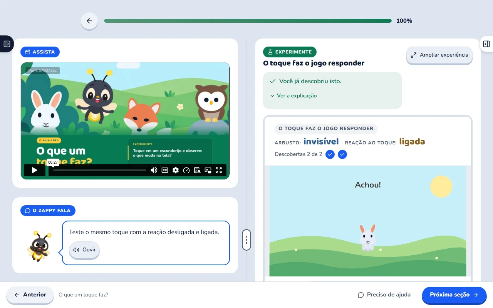
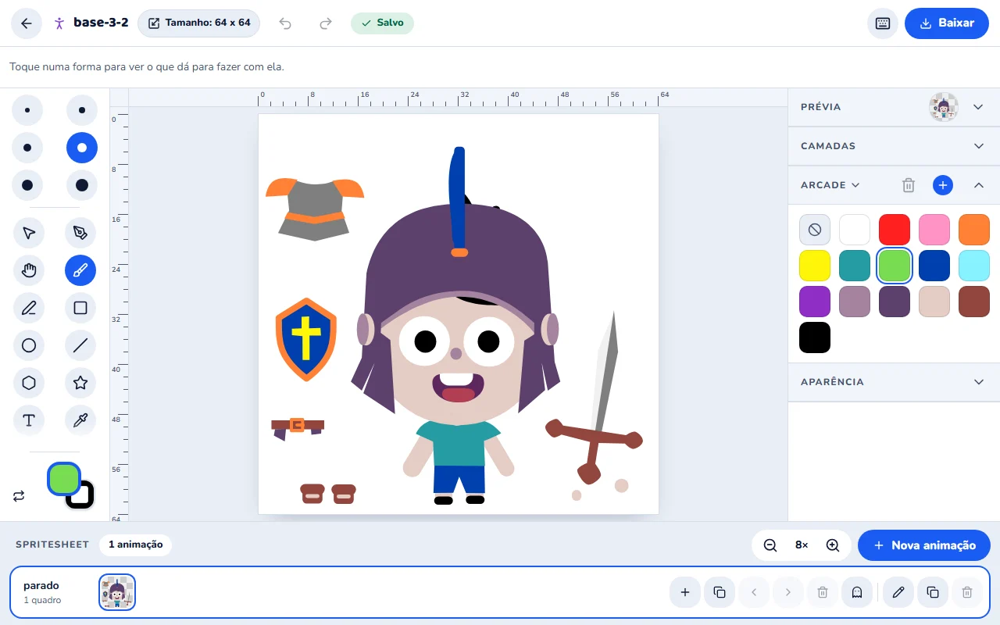
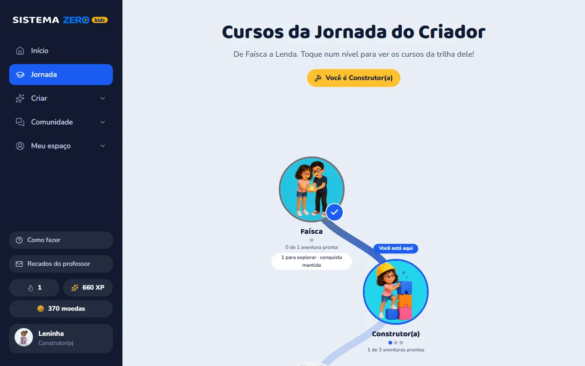

# Respostas práticas e demonstrações da Comunidade

Revisão de 01/10/2026. Complemento das [quatro páginas](copy/README.md) e do [roteiro visual por seção](roteiro-visual-e-cobertura.md). As respostas estão completas nos arquivos de copy; este documento orienta sua apresentação e suas provas. Nenhuma nova captura de staging foi feita nesta revisão.

## Uma pergunta, uma preocupação, uma explicação

Programar e desenhar exigem respostas distintas. Para começar a programar, a criança encontra montagem guiada, explicação e teste. Para criar jogos sem saber desenhar, encontra elementos preparados; o Pinta oferece outra possibilidade quando quer trabalhar a própria arte. Usar uma única resposta para as duas perguntas escondia esses mecanismos.

O mesmo critério separa certificado de compreensão, salvamento de exportação, atendimento de recuperação de senha, perfil de jogo público e cancelamento de reembolso. Duas perguntas podem ser próximas no assunto e ainda precisar de respostas próprias.

O título público passou a ser **“Mais sobre a experiência do seu filho”**. Ele convida a conhecer o produto pela perspectiva da família. Os nomes dos grupos também descrevem assuntos que o responsável procura, em vez de explicar nossa finalidade comercial.

As 40 respostas estão em cada página, organizadas por assunto. As seis primeiras mudam conforme o perfil; o conteúdo factual de cada resposta permanece igual. Cada pergunta tem uma âncora estável `duvida-...`, independente da posição. Isso permite reordenar sem perder a ligação com a prova.

Uma resposta educativa pode precisar de vários parágrafos: responder, explicar o mecanismo, dar um exemplo e mostrar o papel da criança. Uma instrução como recuperar a senha precisa de um caminho claro. A extensão acompanha o que falta compreender; não existe uma contagem fixa de frases.

## Prioridade conforme o motivo da visita

| Página | Primeiras seis respostas | Motivo da ordem |
| --- | --- | --- |
| A, padrão | Tempo de tela; compreensão; aula gravada; papel do responsável; ajuda; interesse. | Explicar como uma atividade de criação cabe na rotina e pode ser acompanhada. |
| B, jogos | Programação inicial; nível; Roblox Studio; ajuda; desenho; liberação. | Tornar claros o começo, a ferramenta ensinada e o apoio para construir. |
| C, expressão visual | Interesse apenas em desenho; habilidade de desenho; ideia no papel; programação inicial; liberação; ajuda. | Mostrar a ligação entre arte e interação, com o começo real do percurso. |
| D, formação | Cursos incluídos; compreensão; programação inicial; nível; aula gravada; certificado. | Permitir avaliar conteúdo disponível, prática, adequação e acompanhamento. |

Os critérios decisivos continuam desenvolvidos no corpo principal. As perguntas permitem aprofundar ou localizar uma resposta, sem obrigar a família a ler outras páginas.

## Como colocar a prova junto da resposta

Na implementação, usar os componentes existentes de imagem ampliável e acordeão. A resposta deve começar pelo texto direto. A imagem ou sequência entra logo depois da explicação à qual se refere, com uma legenda curta sobre a ação visível.

- Para localizar um recurso, um print legível pode bastar: o botão de ajuda, por exemplo.
- Para demonstrar uma passagem, usar duas ou três capturas do mesmo projeto ou uma gravação curta: desenho no Pinta, importação e uso no Estúdio.
- Para demonstrar efeito, mostrar a ação e o resultado: regra alterada e comportamento correspondente.
- Para falar de compreensão ou autonomia, acrescentar observação real de uso, com tarefa e apoio registrados. Um print da interface não comprova aprendizagem.

Quando o visual já estiver no corpo da página, o FAQ pode oferecer um recorte ou acesso à demonstração correspondente, preservando a resposta escrita no próprio lugar. Não repetir uma tela inteira quarenta vezes. Os grupos e a abertura dos acordeões devem permitir localizar assuntos mantendo a identidade visual local.

**Situação das provas:** V01–V18 são roteiros de captura, definidos no documento visual principal. “Parcial” abaixo significa que existe um arquivo inspecionado útil para uma parte da explicação; não significa que a sequência foi executada. “Capturar” indica material ainda necessário. As legendas propostas só devem ser usadas quando corresponderem ao conteúdo capturado.

## Mapa de dúvidas, telas e legendas

Os links abrem a resposta na página A. A mesma âncora existe em B, C e D, com o mesmo conteúdo factual. Os recursos R remetem ao [inventário da plataforma](inventario-plataforma.md).

### Começo e aprendizagem

| Âncora / preocupação | O que mostrar junto da explicação | Legenda proposta | Situação / base |
| --- | --- | --- | --- |
| [programacao](copy/pagina-a-tempo-de-tela.md#duvida-programacao): começar sem experiência | Aula de entrada, comando apresentado, ação executada e resultado. Identificar o que já veio preparado. | A aula mostra o passo; a criança monta a instrução e confere o efeito. | V01–V02. Aula existente parcial; capturar editor real. R06–R13, R21–R23. |
| [desenho](copy/pagina-a-tempo-de-tela.md#duvida-desenho): criar sem saber desenhar | Seleção de um elemento preparado e uso no projeto. Como complemento, uma escolha de cor no Pinta. | Um personagem preparado permite começar pelas regras do jogo. | Capturar V01/V05. A galeria do Pinta não demonstra a seleção de elementos prontos do Estúdio. R23, R31–R37. |
| [aulas-gravadas](copy/pagina-a-tempo-de-tela.md#duvida-aulas-gravadas): acompanhar a orientação | Pausa no vídeo, ação correspondente, revisão do trecho e continuação. | Pausar a explicação dá tempo para executar e conferir cada passo. | V03. Controles visíveis na aula existente; sequência pendente. R07–R14. |
| [ajuda](copy/pagina-a-tempo-de-tela.md#duvida-ajuda): travar numa atividade | “Preciso de ajuda”, pedido com contexto e consulta da conversa nos Recados. | A dúvida parte da atividade, e a conversa fica disponível nos Recados. | V04. Entrada visível; conversa de teste a capturar. R19, R58. |
| [pais](copy/pagina-a-tempo-de-tela.md#duvida-pais): participar sem saber programação | Orientação da aula e painel com uma produção correspondente. | Você localiza uma criação para conhecer e conversar com seu filho. | V01/V09; painel a capturar. Observar apoio inicial para relato de autonomia. R70, R73–R77. |
| [aprendizagem](copy/pagina-a-tempo-de-tela.md#duvida-aprendizagem): reconhecer compreensão | Tema no painel, regra no projeto e resultado de uma alteração. | Uma escolha pode ser mostrada no comando e conferida no jogo. | V02/V09 a capturar. Compreensão exige explicação observada da criança. R10–R12, R73–R77. |
| [interesse](copy/pagina-a-tempo-de-tela.md#duvida-interesse): desistência anterior | Uma tarefa inicial completa, com os caminhos de revisão e ajuda. | Conhecer uma atividade ajuda a conversar sobre o que a criança quer experimentar. | V01/V03/V04. Sem imagem prometendo retenção. R06–R19. |
| [so-desenho](copy/pagina-a-tempo-de-tela.md#duvida-so-desenho): interesse exclusivamente artístico | Mesmo personagem no Pinta e depois com uma regra no Estúdio. | A proposta reúne a criação da aparência e a construção da interação. | Capturar V05–V06. R21–R22, R31–R37. |
| [papel](copy/pagina-a-tempo-de-tela.md#duvida-papel): aproveitar uma ideia do caderno | Referência em papel, versão digital feita pela equipe e regra construída. Identificar como demonstração. | A ideia do papel pode orientar a arte digital; as interações são construídas no Estúdio. | Capturar V05–V06. Sem montagem que sugira conversão automática. R31–R37. |
| [nivel](copy/pagina-a-tempo-de-tela.md#duvida-nivel): criança que já programa | Atividade real de entrada, curso publicado e requisito de um recurso posterior. | O projeto de entrada mostra o ponto de partida do percurso. | V01/V08/V18. Catálogo atual a capturar. R04–R05, R82. |
| [roblox](copy/pagina-a-tempo-de-tela.md#duvida-roblox): expectativa de outra ferramenta | Interface real do Estúdio e seu projeto, com nome legível. | As primeiras construções acontecem no Estúdio da Comunidade. | Capturar V01–V02. Não usar Roblox como imagem de uma entrega que não é oferecida. R21. |
| [apoio-especifico](copy/pagina-a-tempo-de-tela.md#duvida-apoio-especifico): avaliar adequação | Leitura e controles de uma atividade; demonstrar apenas os apoios disponíveis nela. | A tarefa mostra a leitura, os controles e as ações que a criança precisa acompanhar. | V01/V18; avaliação individual depende da necessidade. R07–R18, R85. |

### Recursos e continuidade

| Âncora / preocupação | O que mostrar junto da explicação | Legenda proposta | Situação / base |
| --- | --- | --- | --- |
| [catalogo](copy/pagina-a-tempo-de-tela.md#duvida-catalogo): o que está incluído hoje | Lista de cursos publicados e incluídos, acessada como assinante. | Estes são os cursos disponíveis nesta demonstração. | Capturar V18 e datar a conferência editorial. Não usar contagem interna de roteiros. R82. |
| [liberacao](copy/pagina-a-tempo-de-tela.md#duvida-liberacao): ferramentas no primeiro dia | Recurso na aula, requisito na Jornada e acesso livre após cumprir o marco. | A atividade guiada vem primeiro; a Jornada indica o acesso às ferramentas livres. | V08. Print atual da Jornada precisa ser substituído para provar o caminho de avanço. R04–R05, R24, R76. |
| [ia](copy/pagina-a-tempo-de-tela.md#duvida-ia): autoria da criança | Decisão fornecida no Pensa; orientação do Zappy; alteração feita pelo usuário; teste. | A ajuda organiza e explica; a criança decide, constrói e confere. | Capturar V14. Identificar demonstração da equipe; não inferir autoria de aluno. R41–R47. |
| [pensa](copy/pagina-a-tempo-de-tela.md#duvida-pensa): entender o planejamento | Pergunta sobre a ideia, resposta da criança, escolha confirmada, tarefas e abertura da ferramenta. | O Pensa ajuda a transformar as escolhas sobre o jogo em um plano de criação. | Capturar V14 em acesso elegível. Não apresentar sugestões geradas como decisões já feitas pela criança. R41–R45. |
| [zappy](copy/pagina-a-tempo-de-tela.md#duvida-zappy): entender a ajuda contextual | Bloco e dúvida no Estúdio, resposta contextual, usuário fazendo o ajuste e testando. | O Zappy explica uma dificuldade; a criança faz o ajuste e testa. | Capturar V14. O balão “O Zappy fala” da aula não comprova esse recurso. R46–R47. |
| [creditos](copy/pagina-a-tempo-de-tela.md#duvida-creditos): limite de uso da IA | Saldo e informações de uso na área do responsável. | Os créditos dos recursos de inteligência artificial são compartilhados pela família. | Capturar V14 com dados de teste. R47. |
| [planejamento](copy/pagina-a-tempo-de-tela.md#duvida-planejamento): planejar em conjunto | Convite, participantes e plano compartilhado no Pensa; ferramentas individuais identificadas. | Duas crianças podem compartilhar o plano e trabalhar nas próprias ferramentas. | Capturar V14. Não sugerir coedição do jogo. R45. |
| [3d](copy/pagina-a-tempo-de-tela.md#duvida-3d): acesso ao Molda | Requisito, nível da conta e criação em três dimensões na ferramenta. | O acesso ao Molda acompanha os requisitos da Jornada. | Capturar V15 se o percurso estiver alcançável; caso contrário, explicar a pendência de publicação. R38–R40. |
| [codigo](copy/pagina-a-tempo-de-tela.md#duvida-codigo): continuidade para código | Marco correspondente e relação entre blocos e código no projeto. | Etapas posteriores apresentam a relação entre blocos e código. | Capturar V15 sob as mesmas condições de disponibilidade. R29–R30. |
| [desafio](copy/pagina-a-tempo-de-tela.md#duvida-desafio): continuar o que começou | Conta de teste que fez o Desafio, progresso registrado e próximo requisito. | A mesma conta mantém o ponto registrado no percurso. | Capturar V03/V08. R87. |
| [certificado](copy/pagina-a-tempo-de-tela.md#duvida-certificado): conclusão documentada | Curso que oferece certificado, requisitos cumpridos e documento de teste. | O certificado registra a conclusão deste curso. | Captura específica ligada a V18; não usar diploma ilustrativo. R20. |
| [custos](copy/pagina-a-tempo-de-tela.md#duvida-custos): compra separada de ferramentas | Planos, recursos incluídos e marcos de liberação; créditos em detalhe separado. | As ferramentas estão incluídas; o acesso segue a Jornada. | V08/V14/V17. Condições comerciais governam a resposta. R24, R47, R79–R82. |

### Uso no dia a dia

| Âncora / preocupação | O que mostrar junto da explicação | Legenda proposta | Situação / base |
| --- | --- | --- | --- |
| [telas](copy/pagina-a-tempo-de-tela.md#duvida-telas): tempo já permitido | Aula pausada para executar uma tarefa; mostrar o uso, sem inventar controle parental de duração. | A atividade pode ser organizada dentro do tempo combinado pela família. | V01/V03. Print demonstra recurso; duração é decisão familiar. R07–R14. |
| [equipamento](copy/pagina-a-tempo-de-tela.md#duvida-equipamento): computador necessário | Aula e ferramenta no navegador de um computador, com controles legíveis. | A criação usa computador, navegador, mouse e teclado. | V01. Não inferir requisitos mínimos de hardware por um print. R83. |
| [internet](copy/pagina-a-tempo-de-tela.md#duvida-internet): perda de conexão | Aviso de falha/local, reconexão e confirmação de sincronização em teste controlado. | Confira o salvamento na conta quando a conexão voltar. | Capturar V16. Não simular texto de erro numa imagem. R26–R27, R84. |
| [salvamento](copy/pagina-a-tempo-de-tela.md#duvida-salvamento): retomar a criação | Aviso, projeto na galeria, saída e reabertura da mesma versão. | A criação guardada na conta pode ser aberta para continuar. | V16. Pinta existente mostra galeria e aviso, mas falta executar retomada. R14, R26–R27, R36. |
| [exportacao](copy/pagina-a-tempo-de-tela.md#duvida-exportacao): baixar um arquivo | Opções reais de exportação e reabertura de um arquivo compatível. | O formato escolhido define como a cópia pode ser usada. | Capturar V16. Nomear os formatos efetivamente disponíveis. R27, R36. |
| [ferias](copy/pagina-a-tempo-de-tela.md#duvida-ferias): pausa na rotina | Configuração de férias e mensagem sobre a sequência de participação. | O modo férias protege a sequência de participação, sem suspender o plano. | Captura específica, R68. Conferir mensagem e contrato; recurso não pausa cobrança. |
| [pontos](copy/pagina-a-tempo-de-tela.md#duvida-pontos): frequência e conquistas | Missão/conquista com requisito visível e um projeto da conta de teste. | Pontos registram participação; os projetos permitem conhecer o trabalho. | V12. Perfil existente parcial; não prova aprendizagem nem adesão. R63–R69. |

### Participação e família

| Âncora / preocupação | O que mostrar junto da explicação | Legenda proposta | Situação / base |
| --- | --- | --- | --- |
| [irmaos](copy/pagina-a-tempo-de-tela.md#duvida-irmaos): dois perfis | Seleção de duas crianças de teste e projetos/progresso distintos. | Cada criança tem seu perfil, seus projetos e seu progresso. | Capturar V13. R71–R73. |
| [perfil](copy/pagina-a-tempo-de-tela.md#duvida-perfil): controle de visibilidade | Configuração na área do responsável, estado inicial e efeito na visão de outro perfil. | O responsável administra a visibilidade do perfil para os colegas. | Capturar V11. Print do perfil infantil não demonstra o controle parental. R57, R72. |
| [jogos-publicos](copy/pagina-a-tempo-de-tela.md#duvida-jogos-publicos): alcance de um link | Publicação de teste e link aberto fora da sessão, mostrando os controles do jogo. | O link de um jogo publicado tem visibilidade pública própria. | V10. Mural existente parcial; abertura externa pendente. R28, R49–R50. |
| [convivencia](copy/pagina-a-tempo-de-tela.md#duvida-convivencia): avisar sobre um problema | Combinados abertos, localização do aviso à equipe e caminho de uso, sem enviar denúncia real. | Os combinados orientam a participação, e a criança tem um caminho para avisar a equipe. | Capturar V11. Clube existente não demonstra a operação da moderação. R53–R55. |
| [indicacao](copy/pagina-a-tempo-de-tela.md#duvida-indicacao): convite a outra família | Área de indicação, link e condições vigentes. | O convite segue as condições apresentadas no programa de indicações. | Captura específica, R88. Confirmar campanha; sem benefício inventado. |

### Conta e assinatura

| Âncora / preocupação | O que mostrar junto da explicação | Legenda proposta | Situação / base |
| --- | --- | --- | --- |
| [atendimento](copy/pagina-a-tempo-de-tela.md#duvida-atendimento): falar com a equipe | Entrada do atendimento do responsável e conversa de teste. | O atendimento da família reúne dúvidas sobre conta e assinatura. | Captura específica, R78. Não enviar mensagem real para obter um print. |
| [senha](copy/pagina-a-tempo-de-tela.md#duvida-senha): recuperar acesso | Opção de recuperação na tela de entrada. | A recuperação de senha começa na tela de entrada. | Captura específica, R90. Sem expor e-mail, token ou link de recuperação. |
| [cancelamento](copy/pagina-a-tempo-de-tela.md#duvida-cancelamento): próxima renovação | Minhas compras e opção de gestão da assinatura, sem cancelar uma compra real. | A próxima renovação pode ser cancelada em Minhas compras. | Capturar V17. R79–R80. |
| [reembolso](copy/pagina-a-tempo-de-tela.md#duvida-reembolso): acionar a garantia | Canal e condições indicados nos termos da oferta real. | O pedido de reembolso segue o canal indicado nos termos da assinatura. | V17 e termos. Um print de cancelamento não comprova reembolso. R81. |

## Imagens existentes: o que foi realmente inspecionado

Foram abertos nove arquivos de tamanho padrão. As versões `@2x` não foram comparadas nesta revisão. A inspeção foi dos arquivos locais, sem verificar correspondência com uma sessão atual de staging.

| Arquivo | O que aparece | Uso e limite encontrados |
| --- | --- | --- |
| `tela-aula-topo.webp` | Vídeo, texto/áudio, experimento, navegação e entrada de ajuda. | Útil para orientar o olhar na aula. Não mostra editor de blocos, conversa de ajuda nem uso independente por criança. Conferir identificador de perfil presente no vídeo antes do uso público. |
| `tela-aula.webp` | Recorte de vídeo, explicação, experimento de toque e botão de ajuda. | Complementa o detalhe da atividade. Estado final estático não demonstra toda a sequência de ações. |
| `tela-pinta.webp` | Galeria com tipos de arte, duas criações e aviso “Guardado na sua conta”. | Serve para organização das produções. Não mostra desenho no editor, animação, importação para o Estúdio ou persistência entre sessões. |
| `tela-jornada.webp` | Mapa, perfil no posto Construtor e contagens de atividades. | Há “0 de 1 aventura pronta” e “conquista mantida” em uma etapa. Substituir para demonstrar avanço normal e catálogo atual; esse estado não comprova a sequência de liberação do assinante. |
| `tela-mural.webp` | Cartões de projetos, autores, contagens e botões para jogar. | Útil para explicar a vitrine. Não prova publicação pela criança, comunidade ativa, abertura externa nem autorização de uso dos nomes. |
| `tela-clube.webp` | Canais, botão Combinados e estado “Nenhuma conversa ainda”. | Não demonstra conversa nem moderação. A imagem contém “O professor acompanha todas as conversas”, afirmação operacional mais ampla do que a copy assume. Confirmar a operação e atualizar a captura/interface conforme o serviço real antes de usá-la como prova. |
| `tela-meu-espaco.webp` | Perfil, avatar, marcos e referência a “1º lugar no ranking de 1”. | Mostra parte do espaço pessoal; não mostra quarto, controles do responsável nem comunidade numerosa. Substituir quando a intenção for demonstrar esses recursos. |
| `preview-estudio.webp` | Composição ilustrada de blocos, elementos e uma nave. | É ilustração, inadequada como print de funcionamento do Estúdio. |
| `preview-regra.webp` | Composição ilustrada de pontuação e blocos. | Pode ilustrar uma ideia, mas não comprova o efeito de uma regra no produto real. |

### Aula: referência visual parcial

**O que já permite explicar:** onde a criança encontra orientação, experimento e entrada de ajuda. **O que falta:** a sequência de pausar, executar, rever e enviar uma dúvida de teste. O balão “O Zappy fala” desta aula não é a demonstração do assistente com inteligência artificial no Estúdio.

### Pinta: galeria, sem demonstração do editor

**O que já permite explicar:** trabalhos organizados na galeria e um aviso de salvamento. **O que falta:** escolher uma cor, editar o personagem, preparar a arte e levá-la ao Estúdio. Essas ações precisam ser mostradas para sustentar a promessa da página C.

### Jornada: estado a substituir na prova de progressão

**O que já permite explicar:** existe um mapa do percurso. **O que falta:** uma conta de aluno com estado representativo do catálogo publicado, mostrando requisito e liberação após cumpri-lo. A captura atual não deve ser tratada como prova de que todas as etapas estão disponíveis.

## A prova da inteligência artificial precisa mostrar quem faz cada parte

O argumento educativo está no corpo de todas as páginas e em três respostas próprias: papel da IA, Pensa e Zappy. A demonstração deve tornar visíveis as escolhas e ações do usuário.

No **Pensa**, registrar a pergunta sobre uma ideia, a resposta fornecida ou alternativa escolhida, a confirmação da decisão e a organização em tarefas. Mostrar ao menos uma tarefa aberta na ferramenta correspondente. Se a equipe produzir a demonstração, identificá-la assim. As instruções do produto preservam as decisões da criança, mas isso não é evidência de que todo uso real terá a mesma qualidade.

No **Zappy**, mostrar a dúvida junto do projeto, a orientação recebida e a mudança feita pelo usuário. A implementação é de consulta e orientação: referências podem apontar blocos, aulas e tutoriais, sem o assistente editar o projeto. Esse fato sustenta a distinção entre receber ajuda e realizar a construção.

Fontes locais conferidas: [regras de conversa e escolhas do Pensa](../../../../packages/member-shell/src/server/pensa-agents/stage-z.ts), [planejamento e tarefas](../../../../packages/pensa/src/core/types.ts), [documentação do Zappy no Estúdio](../../../../packages/studio/docs/zappy.md), [painel do assistente](../../../../packages/studio/src/components/tutor/ZappyPanel.tsx) e [contexto das respostas](../../../../packages/member-shell/src/server/zappy-ai.ts). Disponibilidade, créditos, qualidade das respostas e sequência de uso ainda precisam da conferência de staging prevista.

## Ordem de produção das novas provas

Priorizar a aula real com tarefa e revisão, o caminho Pinta → Estúdio, a ajuda pelos Recados, o painel do responsável e o catálogo/Jornada. São as demonstrações que sustentam as promessas principais das quatro páginas. Depois, registrar Pensa/Zappy, salvamento, publicação e os controles da família. As telas operacionais acompanham as respectivas respostas práticas.

Conservar o mesmo projeto nas passagens entre ferramentas sempre que ele servir ao argumento. Mostrar a etapa da conta e distinguir o que já veio preparado. Se uma imagem não corresponder ao que a frase diz, mudar a imagem ou a frase antes de publicar. A aparência de um print não substitui a ação que precisa ser comprovada.
