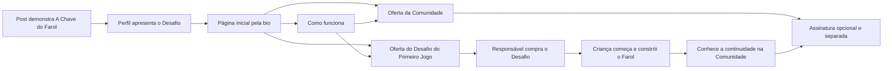

# Proposta de melhoria do Instagram: Desafio do Primeiro Jogo e continuidade na Comunidade

**Data:** 08/10/2026. **Estado:** proposta aprovada e incorporada aos documentos de execução do Instagram. As publicações continuam em preparação; esta tarefa não aplicou mudanças na conta nem publicou materiais. Este arquivo preserva a fundamentação da decisão, não é outra fonte de copy final.

**Escopo confirmado pelo responsável:** nas redes sociais, com foco no Instagram, o **Desafio do Primeiro Jogo** é o primeiro passo e o principal exemplo de aprendizagem. O projeto demonstrado é **A Chave do Farol**. A Comunidade dos Criadores aparece como continuidade. O destaque **Projetos** apresenta todos os jogos existentes: **A Chave do Farol, Cadê Todo Mundo?, Nave Contra Asteroides e Corre Dino**, ampliando o catálogo a cada novo projeto. A orientação mais recente do responsável inclui o Cadê nessa apresentação; sua campanha de entrada continua reservada aos casos presenciais específicos.

**Direção pedagógica confirmada pelo responsável:** as diretrizes das aulas também orientam as copies de marketing desta proposta. Preservar o método apresentado, o raciocínio concreto, a conversa contínua e a ligação entre fala e demonstração. A aplicação ao marketing está detalhada na seção 2 e nos exemplos revisados da seção 6; as regras pedagógicas continuam tendo sua fonte nos documentos das aulas.

Base: [pesquisa e evidências](pesquisa-evidencias-2026-10-08.md), documentos atuais do Instagram, posicionamento e produto local. Este documento concentra o diagnóstico e as recomendações que orientaram a revisão. A execução e as copies finais estão no [guia principal](../README.md), em [Destaques](../01-destaques.md), [Fixados](../02-fixados.md), [Postagens](../03-postagens.md) e [Links e publicação](../apoio/links-e-publicacao.md).

**Revisão posterior de linguagem:** o responsável pediu textos que uma criança de 10 anos consiga entender, mantendo a conversa com os pais. Os guias de execução foram reescritos por inteiro na copy pública: cenas concretas, explicação curta dos nomes necessários e frases ligadas entre si. Depoimentos literais e condições das ofertas foram preservados. Os exemplos antigos neste documento registram a proposta inicial; para produzir, usar a versão atual dos guias.

## Complementos incorporados durante a aplicação

- Posicionamento, bio e orientações de produção foram substituídos no guia principal. Desafio e Farol conduzem a entrada; a Comunidade é continuidade opcional e separada. Na decisão posterior sobre os links, o responsável aprovou a página inicial na bio, com Como funciona, oferta do Desafio e oferta da Comunidade. Os quizzes ficam para campanhas específicas. A aplicação inclui os botões no código local do funil e a atualização dos convites do Instagram. Em seguida, os textos dos botões foram encurtados a pedido do responsável: nome da opção, uma frase de apoio e a condição essencial da contratação. A versão final está no guia principal.
- A ordem dos destaques é viva. Atualizações podem trazer Projetos, Alunos, Avaliações e Dúvidas para a frente; Como funciona e Sobre nós podem ficar ao final. Os três fixados orientam quem chega, e as copies indicam os destaques pelo nome.
- Alunos e F02 começam com vídeos reais de Rafael, Jeffrey, Débora e André fazendo atividades na Comunidade. O destaque Alunos recebe novos registros ao longo do tempo; sua abertura não enumera nomes nem fixa uma quantidade de participantes. Cada criança permanece identificada no próprio vídeo. O foco é participação e reações, sem tornar a identificação técnica do curso o assunto principal.
- Avaliações recebe relatos de crianças, adultos e responsáveis. A primeira seleção usa as falas de Rafael, Débora e André autorizadas pelo usuário, que confirmou o teste da experiência do Farol e a reafirmação dos relatos. Não mencionar uma experiência anterior na copy pública. Do Rafael, usar o trecho literal sobre compartilhar o link, sem a referência à nave.
- Débora e André são filhos de Helena e Júlio, conforme confirmação do usuário. O vínculo aparece junto dos vídeos e das falas.
- Projetos é o catálogo vivo dos quatro jogos, com o Farol identificado como primeiro projeto. Por orientação posterior do responsável, cada projeto tem duas cartelas: montagem com dois momentos da partida, com pelo menos uma imagem do jogo em andamento; depois, um recorte dos blocos no Estúdio ligado às habilidades praticadas. No Farol, a imagem final mostra o barco já na costa e o farol aceso. Quando houver telas de abertura e encerramento, escolher apenas uma delas para acompanhar a ação; a Nave e o Dino mostram uma cena em andamento junto da tela final. O catálogo inicial tem oito telas, e novos projetos seguem esse formato com copy completa. As legendas dos vídeos de Alunos variam entre aprender, explorar, personalizar e testar conforme a ação visível.
- A aplicação entrega 12 posts, incluindo três fixados, e 12 sequências de stories com 59 telas. Dessas, 50 formam os seis destaques; nove são aprofundamentos do ciclo. Todos os textos públicos estão escritos nos guias, com uma fonte de manutenção por peça.

As tabelas de diagnóstico abaixo registram a situação observada antes da aplicação. Para produzir, usar os guias vigentes, já atualizados com os complementos acima. As versões anteriores dos guias estão no [histórico](../historico/2026-10-08-antes-do-desafio/README.md).

## 1. Recomendação central

**Apresentar o Desafio do Primeiro Jogo como primeiro passo, demonstrando A Chave do Farol, e conectar essa experiência à continuidade na Comunidade.** A primeira visita deve permitir ao responsável entender o que a criança aprende, enxergar como isso acontece e encontrar o caminho para conhecer e contratar o Desafio.

A frase atual continua adequada para a visão de continuidade:

> Seu filho aprende criando jogos, da primeira experiência às próprias ideias.

No primeiro contato, essa visão ganha um exemplo concreto no Farol: a experiência que torna um conceito novo concreto, a orientação da montagem, o teste no jogo e uma escolha que a criança possa explicar. Helena e Júlio narram situações reais e explicam o porquê do que aparece. Os recursos da Comunidade entram ao apresentar o que pode vir depois desse começo.

O plano tem uma base editorial consistente. O principal ajuste é de **ordem, quantidade de informação e conexão com a entrada no produto**. Ainda não há resultados das novas publicações que permitam diagnosticar baixa conversão ou alcance.

## 2. O que preservar e o que melhorar

Preservar a voz de Helena e Júlio, a comunicação com o adulto, a faixa de 9 a 14 anos, o respeito ao tempo combinado em família, a defesa concreta das aulas gravadas, os seis destaques e a distinção entre demonstração da equipe e experiência de aluno. A jornada continua visível, com a prioridade de entrada agora definida pelo responsável: o Desafio do Primeiro Jogo.

| Prioridade | Situação atual e evidência | Problema provável | Mudança proposta |
| --- | --- | --- | --- |
| Alta | “Como funciona” tem 20 unidades e três títulos, com possíveis desdobramentos em telas [L03]. | Exige bastante atenção para conhecer a experiência inteira. É uma hipótese de fricção, não abandono medido. | Fazer as primeiras oito telas contarem uma história completa, com aprofundamentos depois. |
| Alta | O ciclo explica comandos, IA, postos e continuidade comunitária em F07, F08, F09 e F12; a demonstração comparável de F10 chega na quarta semana [L04]. | A apresentação de recursos compete com o interesse inicial pela atividade. | Trazer a comparação para a primeira semana, usando a posição da chave no Farol; adiar F08/F09 e mostrar uma decisão por vez. |
| Alta | F01 prevê 75–90 segundos; seis dos sete Reels começam em 55 segundos ou mais [L04]. | Há poucas oportunidades de entrada com uma ideia visual simples. | Testar Reels de descoberta com 20–35 segundos e manter explicações mais longas quando necessárias. As durações são propostas de edição. |
| Alta | Bio leva à página geral; já existem oferta e quiz próprios do Desafio [L09, L12]. | O convite pode diluir o primeiro passo escolhido pelo responsável. | Priorizar a oferta do Desafio na bio e nas peças sobre o Farol. Reservar o quiz para convites de orientação e a Comunidade para continuidade. |
| Alta | Tabela de disponibilidade e seleção dos registros de alunos estão pendentes [L05]. | Uma gravação de equipe pode parecer representar acesso imediato ou resultado de aluno. | Produzir a partir de contas e materiais correspondentes à oferta mostrada. Não fazer o lançamento depender de ferramentas avançadas. |
| Média | “Verificar esta etapa” está nos guias, mas a interface infantil usa “Verificar esta parte” [L08]. | Narração e captura podem divergir. | Atualizar as referências na futura revisão e gravar a interface atual. |
| Média | O novo calendário começa em 05/10, mas o ciclo ainda não começou [L01]. | As datas deixam de orientar uma produção realista. | Usar quatro semanas a partir do início efetivo, sem acumular posts para compensar datas passadas. |
| Média | Já há medição de conteúdo e funil, mas a ligação entre origem, compra e uso ainda precisa ser conferida [L09]. | Cliques e visitas, isoladamente, não mostram compra nem realização do Desafio. | Acompanhar visitas à oferta, compra do Desafio, início e conclusão; ler assinatura da Comunidade como continuidade separada. |

Correção editorial pequena: em “Sobre nós”, o bastidor remete a F12, enquanto o bastidor do casal está em S12. Corrigir a referência ao incorporar a proposta.

### Diretrizes pedagógicas aplicadas à comunicação

Fontes: [Diretrizes Pedagógicas](../../../../../aulas-interativas/DIRETRIZES-PEDAGOGICAS.md), especialmente as seções 1, 2, 3 e 6; [especificação do roteiro](../../../../../aulas-interativas/ESPEC-ROTEIRO.md); [módulos do Desafio](../../../../../aulas-interativas/modulos-desafio-primeiro-jogo.md); e roteiros do Farol para [movimento](../../../../../aulas-interativas/aulas/desafio-dia-1.roteiro.md), [coleta e memória](../../../../../aulas-interativas/aulas/desafio-dia-2.roteiro.md) e [condição e personalização](../../../../../aulas-interativas/aulas/desafio-dia-3.roteiro.md). As decisões vigentes nas Diretrizes prevalecem sobre exemplos antigos. Esta tabela registra sua aplicação editorial, sem criar outra versão das regras das aulas.

**Isso vale para toda a copy:** bio, capas, falas, slides, legendas, stories, respostas e convites. Cada formato desenvolve o que cabe no seu propósito; um post pode mostrar um recorte da aprendizagem, desde que preserve o contexto e não apresente esse recorte como toda a aula.

| Princípio das aulas | Aplicação na copy e na produção de marketing |
| --- | --- |
| Contexto antes da ação; uma ideia por parte | Situar o jogo e a mudança mostrada antes de apontar uma ferramenta. Dar a cada peça uma ideia compreensível; trocar o tour de recursos por uma situação concreta. |
| Experiência antes da montagem de um conceito novo | Quando explicar o método, mostrar que a criança primeiro observa e manipula a relação e depois a aplica nos blocos. Um corte que mostra só o resultado deve ser identificado como demonstração, sem sugerir descoberta sem orientação. |
| Explicar enquanto demonstra, ligando efeito e causa | A fala acompanha o gesto e diz por que o resultado ocorreu. Na demonstração da equipe, usar “eu” para o gesto de quem grava; identificar o registro como demonstração da equipe. |
| Conversa contínua e atenção ligada à tela | Ligar as frases pelo raciocínio, com “porque”, “por isso”, “depois” e outras conexões naturais. “Olha aqui” exige uma referência visível; “olha só” acompanha um resultado novo. Evitar sequência de frases soltas e chamados repetidos. |
| Instrução completa, no ritmo de quem acompanha | Se a peça ensinar uma ação executável, conservar os passos necessários, o destino do encaixe antes da peça e o teste. Para um vídeo mais curto, reduzir o assunto ou usar um trecho demonstrativo identificado; não acelerar os gestos nem vender o resumo como instrução suficiente para executar a montagem. |
| Construção guiada, experimentação e escolha têm momentos próprios | Na demonstração, distinguir comparação na experiência, montagem orientada e personalização que fica no projeto. Mostrar a liberdade que aquela etapa permite, sem atribuir escolha livre a todo passo obrigatório. |
| Autoria fiel ao que a criança fez | No Farol, cenário, desenhos e movimento do barco vêm preparados; a criança programa movimento, coleta, memória e respostas da porta. Ao personalizar, escolhe artes disponíveis e escreve avisos. Não atribuir a ela o desenho das artes prontas ou a animação do barco. |
| Correção como parte do aprendizado | Mostrar tentativa, orientação, ajuste e novo teste quando correspondam ao caso real. A verificação confere critérios configurados; um jogo funcionando ou um certificado, isoladamente, não comprova compreensão de todos os conceitos. |
| Conquista concreta e próximo passo real | Reconhecer o que foi feito e ligar o convite ao assunto apresentado. Preservar a surpresa onde ela existe no curso, sem inventar segredos, recompensas ou suspense como regra de marketing. |
| Vocabulário e interlocutor claros | No marketing, falar com o responsável usando “você” e “seu filho”; “a gente” para a voz de Helena e Júlio. Curso e aula continuam adequados ao adulto. Em capturas e trechos dirigidos à criança, manter aventura, fase, parte, Mapa da Aventura e os rótulos reais. |
| Escolhas opcionais como convite | Oferecer o próximo passo com clareza e utilidade, sem acrescentar ordens sobre o que a família não precisa fazer. Uma condição real de acesso continua explícita onde afeta a decisão. |

As regras comerciais de voz continuam válidas, incluindo a abertura afirmativa e a pontuação do marketing. Trechos literais das aulas conservam seu contexto e sua voz; o convite comercial é dirigido ao adulto, fora da fala de celebração da criança.

**Conferência de cada peça:** quem está falando e com quem; qual conceito ou conquista está sendo mostrado; que orientação veio antes; o que a criança efetivamente faz; por que o resultado acontece; qual liberdade e ajuda existem; e se o próximo passo corresponde ao conteúdo. Toda indicação de duração nesta proposta fica subordinada à clareza da fala e ao tempo de observar a ação.

## 3. Posicionamento: tornar a diferença visível

Criar jogos, desenhar personagens e compartilhar projetos são argumentos presentes em outras ofertas. O [Scratch](https://www.scratchfoundation.org/home) oferece criação e comunidade gratuitamente; o [Tynker](https://www.tynker.com/parents/pricing/index.php) apresenta cursos autoguiados e progressão. Isso enfraquece alegações de exclusividade baseadas apenas nessas características.

O território a desenvolver é **a passagem orientada entre aprender uma regra e usá-la numa criação**, com a família conseguindo acompanhar essa passagem. O Desafio torna esse começo concreto no Farol, e a Comunidade amplia o percurso. Trata-se de uma escolha de posicionamento, não de superioridade pedagógica comprovada.

| Para quem | Interesse de entrada | Prova mais útil | Papel no primeiro ciclo |
| --- | --- | --- | --- |
| Responsável por criança interessada em jogos | Ela quer entender ou fazer um jogo. | Regra alterada e diferença visível na partida. | Prioridade de teste para descoberta. |
| Responsável procurando aprendizagem no tempo de tela permitido | Quer saber o que acontece durante a atividade. | Orientação, ação da criança e explicação de uma escolha. | Argumento transversal, com aplicação à rotina. |
| Família com interesse visual | Quer escolher o personagem e a aparência do jogo. | Personalização com as artes disponíveis no Farol, sem atribuir desenho autoral à criança. | Mostrar escolha visual real. Para quem procura aprender desenho, explicar a diferença e apresentar a oferta pertinente da Comunidade separadamente. |
| Família buscando formação tecnológica | Quer compreender a sequência de aprendizagem. | Dois projetos relacionados e o próximo passo real. | Consideração e decisão; evitar promessa distante de carreira. |

Os quatro perfis já existem no posicionamento. A proposta muda o peso no primeiro ciclo, não declara um segmento vencedor. A prioridade inicial de jogos é hipótese coerente com a experiência oferecida, a ser comparada com as demais motivações.

### O Desafio como primeiro passo e primeiro exemplo

Apresentar o **Desafio do Primeiro Jogo** pelo projeto **A Chave do Farol**: o personagem anda, recolhe uma chave e encontra uma porta cuja resposta depende dessa chave. O responsável conhece uma construção específica e a maneira de aprender antes de considerar a continuidade.

O contrato local prevê **pagamento único e 30 dias de acesso ao curso, ao Estúdio das atividades e ao Mural completo**, seguidos de Mural visitante. A Comunidade é contratada separadamente. O quiz de orientação entrega resultado gratuito; isso não torna o curso gratuito. Preço e condições devem ser conferidos na oferta publicada antes da divulgação [L12].

As três etapas de programação podem ser distribuídas pelo prazo de acesso; não prometer que toda criança concluirá em três dias. A criança conhece uma versão pronta, experimenta os conceitos, monta as regras com orientação, personaliza dentro das opções ensinadas e aprende a publicar. As capturas devem respeitar esse percurso e a autoria real.

O exemplo comparativo principal passa a ser a **posição da chave**, ensinada no Farol após a experiência de posição. A escolha de velocidade foi retirada desse curso em 06/10; por isso, não apresentar a antiga ideia de variar velocidade como tarefa atual do Desafio.

## 4. Perfil, destaques e fixados

### Bio e entrada no perfil

Manter nome e foto do casal. A bio atual já informa categoria e idade; uma revisão pode explicitar a orientação e a continuidade:

> 🎮 Programação para crianças de 9 a 14 anos
> 💡 Seu filho aprende criando o primeiro jogo
> 👇 Conheça as aulas e escolha por onde começar

Título do link: **Conheça as aulas e escolha por onde começar**. Destino aprovado: `https://sistemazero.com.br/`, página inicial com Como funciona e os dois botões de oferta direta. A copy completa está no guia principal. O Desafio é a primeira experiência sugerida; a Comunidade pode ser contratada diretamente e inclui o Desafio durante a assinatura ativa. Os quizzes ficam reservados a campanhas específicas.

### Destaques: conservar os seis, encurtar a primeira passagem

Manter os seis destaques: **Como funciona, Projetos, Alunos, Dúvidas, Avaliações e Sobre nós**. A sequência é apenas uma referência inicial; a ordem acompanha as atualizações. Reaproveitar as capas prontas. A melhoria prioritária está nas cenas e na sequência, não numa troca de identidade visual.

Proposta para as primeiras oito telas de “Como funciona”:

| Tela | Conteúdo | Prova ou cena |
| --- | --- | --- |
| 1 | O Desafio começa com um jogo concreto: A Chave do Farol. | Uma ação do jogo funcionando e sua regra; demonstração identificada. |
| 2 | Um conceito novo começa numa experiência para observar e comparar. | Porta com e sem chave, ou movimento por quadros, com a orientação recebida pela criança. |
| 3 | Ela aplica a ideia numa montagem guiada e testa o resultado. | Ponte com a experiência, trecho de montagem e teste da mesma regra. |
| 4 | As construções se conectam no mesmo projeto. | Movimento, coleta da chave e resposta da porta, com o que veio preparado reconhecível. |
| 5 | Há escolhas que ficam no jogo dela. | Personagens e cenários do catálogo do Farol ou posição da chave, no momento ensinado; não apresentar essas artes como desenhadas pela criança. |
| 6 | A família pode jogar e conhecer uma escolha. | Projeto e explicação contextualizada; publicação conforme o acesso do Desafio. |
| 7 | O responsável conhece formato e condições. | Aulas gravadas, 9–14 anos, computador; pagamento único e 30 dias de acesso, com condições na oferta. Desdobrar em duas telas se necessário. |
| 8 | Conhecer o Desafio é o próximo passo; a Comunidade oferece continuidade separada. | Link da oferta do Desafio e indicação breve do que pode vir depois. Não prometer criação livre ou todos os recursos no acesso inicial. |

As seções detalhadas de aula vêm depois; ferramentas da Comunidade aparecem na apresentação da continuidade, com requisitos e contratação separados. Não prometer Estúdio livre, Pinta ou ferramentas avançadas como entrega do Desafio. Projetos começa pelo Farol e apresenta também Cadê Todo Mundo?, Nave Contra Asteroides e Corre Dino, conforme a ampliação de escopo confirmada pelo responsável.

Em Dúvidas, colocar primeiro idade, equipamento, formato, ajuda e como começar. Preservar as condições comerciais e de visibilidade, usando as respostas atuais. Não concentrar as 20 respostas numa única sequência de lançamento. Projetos continua recebendo cursos efetivamente publicados.

### Fixados

| Peça | Proposta | Material necessário |
| --- | --- | --- |
| F01 · O primeiro jogo do seu filho | Apresentar o Desafio com uma regra do Farol: experiência, montagem e teste. Fechar com o primeiro passo e uma menção à continuidade. Testar 45–60 segundos, conservando mais tempo se necessário. | Capturas do Farol no acesso do Desafio; contextualizar artes e partes preparadas. |
| F02 · Alunos em atividade | Mostrar os quatro alunos participando das atividades, com suas reações reais. | Vídeos de Rafael, Jeffrey, Débora e André; vínculo familiar de Débora e André identificado. |
| F03 · Como começar pelo Desafio | Explicar formato, computador, apoio, pagamento único, prazo de acesso e próximo passo. | Telas e condições do Desafio. A assinatura da Comunidade aparece como continuidade opcional, em contratação separada. |

Na aplicação, F02 usa os vídeos de Rafael, Jeffrey, Débora e André em atividades da Comunidade, conforme definição do usuário. Mostrar participação e reações reais, sem atribuir todos os registros ao Farol. O Cadê aparece na apresentação do catálogo de Projetos, mantendo sua campanha de entrada no presencial. A alternativa de bastidor foi escrita por inteiro como F02B para eventual adiamento da montagem dos registros.

## 5. Primeiro ciclo: proposta de quatro semanas

Manter **três posts e três dias de stories por semana**. É uma escolha de capacidade já documentada, não uma regra do algoritmo. A [orientação oficial da Meta](https://about.fb.com/news/2024/10/best-practices-education-hub-creators-instagram/) inclui recomendações personalizadas; os horários atuais podem permanecer como convenção até haver dados próprios.

**T0** é o primeiro dia em que os materiais iniciais e seus destinos estiverem conferidos. A tabela abaixo é uma simulação para revisão do guia 03, sem agendamento e sem criar um segundo calendário operacional. Os números F continuam identificando os roteiros atuais.

| Semana / ordem | Peça proposta | Decisão sobre o material atual | Função e próximo passo |
| --- | --- | --- | --- |
| 1 / 1 | F01 revisado: o primeiro jogo do seu filho | Apresentar o Desafio usando uma regra do Farol. | Conhecer o primeiro passo e sua proposta. |
| 1 / 2 | F10 adaptado: a chave mudou de lugar, o caminho mudou junto | Reaproveitar o formato comparativo com a posição da chave, ensinada no Farol, após a experiência de posição. | Observar uma escolha que fica no projeto. |
| 1 / 3 | F03 revisado: como começar pelo Desafio | Reduzir texto por slide e apresentar as condições corretas. | Conferir adequação e conhecer a oferta. |
| 2 / 1 | F02: alunos em atividades na Comunidade | Usar os quatro vídeos indicados pelo responsável; bastidor do Farol como alternativa de produção. | Dar contexto à prova e conhecer as aulas. |
| 2 / 2 | F05 revisado: o personagem ainda não anda | Mostrar a experiência de quadros, a montagem orientada e o teste do movimento. | Entender como conceito, orientação e prática se conectam. |
| 2 / 3 | Nova peça: a porta confere se o personagem tem a chave | Comparação com e sem chave na experiência real; explicar a condição. | Conhecer uma regra ensinada no Desafio. |
| 3 / 1 | F06 substituído: o mesmo jogo com outras escolhas | Mostrar troca de personagem e cenário pelas opções do Farol. Guardar Pinta para uma peça futura de continuidade. | Explorar personalização sem prometer curso de desenho. |
| 3 / 2 | F04 adaptado: alguém da família joga o Farol | Usar publicação e link do projeto do Desafio; retirar dependência do Dia das Crianças. | Mostrar a consequência de compartilhar; sem venda obrigatória. |
| 3 / 3 | Nova peça: o que vem pronto e o que seu filho programa | Substituir F08; ligar o cenário preparado às regras de movimento, coleta e porta. | Esclarecer autoria e o sentido de um começo guiado. |
| 4 / 1 | F07 adaptado: o jogo lembra que a chave foi encontrada | Usar a experiência de memória e sua aplicação na porta, com um único conceito. | Mostrar como as construções se conectam no mesmo jogo. |
| 4 / 2 | F11 revisado: critérios para escolher esse primeiro passo | Comparação respeitosa por formato, orientação, equipamento e entrega. | Apoiar decisão sobre o Desafio. |
| 4 / 3 | F12 substituído: depois do primeiro jogo | Apresentar um próximo projeto disponível e o percurso da Comunidade, com contratação separada. | Mostrar continuidade sem prometer liberação automática de recursos. |

F08, sobre Pensa e Zappy, F09, sobre postos, e a versão original de F06, sobre Pinta, ficam para aprofundamento da continuidade. A versão original de F12, sobre desafio do mês e participação, volta quando houver atividade vigente e exemplos. Esses recursos pertencem à comunicação da Comunidade e não devem parecer inclusos no Desafio.

**Stories:** em um dia, acompanhar a demonstração com uma escolha entre duas versões; em outro, responder uma dúvida real; no terceiro, mostrar bastidor ou projeto e oferecer um próximo passo quando fizer sentido. Usar três a cinco telas como referência de produção, ajustando ao assunto. Levar as respostas permanentes ao destaque correspondente. Antecipar a presença do casal para a primeira semana.

O Dia das Crianças pode receber uma conversa ou brincadeira em família se os materiais estiverem prontos. Não é necessário comprimir o lançamento para usar a data.

## 6. Exemplos de redação propostos

São rascunhos para tornar a direção revisável, todos centrados no **Desafio do Primeiro Jogo · A Chave do Farol**. Os textos aplicam as diretrizes pedagógicas ao diálogo com o responsável: contexto, experiência antes da montagem, causa do resultado, autoria precisa e frases conectadas. A voz também segue as [regras comerciais da casa](../../../../../../packages/marketing/src/domain/copy/light-copy-rules.ts).

### 6.1 Reel de descoberta: a chave muda a resposta do farol

**Formato:** vídeo vertical, edição inicial de 45–60 segundos, ajustada à fala e aos gestos. **Abertura visual:** duas respostas do farol, na demonstração da equipe, sem percorrer e resolver a aventura inteira. Identificar o trecho da experiência e o trecho de montagem. O vídeo apresenta o método ao adulto; a aula conserva a instrução completa para a criança executar.

**Fala:**

> Olha aqui: eu chego ao farol sem a chave, e a luz continua apagada. Quando volto com a chave, ela acende, porque o jogo confere se o personagem já pegou a chave.
>
> No Desafio do Primeiro Jogo, seu filho aprende a programar essa condição. Primeiro, uma experiência mostra as duas respostas. Depois, a aula ensina a montar a regra no jogo dele, com os passos e os testes.
>
> Assim, ele pode mostrar para você o que faz o farol acender. No link da bio, conheça o Desafio e veja como começar.

**Legenda:**

> A mesma porta dá respostas diferentes conforme o personagem esteja com a chave.
>
> No jogo A Chave do Farol, seu filho conhece essa condição numa experiência e depois aprende a programá-la no próprio projeto. A orientação mostra os passos, e ele testa o farol com e sem a chave para conferir as duas respostas.
>
> Essa construção faz parte do Desafio do Primeiro Jogo. Ao longo das etapas, ele programa o movimento, a coleta da chave e a resposta da porta. O cenário, os desenhos e o movimento do barco vêm preparados para essa construção.
>
> A gravação é uma demonstração da equipe. As aulas são gravadas, para crianças de 9 a 14 anos, em computador com internet, mouse e teclado.
>
> O Desafio tem pagamento único e 30 dias de acesso. No link da bio, confira a proposta e as condições para começar com seu filho.

**Destino:** oferta do Desafio. Não anunciar a regra da porta como conteúdo da primeira aula: ela é construída no Dia 3, sobre o movimento e a coleta já ensinados. Mostrar os estados reais e dar tempo de observar a diferença.

### 6.2 Carrossel: o que vem pronto e o que seu filho programa

**Formato:** cinco slides, com capturas do Farol. **Objetivo:** explicar autoria e construção guiada numa conversa contínua.

**Slide 1:**

> O cenário vem preparado para seu filho começar pelas regras de A Chave do Farol.

**Slide 2:**

> Primeiro, ele conhece o jogo pronto. Depois, as experiências ajudam a entender as ideias que vai usar, como fazer o personagem andar e guardar que a chave foi encontrada.

**Slide 3:**

> Com essa referência, ele acompanha os passos da montagem e testa cada regra no próprio jogo. A programação vai ligando o movimento, a coleta da chave e a resposta da porta.

**Slide 4:**

> Mais adiante, ele escolhe personagens e cenário entre as imagens disponíveis, escreve os avisos e decide onde fica a chave. Essas escolhas permanecem no jogo que vai mostrar.

**Slide 5:**

> Esse é o caminho do Desafio do Primeiro Jogo. No link da bio, veja como seu filho pode começar. A Comunidade dos Criadores oferece continuidade em uma contratação separada.

**Legenda:**

> Os desenhos preparados dão um ponto de partida para aprender a programar as regras do jogo.
>
> No Desafio do Primeiro Jogo, seu filho começa conhecendo A Chave do Farol. Cada conceito novo ganha uma experiência antes da montagem, para ele observar a ideia e depois aplicá-la com orientação.
>
> A criança programa as regras ensinadas e personaliza o jogo com as opções do curso. O cenário, as artes e o movimento do barco já vêm preparados; escolher essas imagens faz parte da personalização.
>
> As aulas são gravadas, para crianças de 9 a 14 anos, em computador com internet, mouse e teclado. São 30 dias de acesso, com pagamento único. A demonstração é da equipe. Conheça a proposta e as condições pelo link da bio.

**Produção:** identificar jogo pronto, experiência, montagem e personalização; usar imagens do curso e escolhas disponíveis. Esta peça esclarece autoria ao adulto. Os trechos literais de aula mantêm sua fala original, sem acrescentar avisos soltos no meio da montagem.

### 6.3 Stories para conhecer o Desafio

**Tela 1, demonstração:**

> Olha aqui: eu chego ao farol sem a chave, e a luz fica apagada. Com a chave, ela acende. Essa diferença vem de uma condição que seu filho aprende a programar.

**Tela 2, orientação:**

> Antes de montar essa regra, ele compara as duas respostas numa experiência. Depois, acompanha os passos da aula e testa no próprio jogo, com tempo para pausar e rever.

**Tela 3, próximo passo do responsável:**

> Esse é um exemplo do Desafio do Primeiro Jogo. No link, você conhece as aulas e as condições para começar: pagamento único e 30 dias de acesso.

Sticker: **Conhecer o Desafio**. Destino: oferta do Desafio. Texto de apoio: **Aulas gravadas · 9 a 14 anos · Computador com internet, mouse e teclado**. No “Olha aqui”, mostrar as respostas reais; identificar a demonstração da equipe. Dar tempo para observar cada ação e desdobrar a tela se necessário.

### Fluidez da conversa e fidelidade ao curso

Uma frase retoma a ação ou ideia anterior. “Olha só” aponta para um resultado visível; “agora” corresponde à mudança que acabou de acontecer; o convite leva ao conteúdo apresentado. Na fala sobre o Farol, usar “por isso” ou “ou seja” para a ligação, preservando “então” como o nome da parte do bloco Se quando ela aparecer.

Dizer apenas “ele testa e aprende” deixa de mostrar a relação. A demonstração pode apresentar a porta com e sem chave e explicar por que as respostas mudam. Na montagem guiada, reconhecer os passos ensinados; na personalização, mostrar uma escolha que permanece no projeto. Perguntas para a família servem à conversa, sem transformar cada conquista numa prova.

Os fechamentos podem variar entre teste, escolha, explicação e apresentação a alguém. A consequência humana permanece sem repetir a mesma frase familiar em todas as peças.

Exemplo de ajuste em F04: substituir “Um jogo guardado no computador fica só com ele” por **“Depois de publicar, ele pode mandar o link para alguém da família jogar em outro lugar.”** A família também pode jogar no mesmo computador antes da publicação.

## 7. Caminho do Instagram até o produto

O caminho principal usa o funil existente do Desafio. A Comunidade é a continuidade possível, contratada separadamente. A campanha de entrada do Cadê Todo Mundo? permanece nos casos presenciais específicos; sua apresentação como projeto está incluída no destaque de catálogo.

Os quizzes ficam para campanhas específicas, fora desta entrada do Instagram. A família pode conhecer e contratar a Comunidade diretamente, sem precisar comprar ou concluir o Desafio avulso.

| Ponto | Proposta concreta | Condição |
| --- | --- | --- |
| Bio | Usar `https://sistemazero.com.br/` com os três caminhos aprovados. | Botões com explicação, destino direto e UTMs preservadas; Desafio com pagamento único, Comunidade como assinatura. |
| Convites para conhecer o Desafio | Pela bio, indicar o botão do Desafio; em stickers, usar a oferta L0. | Conferir a oferta publicada em celular, preço vigente, pagamento único e 30 dias de acesso. |
| Quizzes de orientação | Reservar a campanhas específicas, fora dos convites deste ciclo de Instagram. | Preservar os fluxos existentes; não exigir quiz para conhecer as ofertas. |
| Demonstrações | Mostrar o Farol e uma relação de aprendizagem real, levando ao Desafio quando houver convite comercial. | Respeitar a ordem da aula e o momento do conceito; não usar capturas do Cadê como se fossem do Farol. |
| Visita pelo celular | Explicar que a atividade será no computador. | Requisitos e formato compreensíveis antes da compra. |
| Primeira entrada após a compra | Aproveitar o fluxo existente de acesso e começo de A Chave do Farol. | Conferir eventuais dificuldades entre pagamento confirmado e uso. |
| Continuidade | Apresentar a Comunidade, seus cursos e seus planos em L5, no contexto do que a família poderá fazer depois. | Contratação separada; não prometer assinatura, Estúdio livre ou Pinta como inclusão automática no Desafio. |

Manter UTMs sem dados pessoais. Na incorporação ao guia, usar identificação própria do ciclo do Desafio, por exemplo `utm_campaign=desafio_instagram_ciclo01`, com `utm_source=instagram`, `utm_medium=organic_social` e `utm_content` da peça ou da bio. A origem dos convites presenciais continua separada. O link comum da bio não identifica qual Reel originou a visita.

O foco atual pode ser executado com as páginas existentes. Esta proposta não exige criar um novo funil ou mudar a pedagogia das aulas.

## 8. Medição e experimentos

Reaproveitar os registros existentes e distinguir **compra do Desafio**, **uso do curso** e **assinatura posterior da Comunidade**. Essas são decisões diferentes. O resultado inicial do Instagram é levar famílias adequadas a conhecer e começar o Desafio; a continuidade amplia a leitura quando houver tempo e dados.

### Painel mínimo

| Pergunta | Medida e base | Janela / cuidado |
| --- | --- | --- |
| A demonstração interessa? | Alcance, retenção disponível, compartilhamentos e visitas ao perfil; contagens e taxas com a mesma base. | D+7 da peça; comparar formatos e durações semelhantes. Não substituir alcance por reproduções no denominador. |
| O próximo passo está claro? | Cliques de link, escolhas na página inicial e sessões nas ofertas. | Separar cliques dos três caminhos; cliques do Instagram e sessões do site podem diferir. |
| A família compra o Desafio? | Primeiras compras pagas confirmadas atribuíveis ao Instagram; conclusão entre checkouts únicos vinculáveis à mesma origem. | Ler coortes de checkout em D+14; informar números absolutos, reembolsos e perdas de atribuição. |
| A criança começa? | Contas compradoras da mesma origem com ao menos um perfil que realizou a primeira atividade verificável ÷ contas com compra aprovada do Desafio dessa origem. | Janela analítica de sete dias após a aprovação, sem relação com gratuidade; considerar somente coortes que completaram essa janela. |
| O curso é concluído? | Contas com ao menos um perfil que concluiu o Desafio ÷ contas compradoras da mesma origem; também mostrar conclusão entre as que começaram. | Ler depois dos 30 dias de acesso, com contagens e ajuda necessária quando observada. Conclusão técnica não comprova compreensão de todos os conceitos. |
| Há continuidade na Comunidade? | Entre as contas compradoras do Desafio dessa origem que não eram assinantes, quantas iniciaram uma assinatura paga da Comunidade ÷ total dessas contas compradoras que não eram assinantes. | Leitura inicial em D+45 da compra; separar reembolsos e contratos independentes. Não estimar retenção longa com essa janela. |

As definições são propostas de medição, não afirmação de que todos os eventos já existem. Se origem, início ou conclusão não forem recuperáveis com confiança, registrar “não medido”. A preparação editorial avança com os dados disponíveis; eventual instrumentação fica numa frente posterior. Não misturar resgates presenciais do Cadê com compras do Desafio pelo Instagram.

### Três testes em sequência

| Teste | Comparação | Medida principal | Critério de decisão e proteção |
| --- | --- | --- | --- |
| 1. Compreensão antes de publicar | Mostrar primeiras telas e fixado a cinco responsáveis novos. Pedir que expliquem qual jogo é criado, como se aprende, equipamento, pagamento e relação com a Comunidade. | Respostas corretas e pontos de confusão. | Se a mesma confusão surgir em duas pessoas, revisar e conferir novamente. Critério operacional, sem representatividade estatística. Confusão entre curso pago, quiz gratuito e assinatura deve ser corrigida. |
| 2. Abertura da demonstração | Efeito da chave na porta primeiro ou casal apresentando a situação; mesmo corpo, destino e duração próximos. | Retenção disponível e visitas ao perfil em D+7. | Leitura exploratória; repetir em outro assunto antes de padronizar. Trial Reels, se disponível, não equivale a sorteio de público. |
| 3. Clareza do convite | Comparar “Conheça o Desafio” e “Veja como seu filho começa a programar A Chave do Farol”, em stories próximos com a mesma oferta de destino. | Cliques por alcance da tela com link em D+7; conferir sessões, checkouts e compras atribuíveis. | Manter a oferta. Sem distribuição aleatória, tratar diferenças como observacionais. Mais cliques não comprova mais compras nem maior conclusão. |

Não mudar abertura, público, destino e oferta ao mesmo tempo. A comparação entre quiz e oferta direta já aparece na estratégia do Desafio; retomá-la depois, como teste separado, sem acrescentar essa variável ao teste de texto do convite. Com pouco volume, continuar coletando; não declarar vencedor por uma ou duas vendas.

## 9. Produção e prioridades de execução

| Ordem | Trabalho | Entrega verificável |
| --- | --- | --- |
| P0 · antes das gravações | Conferir o Farol publicado, suas experiências, montagens e personalização, rótulos da interface e materiais de alunos, à luz das diretrizes pedagógicas vigentes. | Lista de cenas no acesso do Desafio, com momento da aprendizagem, autoria e contexto correspondentes. |
| P0 · antes de publicar os links | Conferir página inicial, Como funciona e ofertas do Desafio e da Comunidade. | Cada convite leva à informação prometida, com preço, contrato e condições corretos. Essa conferência pública completa não foi executada nesta análise. |
| P1 · preparação inicial | Editar a primeira passagem dos destaques, F01, F03 e uma demonstração curta; conferir a conversa e a relação entre fala e tela. | Perfil compreensível e três materiais que preservam contexto, conceito, orientação e resultado, sem depender de IA ou 3D. |
| P1 · primeira semana | Antecipar a presença do casal e registrar dúvidas recebidas. | Bastidor e respostas que reflitam situações reais. |
| P2 · quatro semanas | Produzir pelos mesmos lotes e cadência, substituindo as peças propostas. | 12 posts, stories correspondentes e dados D+7. Se a produção exceder a capacidade, reduzir volume antes de acumular gravações sem revisão. |
| P2 · após maturação | Ler visitas, compra do Desafio, início, conclusão e assinatura posterior da Comunidade quando houver dados. | Decisão documentada sobre mensagem, convites para o primeiro passo e próximo ciclo. |

Um lote inicial do Farol pode render: porta com e sem chave; experiência e montagem do movimento; duas posições para a chave; escolha entre artes disponíveis; projeto apresentado à família; fala do casal sobre uma escolha do roteiro. A disponibilidade de alunos reais determina o lote de prova social. As cenas de continuidade usam outro acesso identificado quando necessário.

## 10. Incorporação aos documentos

| Documento | Aplicação e fonte de execução |
| --- | --- |
| [README do Instagram](../README.md) | Registrar Desafio como primeiro passo, Farol como exemplo principal e Comunidade como continuidade; ajustar ordem de produção e bio. |
| [01 · Destaques](../01-destaques.md) | Usar o Farol na primeira passagem e em Projetos, com experiência, montagem e teste; apresentar também Cadê, Nave Contra Asteroides e Corre Dino no catálogo e distinguir Desafio e assinatura. |
| [02 · Fixados](../02-fixados.md) | Apresentar o Desafio em F01/F03, preservando raciocínio, orientação e autoria; usar os quatro registros de alunos em F02 e manter uma alternativa completa de bastidor. |
| [03 · Postagens](../03-postagens.md) | Incorporar a sequência de quatro semanas, datas reais, adiamentos e medição; aplicar a conferência pedagógica às copies e capturas. Continuar como calendário único. |
| [Links e publicação](../apoio/links-e-publicacao.md) | Usar a página inicial na bio e ofertas diretas nos botões e stickers; manter quizzes nas campanhas específicas, com identificação de origem própria. |
| [Posicionamento](../../posicionamento.md) e [diretrizes de copy](../../diretrizes-copy.md) | Referências preservadas. A aplicação específica ao Instagram e as diretrizes pedagógicas estão no README do canal; estes documentos gerais não foram alterados nesta tarefa. |
| [Documentos do Desafio](../../../desafio-primeiro-jogo/README.md) | Referências reutilizadas para conferir produto, quiz, contrato e continuidade; a aplicação posterior alterou os acessos no código do funil; estes documentos de produto não foram modificados. |

O resultado esperado é uma apresentação mais fácil de entender e produzir, com o Desafio como primeiro passo concreto, a Comunidade como continuidade e acompanhamento da compra e do uso. **Ganho de alcance, conversão, autonomia ou retenção permanece hipótese até medição.**

Esta entrega aplica a revisão editorial aos documentos do Instagram. Não houve publicação, agendamento, cadastro remoto de campanha, disparo de mensagem ou alteração do código do produto.

Conferência editorial: inventário das peças e telas, copy pública, citações literais, links locais, âncoras e destinos dos stickers. Condições comparadas ao contrato local do Desafio e demonstrações alinhadas aos roteiros do Farol. Essa conferência não equivale a validação funcional do acesso nem a teste de conversão.
