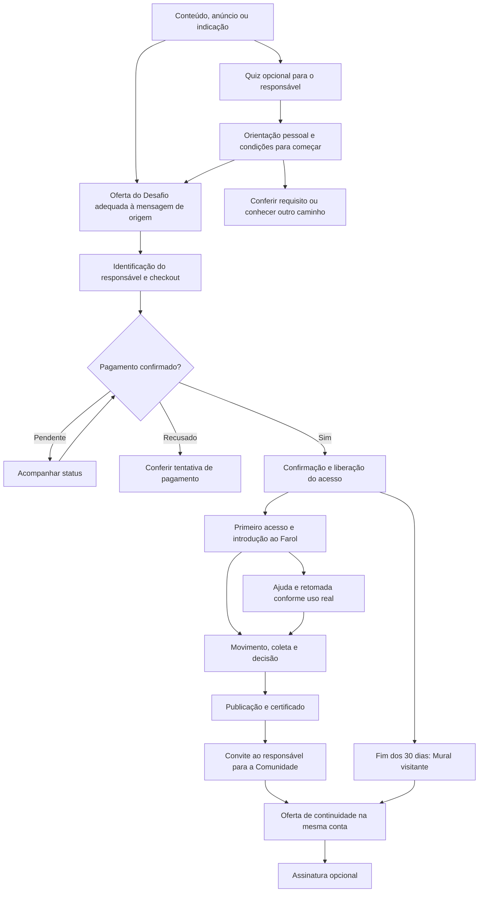

# Proposta do novo funil do Desafio do Primeiro Jogo

**Versão 2 · 03/10/2026 · Proposta aprovada.** A implementação local posterior está registrada em [implementacao.md](implementacao.md); as descrições de escopo documental abaixo se referem ao momento da proposta. A [segunda pesquisa](pesquisa-aprofundada-v2-2026-10-03.md) fundamenta esta revisão; a [revisão de decisões](revisao-v2.md) registra o que mudou. Na tarde do mesmo dia o quiz foi revisto para tráfego frio, sem produto antes do resultado: ver a [revisão do quiz e da bio](revisao-quiz-frio-e-bio.md).

## A decisão central

Apresentar o Desafio como **uma primeira experiência completa de programação de um jogo, com orientação e uma criação para mostrar**, por R$ 67, pagamento único. A família conhece o modo de aprender do Sistema Zero fazendo o Farol. A Comunidade dos Criadores é a continuidade principal, contratada separadamente quando fizer sentido.

O Desafio precisa valer a compra por si. Seu papel de entrada aparece na dimensão do percurso, no compromisso financeiro único e na possibilidade de experimentar o formato. A assinatura amplia o repertório e a continuidade; não completa uma entrega deliberadamente interrompida.

A decisão do responsável envolve duas pessoas: ele escolhe e paga; o filho experimenta. A oferta precisa mostrar uma atividade que a criança possa querer conhecer e explicar ao adulto como a aprendizagem acontece. “Gosta de jogar” e “quer programar” são informações diferentes. Preço baixo, conclusão do quiz e preferência declarada não comprovam disposição para usar ou continuar.

**A tese comercial:** vocês encontram um primeiro projeto organizado, com orientação e lugar para fazer, testar e mostrar. Seu filho trabalha nas regras do Farol; você pode conhecer a construção e observar como ele acompanha o formato. Essa é uma experiência pela qual vale decidir, com começo, entrega e prazo claros.

### Melhorias centrais da versão 2

- O resultado do quiz passa a recomendar uma ação pertinente à situação, além de identificar o argumento de entrada.
- A demonstração do Farol substitui papel e objetos como convite padrão; a experiência em casa fica opcional.
- Condições de equipamento aparecem cedo; interesses por desenho e histórias não são tratados como se fossem a mesma resposta.
- Três versões de argumentação continuam propostas, com base compartilhada e avaliação gradual, sem declarar três públicos validados.
- A prova principal acompanha o mesmo projeto pelo processo. Integração é demonstrada, sem alegação de exclusividade de mercado.
- A avaliação inclui uso, assinaturas e contribuição financeira observada, considerando também entrada direta na Comunidade.

### Documentos da proposta

1. [Pesquisa, concorrentes, evidências e diagnóstico local](pesquisa-2026-10-03.md).
2. [Quiz completo: perguntas, lógica, resultados e destinos](quiz-e-resultados.md).
3. [Direção de copy: oferta, variações, respostas e pós-compra](copy-proposta.md).
4. [Provas visuais, escopo de migração e validação](provas-e-validacao.md).
5. [Pesquisa aprofundada e aplicação crítica do Fluxo Criativo](pesquisa-aprofundada-v2-2026-10-03.md).
6. [Achados da revisão e decisões corrigidas](revisao-v2.md).

## O que a nova oferta vende

| Elemento | Definição desta proposta |
| --- | --- |
| Nome | Desafio do Primeiro Jogo |
| Projeto | A Chave do Farol |
| Comprador | Mãe, pai ou responsável; linguagem comercial dirigida ao adulto. |
| Faixa comunicada | 9 a 14 anos, alinhada à Comunidade. É recorte da orientação comercial, não diagnóstico de capacidade. |
| Resultado central, o quadro | Programar as regras do Farol, testar o jogo e aprender a publicá-lo para outras pessoas jogarem. |
| Mecanismo, a furadeira | Conhecer jogando; acompanhar a explicação; montar no Estúdio da aula; testar; verificar a etapa; enviar; publicar. |
| Consequência para a criança | Ter um projeto do qual participou, que consegue jogar e apresentar. Aprender a relacionar uma regra ao que acontece na tela. |
| Consequência para o responsável | Conhecer o que o filho está fazendo e avaliar a experiência por uma criação concreta, antes de decidir pela continuidade. |
| Escopo pedagógico | Introdução, três etapas de construção e certificado: cinco aulas, dez seções e nove vídeos na autoria local, incluindo o quiz antes do certificado. |
| Arte e preparação | Cenário, desenhos e movimento do barco já preparados. A criança constrói movimento do personagem, coleta/memória e decisão do farol. |
| Formato | Aulas gravadas, prática integrada, materiais de consulta e caminho de ajuda por mensagem. Não há aula ao vivo nem promessa de resposta imediata. |
| Preço | R$ 67, pagamento único, sem renovação automática. Implementação deve usar cotação real do catálogo e respeitar cupom válido. |
| Prazo | 30 dias a partir da aprovação do pagamento, para curso e Mural completo. Não depende do primeiro login. |
| Depois do prazo | Curso expira; permanece Mural visitante para ver e jogar. Não permite continuar publicando, comentando ou reagindo por esse acesso visitante. |
| Jogo publicado | Link continua acessível enquanto a publicação estiver disponível; não prometer hospedagem eterna ou permanência de conteúdo removido. |
| Garantia | Preservar os sete dias presentes no contrato local e suas condições no checkout. Não ampliar nem reiniciar o prazo de acesso. |
| Continuidade | Comunidade por contratação separada, na mesma conta; recursos e liberações conforme plano e Jornada. Sem assinatura automática, desconto ou crédito de R$ 67 inventado. |

O Mural completo não libera automaticamente Estúdio livre, Pinta, Pensa, Molda ou todo o catálogo. O Estúdio desta oferta é o da atividade guiada. O Caderno do Aluno acompanha as aulas; o antigo Mapa dos Pais sai da promessa. Quantidade de perfis cobertos pela compra e operação de suporte precisam ser conferidas com conta de comprador antes da redação comercial final. Não herdar “até dois perfis” da assinatura.

### Por que três etapas e não “jogo pronto em três dias”

Os três dias nomeiam as construções no curso. A duração real inclui assistir, localizar os blocos, montar, testar e eventualmente pedir ajuda. Propomos falar em **três etapas de construção para organizar durante os 30 dias de acesso**. Introdução e certificado continuam presentes, sem serem vendidos como mais dois dias de programação. Não anunciar minutos por aula ou prazo garantido de conclusão sem observação de uso.

## Alternativas consideradas

| Alternativa | Vantagem | Limite | Decisão |
| --- | --- | --- | --- |
| Uma oferta geral, quiz somente orientativo | Mais simples de manter e medir. | Reconhece pouco os motivos diferentes depois do resultado. | Controle útil e primeiro destino para testar a entrada. Pode vencer as variantes; não há resultado observado ainda. |
| Três apresentações do mesmo Desafio, com resultado sensível aos quatro motivos | Personaliza o argumento dentro da entrega real e mantém uma base comum. | Exige três redações e cuidado no encaminhamento do interesse por desenho. | **Arquitetura editorial recomendada.** Base comum de componentes/contrato, variantes de argumento e comparação gradual, sem fragmentar a medição desde o começo. |
| Quatro páginas espelhando integralmente a Comunidade | Mantém simetria de navegação. | Uma página de expressão visual pode sugerir desenho e criação de personagens que o Farol não ensina. | Não adotar automaticamente; só caberia com uma promessa estritamente de programação, sem ganho claro sobre a proposta de três páginas. |

## Públicos, pesos e páginas

Os quatro motivos da Comunidade continuam registrados. Não são quatro personalidades, nem grupos exclusivos. O quiz separa o motivo principal do adulto, os interesses observados da criança e as condições de uso.

| Motivo | Papel no Desafio | Desejo principal | Dor ou obstáculo principal | Objeção principal | Argumentos secundários |
| --- | --- | --- | --- | --- | --- |
| B. Criar jogos | Página padrão, centrada no projeto concreto. | Conseguir começar um jogo e mostrar uma versão funcionando. | Não saber por onde começar ou se perder numa tentativa. | “Vai conseguir acompanhar? É o tipo de jogo que imagina?” | Rotina, valor educativo, ajuda, Mural, preço/prazo. |
| A. Aprender no tempo de tela permitido | Página específica. | Reservar parte do tempo combinado para uma construção que a família possa conhecer. | Não encontrar uma atividade que interesse ao filho e permita acompanhar o que ele fez. | “Vai ser só mais um vídeo ou outra obrigação?” | Primeiro jogo, método, publicação, ajuda e requisitos. |
| D. Iniciação tecnológica | Página específica. | Conhecer uma sequência inicial de programação com aplicação visível. | Dificuldade de avaliar conteúdo, progressão e formato antes de escolher um curso. | “O que aprende de fato? O projeto vem todo pronto?” | Interesse, rotina, autonomia gradual, Mural e continuidade. |
| C. Expressão visual | Resultado próprio e qualificação de expectativa. | Valorizar personagens, desenhos e histórias. | Encontrar uma experiência que corresponda a esse interesse. | “Meu filho vai desenhar os próprios personagens?” | Se aceitar arte preparada, pode conhecer a construção do Farol. Se busca desenho como tarefa principal, o Desafio não é a indicação principal. |

**Por que B como apresentação padrão aqui, enquanto a Comunidade usa A:** a Comunidade vende uma possibilidade ampla de aprendizagem contínua; o Desafio já nomeia uma atividade específica. A abertura mais concreta é o projeto que será construído. Ela não deve presumir que o filho já pediu para programar: oferece a possibilidade e mostra o percurso. A escolha é editorial, ainda não um vencedor de conversão.

Rotas propostas:

- `/kids/desafio-primeiro-jogo/oferta`: primeiro jogo/Farol, base B, também fallback informativo.
- `/kids/desafio-primeiro-jogo/oferta/tempo-de-tela`: A.
- `/kids/desafio-primeiro-jogo/oferta/iniciacao-tecnologica`: D.

Visita ao endereço padrão não identifica a família como B. Família C interessada em conhecer a programação do Farol pode ir à página padrão mantendo C no registro. Empate ou busca aberta conserva motivo principal vazio; o destino não vira dado de segmentação.

As três páginas trabalham formato, ajuda, requisitos, autoria, aprendizagem, Mural e contrato. Mudam a abertura, ordem, exemplos e peso dos argumentos. Não basta trocar o título e manter todo o desenvolvimento idêntico.

### Quem priorizar na primeira avaliação

| Situação da família | Prioridade proposta | O que falta demonstrar |
| --- | --- | --- |
| Filho já manifesta vontade de criar; está começando; há computador e abertura ao formato. | Primeiro grupo de avaliação da experiência e da compra. Pode ter motivo adulto A, B ou D. | Se a promessa corresponde à montagem real e se a ajuda permite retomar. |
| Adulto procura atividade de aprendizagem; filho gosta de jogar, mas não pediu programação. | Convite de descoberta antes de uma recomendação firme. | Interesse da criança ao conhecer o projeto, sem transformar gosto por jogos em adesão. |
| Família quer iniciação tecnológica e precisa avaliar conteúdo. | Demonstração das três construções e do modo de acompanhar. | Se o nível introdutório e o formato correspondem ao que procura. |
| Desenho/histórias têm maior peso. | Resultado específico, com limite de arte preparada. | Se quer conhecer programação ou uma atividade cujo trabalho central seja desenhar. |
| Já conhece o Sistema Zero ou já decidiu pela Comunidade. | Entrada/continuidade direta quando pertinente. | O Desafio pode ser redundante; não colocar uma compra intermediária no caminho. |

Essa priorização é hipótese de adequação, não ranking de valor das famílias. Não depende de renda inferida nem de tipo psicológico. O objetivo é observar uma experiência coerente antes de ampliar a aquisição.

## Funil proposto, da chegada à continuidade

O caminho direto à Comunidade permanece disponível para quem já quer o conjunto. Desafio e Cadê Todo Mundo não formam pré-requisitos comerciais obrigatórios. Quem já tem acesso ao Desafio deve encontrar um caminho claro para entrar, sem incentivo a comprar novamente.

### 1. Aquisição

Trabalhar três ângulos iniciais: uma regra fazendo o Farol responder; uma conversa do responsável sobre o que o filho construiu; uma primeira experiência com começo e chegada claros. Para frio, o quiz oferece orientação antes da compra. Conteúdo que já mostra o curso e o preço pode levar direto à oferta.

Nenhum anúncio precisa afirmar que o filho passa tempo demais na tela. Não usar “diagnóstico”, “talento escondido”, profissão do futuro ou promessa de foco. Uma peça que anuncia programação no Roblox não deve desembocar no Farol. A verdade da oferta começa na primeira peça.

### 2. Quiz e resultado

Promessa pública: **“Descubra por onde seu filho pode começar a criar jogos.”** A entrega é um próximo passo explicado: conhecer o projeto, retomar uma tentativa ou conferir uma condição antes de comprar. Inclui um convite adaptado para conversar com o filho e demonstrações do que ele faria. Uma experiência com objetos pode ser sugerida, mas não é tarefa obrigatória nem passagem necessária à oferta.

São oito perguntas principais, até duas ramificações e saídas antecipadas pertinentes. Nenhum cadastro para ver o resultado. O Sistema Zero se identifica desde a entrada e informa que, ao final, pode apresentar seu curso. O mecanismo comercial é transparente, sem transformar a tela em explicação de segmentação.

O resultado se desenvolve como conversa: o que você contou; por onde começar com seu filho; o que observar; como o Farol oferece esse começo; o que conferir antes de comprar. Mostra duas ou três provas relevantes, e não uma coleção de cartões com frases soltas.

Faixa etária e computador são conferidos cedo. Depois vêm interesse observado, experiência, prioridade do responsável e dúvida. O formato é apresentado com benefícios e limites; uma previsão do adulto nunca será registrada como vontade confirmada da criança. Desde a revisão para tráfego frio (`desafio-farol-v3`), o quiz não apresenta curso, preço nem oferta antes do resultado: o Desafio aparece no resultado, como a primeira experiência na plataforma da Comunidade ([revisão](revisao-quiz-frio-e-bio.md)).

Responder sem cadastro produz uma sessão orientada, não um contato autorizado para campanhas. A identificação comercial continua no pré-checkout. Não condicionar o resultado a e-mail nem interpretar resposta como consentimento para mensagens. Para levar o convite ao filho, propor copiar apenas o texto do convite, sem gerar URL pública com respostas da família.

### 3. Oferta com demonstrações

Sequência sugerida, ajustada por motivo:

1. Promessa concreta, Farol, requisitos, preço/prazo e ação.
2. Uma demonstração contínua: trecho da explicação, criança monta a regra, jogo responde. Identificar claramente gravação demonstrativa, sem simular cliente.
3. O que vem preparado e o que a criança programa, ligado às três construções reconhecíveis.
4. Ajuda e conferência: o que acontece quando a porta não responde como esperado.
5. Como a família acompanha e organiza a primeira tentativa.
6. Publicação do mesmo projeto e participação no Mural durante o acesso.
7. Entregáveis, linha do tempo e oferta, com garantia vigente.
8. Quem prepara a experiência e demonstrações verificáveis de seu trabalho.
9. Respostas práticas, ilustradas quando uma tela explica a resposta.
10. Continuidade opcional e convite final coerente com a compra atual.

Prova próxima da afirmação. O bloco de aprendizagem mostra uma decisão do jogo; o de ajuda mostra onde a pergunta é enviada; o de Mural mostra publicação e interação. O leitor não deve depender de abrir todas as dúvidas para entender o contrato ou o formato.

Os 17 itens do inventário visual são material de apoio, não 17 seções obrigatórias. Concentrar o corpo em seis demonstrações: aventura; regra/efeito; aula/Estúdio; ajuda; publicação; acesso. Usar detalhes em respostas expansíveis. Evitar repetir o mesmo argumento inteiro no resultado e na oferta: o resultado orienta a família; a oferta demonstra e explica a contratação.

Não cabe sustentar “só nós temos comunidade” ou “só aqui há suporte em curso gravado”. A comparação deve explicar o que a família encontra neste percurso. O projeto próprio também precisa ser apresentado honestamente: ensina conceitos em blocos no Sistema Zero, não um curso de Roblox, Minecraft ou Scratch.

### 4. Pré-checkout, pagamento e obrigado

Preservar o checkout existente, a cotação, cupons, Pix/cartão e a confirmação explícita de pagamento. O modal conversa com o responsável e evita solicitar novamente dados já válidos. Não pedir contato da criança nem introduzir um segundo formulário de lead.

Checkout mostra Farol, R$ 67 ou cotação com cupom, pagamento único, 30 dias desde a aprovação e Mural visitante depois. Compra do Desafio não seleciona assinatura. Acesso ainda não liberado deve ter estado próprio; pagamento pendente não recebe copy de “já pode começar”.

Na confirmação, a ação principal é acessar o curso. Conta nova cria senha; conta existente entra com o acesso habitual. Mostrar prazo final real em horário de Brasília quando disponível. Não presumir entrega do e-mail nem conclusão da primeira atividade. A Comunidade pode aparecer como informação discreta, sem uma nova compra bloquear o acesso recém-pago.

### 5. Ativação e acompanhamento

| Situação observada | Objetivo da mensagem ou tela | Ação principal |
| --- | --- | --- |
| Pagamento aprovado e acesso concedido | Entender acesso e prazo; distinguir conta nova/existente. | Criar acesso ou entrar. |
| Conta não ativada | Resolver o acesso, não cobrar esforço da criança. | Recuperar/criar senha. |
| Conta pronta e curso não iniciado | Propor conhecer a aventura juntos. | Abrir a introdução. |
| Introdução concluída | Reconhecer que conheceu o jogo e localizar a montagem. | Abrir Dia 1. |
| Movimento realmente entregue | Valorizar algo concreto e sugerir que o filho mostre a regra. | Continuar para a coleta. |
| Curso concluído, publicação não confirmada | Orientar a mostrar/publicar dentro do acesso restante. | Retomar a seção de publicação. |
| Jogo publicado | Dar uso ao link e apresentar novos caminhos ao responsável. | Ver o jogo; convite secundário à continuidade. |
| Prazo próximo do fim | Informar data verdadeira e o que muda; adaptar ao progresso. | Retomar, quando ainda há acesso. |
| Prazo encerrado | Explicar Mural visitante e preservação do que está guardado. | Visitar Mural; conhecer continuidade opcional. |
| Comunidade contratada | Parar a venda do Desafio/continuidade já adquirida. | Onboarding da assinatura. |

Há automações comportamentais e lembretes no código local. Reutilizá-los após revisar gatilhos e textos. Novos marcos de publicação, diferenciação da introdução e ordenação de mensagens são propostas, não funcionalidades declaradas prontas. Evitar colisão de lembrete de prazo com celebração ou convite. Hipótese inicial: no máximo uma mensagem não transacional por conta em 24 horas, priorizando ajuda à ação atual. Confirmar capacidade e preferências de comunicação antes de automatizar.

### 6. Continuidade na Comunidade

Destino: `/kids/comunidade-dos-criadores/oferta/continuar`, já existente e público. Preservar a mesma conta e o estado real: começou, concluiu, publicou ou precisa retomar. Se a criança ainda está dentro dos 30 dias, informar que pode terminar usando o acesso comprado. Nunca sugerir assinatura obrigatória para concluir algo já incluído.

Mostrar o que a assinatura amplia: outros cursos publicados, continuidade dos projetos, ferramentas conforme os requisitos da Jornada e ambiente integrado. O Desafio entrega a programação do Farol; desenho próprio e uso livre precisam ser apresentados como possibilidades da continuidade, com suas condições. Não reintroduzir pitch obrigatório na aula de certificado.

### O papel de cada porta de entrada

| Entrada | Próximo passo recomendado | Evitar |
| --- | --- | --- |
| Anúncio que mostra o Farol e o preço | Oferta do Desafio ou quiz correspondente à necessidade de orientação. | Desviar para uma oferta maior sem explicar a mudança. |
| Conteúdo geral sobre criação e plataforma | Quiz/oferta da Comunidade, conforme a estratégia principal já existente. | Trocar todas as entradas pelo produto de menor preço. |
| Cadê Todo Mundo já experimentado | Continuidade da Comunidade, salvo preferência explícita por mais uma experiência delimitada. | Escada obrigatória Cadê → Desafio → Comunidade. |
| Desafio comprado, ainda sem começar | Primeiro acesso e resolução da dificuldade. | Pressionar nova compra antes de entregar o acesso atual. |
| Farol em construção ou publicado | Continuidade pertinente ao que já viveu e quer fazer depois. | Afirmar conclusão ou publicação sem evidência. |

Uma primeira compra pode acrescentar confiança, mas também pode adiar uma assinatura que aconteceria diretamente. Essa diferença precisa entrar na avaliação do funil.

## Direção visual

Aplicar as receitas de `kids-oferta.css`, a composição editorial da oferta da Comunidade e o rodapé institucional compartilhado. Manter Baloo 2 nos títulos, Nunito no corpo, cores canônicas, botões 3D somente em elementos clicáveis, cartões claros, capítulos com contraste e prints ampliáveis. Quiz, resultado e confirmação precisam parecer partes dessa mesma experiência.

Usar personagens como apoio; a demonstração do Farol é a imagem principal. Nenhum screenshot de nave deve representar o produto atual. Prints genéricos da Comunidade podem explicar ajuda ou navegação, com recorte e legenda que não sugiram acesso às ferramentas livres. Os prints específicos necessários estão no [plano de provas](provas-e-validacao.md).

## Como saber se o funil está funcionando

O objetivo final é mais famílias usando e continuando na Comunidade. Isso exige medir compra **e** experiência, sem chamar mero clique de lead qualificado.

| Métrica | Definição proposta |
| --- | --- |
| Conclusão do quiz | Sessões que chegaram a resultado válido / sessões que responderam a primeira pergunta; separar saídas por incompatibilidade. |
| Utilidade do resultado | Respostas voluntárias “ajudou a escolher o próximo passo” / respostas ao feedback; guardar contagem e motivo de correção. |
| Compra por entrada | Compradores aprovados / visitantes atribuídos à entrada no início da comparação, com janela fixa. Não excluir depois quem abandonou ou recebeu uma orientação de incompatibilidade. |
| Ativação | Contas com curso iniciado em até sete dias / compras aprovadas com sete dias completos de observação. |
| Primeira construção | Contas com envio válido do Dia 1 / compras com janela de observação definida; não usar conclusão da introdução. |
| Conclusão e publicação | Medir separadamente, durante o acesso; conclusão não prova publicação nem aprendizagem. |
| Continuidade | Compradores do Desafio que contrataram a Comunidade em até 45 dias / compradores do Desafio com 45 dias completos de observação. |
| Qualidade | Reembolsos, pedidos de ajuda por incompatibilidade, ausência de equipamento, satisfação e retenção posterior na Comunidade. |
| Comunidade por entrada | Famílias que iniciam assinatura em até 45 dias / visitantes atribuídos à entrada, com 45 dias completos. Inclui compra direta e compra depois do Desafio, identificadas separadamente. |
| Uso após assinatura | Famílias com uso observado na Comunidade após a compra / novas assinantes da mesma coorte; definir previamente a ação e a janela. Pagar não equivale a usar. |

Guardar coorte por compra, versão do quiz, motivo declarado, adequação, oferta vista e origem. Não misturar resultado do quiz com comportamento observado no curso. Atribuição entre funis deve conservar origem sem sobrescrever o lead anterior. Não enviar respostas sobre a criança a plataformas de anúncio como audiência ou diagnóstico.

Antes de escalar: ensaio de compreensão com um pequeno grupo diverso de responsáveis; navegação completa com conta nova e existente; validação das condições de compra. Para o primeiro experimento, comparar quiz versus entrada direta mantendo criativo, oferta, público e período equivalentes. Acompanhar ativação e continuidade, além de compra. Definir janela e critério de leitura antes; sem meta universal de conversão ou CPA inferida do preço.

### Critério econômico e ordem dos testes

A receita de entrada não é margem disponível para mídia. Usar receita efetivamente recebida menos reembolsos, taxas, tributos e custos variáveis de atendimento/entrega, no horizonte observado. Somar contribuição da Comunidade somente quando ela tiver ocorrido, sem inventar valor vitalício. Dividir a contribuição pela base de visitantes atribuídos no início ajuda a comparar jornadas com taxas de clique diferentes.

1. Conferir compreensão e experiência com famílias; depois, fluxo e medição.
2. Comparar quiz versus oferta direta do mesmo Desafio. Distribuição aleatória, se implementada; caso contrário, resultado observacional com limites explícitos.
3. Comparar um argumento por vez dentro de tráfego comparável. Não declarar um perfil melhor só porque recebeu pessoas de um anúncio diferente.
4. Avaliar, em uma campanha apropriada às duas opções, entrada pelo Desafio versus Comunidade direta. Manter preços verdadeiros e registrar diferenças de entrega; não misturar esse teste com o teste do quiz.

Interromper a ampliação se surgirem compras por expectativa errada, dificuldade recorrente de acesso ou volume de ajuda sem capacidade de resposta. Isso pede corrigir entrega e comunicação, não apenas trocar o botão. Uma taxa maior de compra do Desafio, acompanhada de menos uso e menos assinaturas, não é vitória do funil principal.

## O que esta proposta pede para aprovar

O conjunto concreto é: posicionamento de primeira experiência completa; três apresentações do mesmo Farol; quiz que identifica quatro motivos sem forçar encaixe; resultado útil para tráfego frio; prova visual integrada à argumentação; contrato explícito de R$ 67/30 dias; ativação e continuidade por estado real de uso.

A aprovação autorizará detalhar e implementar esse desenho no app existente. Não inclui aumento de preço, nova ferramenta, aula ao vivo, crédito para assinatura, gasto de mídia ou envio de campanhas. A presente entrega é documental. Catálogo efetivo, gravações e conta com direitos do Desafio precisam ser conferidos antes da publicação coordenada.
