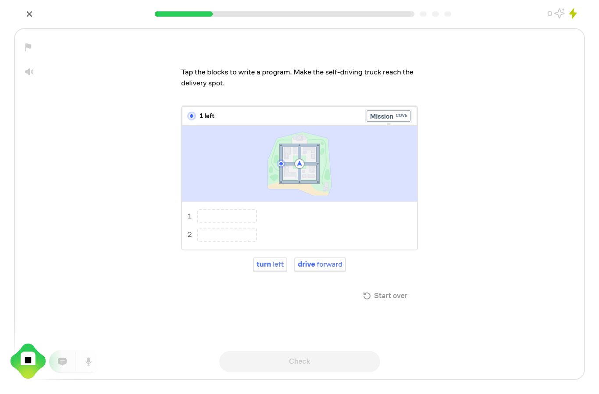
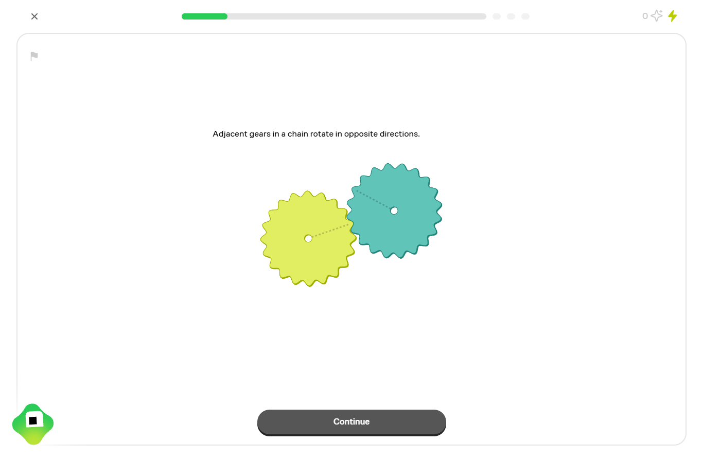
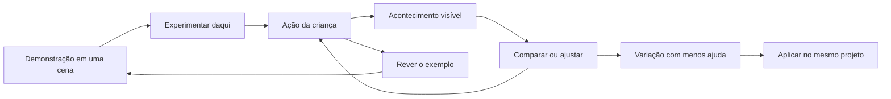
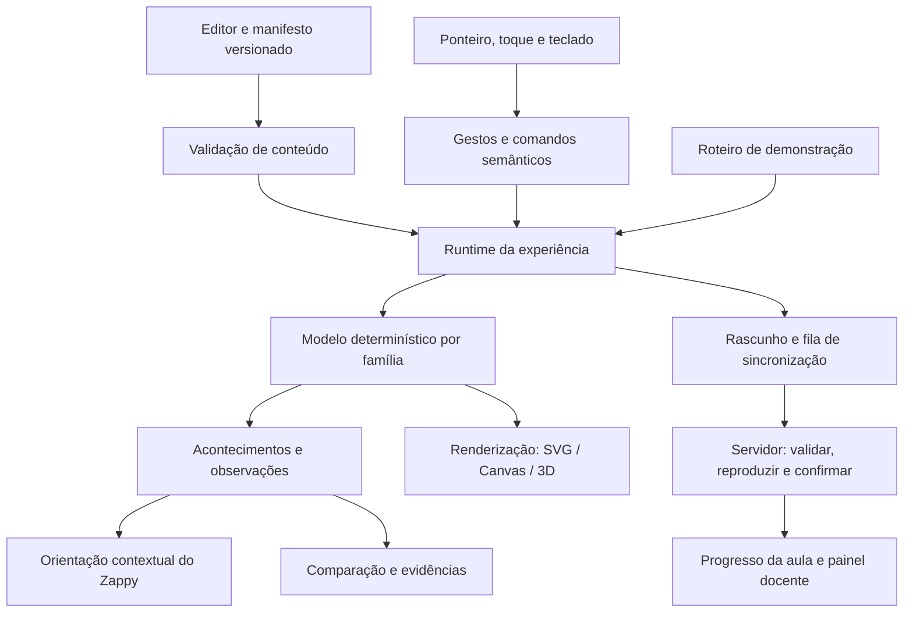

# Proposta para experiências de experimentação e demonstração no Sistema Zero

A recomendação é transformar as cenas atuais em **um ambiente interativo no qual demonstração, manipulação, comparação e orientação usam o mesmo modelo**. O professor mostra um acontecimento, a criança assume o controle da cena e o sistema responde ao que ela fez. A qualidade dessa experiência depende tanto da direção visual e dos gestos quanto da consistência do motor, da autoria e da evidência registrada.

O primeiro investimento deve produzir três experiências de referência — salto, colisão e eventos de som — com acabamento suficiente para estabelecer o padrão das demais. Elas exercitam movimento contínuo, manipulação espacial e relações de causa e efeito. A partir delas, o restante do Corre Dino pode evoluir com componentes compartilhados e missões específicas.

Esta proposta amplia a [v5 aprovada](2026-09-12-exploracao-direta-aulas-kids-proposta-v5.md). Preserva a composição livre das aulas pelo professor, o mesmo projeto entre etapas, a distinção entre entregar e publicar e os critérios próprios de cada seção. Acrescenta uma especificação mais profunda para o motor, a demonstração interativa, a inteligência contextual, o acabamento e a produção de conteúdo. É uma proposta de evolução; não descreve funcionalidades novas como já entregues.

## 1. Base da análise

A referência foi examinada em 12/09/2026 com acesso autenticado. A amostra incluiu home, catálogo, os cursos Thinking in Code e Scientific Thinking e trechos das aulas Combining Parts, Writing Programs e Connecting Gears. Foram observados estados de entrada, manipulação, erro, repetição, acerto, explicação e avanço, conforme o percurso de cada aula. Frações também foi inspecionada em viewport estreito. O [dossiê de evidências](../research/brilliant-2026-09-12/README.md) contém capturas, alcance e limitações.

Também foram examinados os contratos de aprendizagem, modelos de exploração, player, gestos, persistência, autoria, painel docente e partes da integração com o Estúdio. O workspace continha alterações em andamento: encontrar uma capacidade no código não demonstra sua publicação, desempenho em dispositivos reais ou eficácia com crianças.

Há três níveis de evidência neste documento: **observado**, quando exercitado no Brilliant ou reproduzido no modelo local; **verificado no código**, quando sustentado pela implementação lida; e **proposto**, quando se trata de uma decisão de desenho ou engenharia. Não foi identificada a arquitetura interna completa do Brilliant, nem conduzido um ensaio de eficácia ou uma avaliação conversacional de seu tutor.

## 2. O que aproveitar do Brilliant

### Um objeto central que concentra a atenção

Em Frações, a instrução fica junto da figura e a escolha altera a representação. Em programação, uma paleta curta alimenta um programa ligado a um resultado espacial. O aluno encontra uma decisão concreta na tela, com poucos controles concorrentes. A aplicação ao Sistema Zero é concentrar cena, peça relevante e objetivo em uma composição única, reduzindo os cartões e as barras que disputam a atenção. [Evidências B2 e B4](../research/brilliant-2026-09-12/README.md).



### Demonstração e ação com continuidade visual

Connecting Gears passa de duas engrenagens para uma previsão com três e depois para seleção direta numa cadeia maior. O vocabulário visual permanece reconhecível enquanto a tarefa muda. Isso sugere uma demonstração que prepara a próxima ação dentro da mesma representação. A explicação acessível após o acerto é outro recurso útil: acertar não encerra a possibilidade de entender o porquê. [Evidência B3](../research/brilliant-2026-09-12/README.md).



### Acabamento sem depender de 3D

Na cena de programação inspecionada, o SVG combina grupos transformados, linhas, máscaras e imagens. Essa observação sustenta a viabilidade de uma experiência visual rica com desenho vetorial e assets cuidadosamente produzidos. A classe `diagrammarRoot` encontrada no markup não autoriza identificar um framework público, nem concluir que todas as cenas usam o mesmo motor. [Evidência B5](../research/brilliant-2026-09-12/README.md).

### Onde podemos fazer melhor

Nas tentativas incorretas amostradas, o primeiro retorno foi genérico. A oportunidade do Sistema Zero é explicar o acontecimento específico: “Você apertou a tecla, mas o Dino já estava no ar; por isso não houve outro salto”. A figura precisa sustentar essa frase, mostrando o evento e a ligação que produziram o som. [Evidências B2 e B4](../research/brilliant-2026-09-12/README.md).

A própria ajuda do Brilliant registra dificuldade em descobrir a alça de peças negativas. Manipulação direta precisa de uma indicação visual que revele onde pegar e de uma alternativa simples por toque. [Brilliant: uso dos interativos](https://brilliant.org/help/features/how-do-i-use-interactives-on-brilliant/).

O Koji atual é descrito como um tutor que acompanha a atividade e atua sobre suas representações. Essa capacidade inspira orientação contextual, mas não torna um chat generativo requisito da primeira entrega. O material consultado descreve disponibilidade variável por curso e plano; a qualidade de suas conversas não foi avaliada nesta pesquisa. [Brilliant: funcionamento do Koji](https://brilliant.org/help/features/how-does-koji-work/).

## 3. Diagnóstico técnico do Sistema Zero

O estudo público anterior identificou limitações que já estão sendo tratadas. A proposta deve partir dessa evolução, evitando reimplementar recursos existentes.

| Área | Situação verificada | Próximo investimento |
| --- | --- | --- |
| Modelo | `core/learning` separa transições da interface e admite replay de ações. | Executar incrementalmente durante a interação e manter replay para restauração e verificação. |
| Catálogo | Há 14 missões de exploração para 13 aulas, pois salto se divide em gravidade e impulso. | Definir variantes autoráveis e condições iniciais revisadas por família. |
| Manipulação | Alças, peças, captura de ponteiro, seleção por toque e controles alternativos já existem. | Fazer a peça acompanhar o gesto, antecipar destinos e mostrar conexão durante o arraste. |
| Comparação | Existem observações, marcas e cartões de contraste. | Usar o mesmo renderizador para cena, comparação e replay; permitir escolher os testes comparados. |
| Tempo | Há pausa, passos, câmera lenta e posição analítica no salto. | Garantir que acontecimentos independam do tamanho de cada atualização de tempo. |
| Histórico | O registro é validado, agrupado e limitado. | Separar estado transitório, comandos duráveis e evidência pedagógica. |
| Interface | Cena, instruções, peças, barra temporal, ferramentas, pistas, comparação e progresso são empilhados. | Organizar uma área central estável com controles contextuais. |
| Demonstração | `demonstration` existe como intenção de seção, mas não há uma atividade específica de demonstração com passos no contrato examinado. | Acrescentar um modo de demonstração ao runtime compartilhado. |
| Autoria | Editor oferece missões, prévia, ensaio e avisos editoriais. | Oferecer roteiro de demonstração, variantes, pistas condicionais e visualização dos critérios. |
| Persistência | Há rascunho local, fila de salvamento, revisão de bloco e confirmação de tentativa. | Segmentos idempotentes, checkpoint confirmado e recuperação de conflitos entre sessões. |
| Professor | O painel já resume descobertas, montagem e pistas da exploração. | Distinguir exemplo assistido, descoberta, transferência e aplicação no projeto. |
| Ferramentas | Estúdio tem sandbox de checagens e isolamento próprios. | Estudar sua reutilização em um piloto de comportamento, com procedência da evidência explícita. |
| Mídia | Existe coordenação de foco entre vídeo e áudio. | Adicionar narração por passo e retomada coerente com a demonstração. |

Fontes principais: [contratos](../../packages/core/src/learning/index.ts), [missões](../../packages/core/src/learning/exploration.ts), [modelo](../../packages/core/src/learning/exploration-model.ts), [interface](../../packages/member-shell/src/components/learning-exploration.tsx), [palco](../../packages/member-shell/src/components/exploration-stage.tsx), [peças](../../packages/member-shell/src/components/exploration-pieces.tsx), [player](../../packages/member-shell/src/components/lesson-sections.tsx), [autoria](../../packages/admin/src/components/editor/learning-builder.tsx), [painel docente](../../packages/admin/src/components/professor/lesson-learning-panel.tsx).

### Três achados que condicionam a arquitetura

**Reprocessamento durante a ação.** O componente deriva estado por replay, calcula aprovação por outro replay e repete reconstruções no despacho. Movimentos de ponteiro também passam por serialização e, em certos casos, reconstrução para preservar descobertas. A compactação atual é útil, mas não torna o custo independente do histórico. O diagnóstico local registrou crescimento do custo; não mediu travamento de navegador. A recomendação é retirar esse trabalho do caminho de cada quadro, após validar equivalência de comportamento. [Código](../../packages/member-shell/src/components/learning-exploration.tsx), [diagnóstico](../research/brilliant-2026-09-12/model-probe-results.json).

**Dependência da divisão do tempo.** No redutor isolado, um avanço de um segundo registra descobertas que 25 avanços de 0,04 segundo não registram, apesar de produzir o mesmo número de objetos ou o mesmo placar. Os gatilhos de `spawn` e `score` usam a duração da chamada individual. O player atual agrupa avanços antes de reproduzir; portanto, isso é uma inconsistência do modelo a resolver antes da execução incremental, sem afirmar que o percurso atual necessariamente bloqueia o aluno. [Reprodução](../research/brilliant-2026-09-12/model-probe.ts).

**Limite que aparece para a criança.** No caso sintético de camadas, o limite de tamanho impediu novas ações após 869 registros aceitos, antes do teto de mil. A interface prevê avisar que o registro ficou cheio e começar outro. Uma criança que experimenta bastante não deveria administrar a capacidade do histórico. A solução é segmentar e compactar a sessão com preservação verificável das descobertas, mantendo limites no servidor. [Resultado registrado](../research/brilliant-2026-09-12/model-probe-results.json), [interface atual](../../packages/member-shell/src/components/learning-exploration.tsx).

## 4. Alternativas e decisão recomendada

| Alternativa | Benefício | Custo ou limite | Decisão |
| --- | --- | --- | --- |
| Refinar apenas as telas atuais | Melhora rápida de hierarquia, instruções e gestos. | Demonstração, comparação e inteligência continuam distribuídas; aumenta o trabalho por missão. | Útil para ajustes imediatos, insuficiente como direção principal. |
| Runtime compartilhado, com modelos por família | Une demonstração, exploração, evidência e autoria; reaproveita o núcleo existente. | Exige contratos claros, migração e três referências bem construídas. | **Recomendada.** |
| Plataforma universal de jogos com editor completo | Grande liberdade futura. | Alto custo de ferramenta, conteúdo e validação antes de melhorar as aulas atuais. | Reavaliar após o piloto demonstrar necessidade. |

O runtime recomendado pode começar nos pacotes existentes. Extrair um pacote próprio faz sentido quando houver consumidores e dependências bem definidos. A primeira entrega não depende de um editor visual universal, de física genérica ou da adoção simultânea de vários motores gráficos.

## 5. A experiência que a criança deve encontrar

### Experimentação

A tela apresenta uma situação que já funciona, uma missão curta e um primeiro gesto evidente. O objetivo é “Faça o Dino voltar ao chão”; os controles relevantes são o Dino e a ligação da gravidade. O aluno começa sem precisar interpretar um painel de parâmetros.

Cada ação deve produzir três respostas coordenadas: uma mudança perceptível no objeto, uma indicação breve do acontecimento e, quando útil, um vestígio comparável. Ao repetir o salto, a trajetória anterior pode continuar como referência. O indicador de progresso só muda quando acontece algo relacionado à missão.

A dificuldade cresce por uma alteração pertinente: mudar o obstáculo, retirar uma ligação, pedir o mesmo efeito por outro controle. O professor escolhe se essa variação é requisito, aplicação seguinte ou extensão opcional. Prever antes de agir é um recurso editorial, não uma pergunta obrigatória em toda tela.

### Demonstração

A demonstração deve ser uma cena executável com passos autorados. O professor pode mostrar uma ligação, avançar até o acontecimento importante, destacar sua consequência e entregar o controle à criança. “Experimentar daqui” abre uma cópia do estado demonstrado, mantendo o exemplo recuperável.

Há três formas complementares de demonstração:

| Forma | Uso | Controle oferecido |
| --- | --- | --- |
| Fenômeno guiado | Mostrar queda, colisão, fluxo de eventos ou ordem de desenho. | Pausar, avançar até o próximo acontecimento, repetir e experimentar daquele estado. |
| Construção acompanhada | Mostrar como alcançar um objetivo no Estúdio. | Vídeo por trecho, indicação do bloco relevante e retomada do mesmo projeto. |
| Comparação explicada | Tornar uma diferença visível. | Alternar A/B, sobrepor trajetórias ou reproduzir os dois casos no mesmo relógio. |

O vídeo continua importante para a presença do professor e para procedimentos na ferramenta real. Na cena nativa, a demonstração usa comandos do próprio modelo. Não se deve criar uma animação independente cuja física apenas se pareça com a exploração.

### Continuidade entre os dois modos



Esse fluxo é um exemplo dentro da aula. A ordem das seções permanece autorada: uma aula pode começar no projeto, revelar um problema e só então abrir uma demonstração ou exploração.

## 6. Direção visual e intuitividade

### Composição do palco

No notebook, a cena ocupa a área principal. O título comunica a conquista, uma fala curta do Zappy orienta a ação e uma bandeja reúne apenas as peças pertinentes. A comparação entra em uma lateral recolhível ou em uma faixa ligada à cena. O rodapé mantém uma ação principal e acesso estável à ajuda.

| Região | Conteúdo | Comportamento |
| --- | --- | --- |
| Topo | Nome da conquista e posição na aula. | Estável durante tentativas; sem repetir requisitos técnicos. |
| Cena | Personagem, objetos, conexões e acontecimento. | Responde imediatamente e preserva enquadramento. |
| Bandeja | Peças e alternativas ao gesto direto. | Muda por missão; controles avançados aparecem quando necessários. |
| Zappy | Instrução ou pista do momento. | Uma mensagem por vez, junto do elemento pertinente. |
| Comparação | Teste A, teste B e variável alterada. | Aberta quando ajuda a decidir; mantém escala comum. |
| Rodapé | Continuar, repetir exemplo ou testar. | Não desloca o palco quando o estado muda. |

Em tablet e celular, a experiência se reorganiza verticalmente. Rótulos importantes permanecem em HTML legível; reduzir o SVG inteiro não pode transformar a instrução em texto minúsculo. Controles precisam respeitar a área segura e o teclado virtual. A mudança de orientação mantém o estado e cancela com segurança um gesto em andamento.

### Linguagem visual própria

Usar a identidade Kids e uma pequena biblioteca original de personagens, peças, portas, vetores, relógios, marcas de colisão e rastros. A consistência vem de proporção, espessura, contraste e comportamento, não de desenhar todas as cenas da mesma maneira. As imagens do Brilliant ficam como evidência da pesquisa.

Azul pode continuar identificando gravidade e âmbar o impulso, acompanhados de símbolos e rótulos. Objetos manipuláveis apresentam resposta ao foco e à aproximação; elementos decorativos têm menor contraste. Profundidade e sombra ajudam a perceber o que pode ser pego, sem esconder a geometria do conceito.

Os estados visuais a produzir para cada peça são: disponível, focada, selecionada, sendo movida, perto de encaixe válido, destino inválido, conectada e temporariamente indisponível. O cursor ou o dedo precisa receber confirmação antes de soltar a peça. No código atual, algumas conexões decidem o encaixe apenas na soltura; falta desenhar o fio acompanhando o gesto. [Peças atuais](../../packages/member-shell/src/components/exploration-pieces.tsx).

### Movimento com função clara

O impulso inicia o movimento do Dino; a gravidade muda sua velocidade; o toque numa alça desloca a área de contato. Esses movimentos pertencem ao modelo. Já brilho de encaixe, resposta de botão e comemoração pertencem à apresentação e não podem alterar a solução.

Como referências iniciais de direção de animação, usar resposta de toque quase imediata, encaixes de aproximadamente 120–200 ms e transições de modo de 180–300 ms. São escolhas a ajustar em teste, não padrões universais. Durante o arraste, a peça acompanha o ponteiro sem uma mola atrasada; a acomodação pode acontecer depois da soltura.

Com redução de movimento, manter mudanças de estado claras, remover efeitos dispensáveis e oferecer passos para fenômenos temporais. O som reforça contato, encaixe ou evento; sua ausência nunca impede compreender o resultado. Pausa e controle sobre movimento fazem parte da experiência. [W3C: pausa e movimento](https://www.w3.org/WAI/WCAG22/Understanding/pause-stop-hide.html).

## 7. Arquitetura técnica proposta

O sistema deve compartilhar significado e estado, permitindo que a representação varie por família.



### Responsabilidades

| Camada | Responsabilidade | Local inicial sugerido |
| --- | --- | --- |
| Contrato | Versões, parâmetros permitidos, comandos, eventos e critérios. | `packages/core/src/learning` |
| Modelo | Evoluir o estado; produzir acontecimentos; aceitar somente ações válidas. | Módulos por família no core. |
| Runtime | Relógio, modo, despacho, histórico local e assinaturas. | Área de experiências do `member-shell`. |
| Renderização | Desenhar estado e interpolações; posicionar alvos visuais. | Renderizadores e componentes de cena do `member-shell`. |
| Interação | Reconhecer gesto, escolher alvo, mostrar prévia e emitir comando. | Primitivas de interação compartilhadas. |
| Orientação | Selecionar pista e destaque a partir de eventos e contexto. | Regras revisadas no core; apresentação no player. |
| Persistência | Guardar rascunho, enviar segmentos e confirmar evidências. | Cliente atual e serviço de aprendizagem em `members`. |
| Autoria | Configurar missão, exemplo, variação, mídia e critérios. | Editor e ensaio do `admin`. |

Separar o estado de cada família evita que toda experiência precise carregar todos os campos de um grande `ExplorationState`. Isso deve ocorrer por extrações pequenas, mantendo o comportamento v2. A família movimento precisa de posição e velocidade; camadas precisa de ordem; eventos precisa de ligações e disparos. Metadados de sessão e ajuda podem continuar compartilhados.

## 8. SVG, Canvas ou 3D

| Tecnologia | Adequação | Cuidado | Recomendação |
| --- | --- | --- | --- |
| HTML + SVG | Diagramas, poucas dezenas de peças, vetores, conexões, seleção e hitboxes. | Muitos nós dinâmicos podem aumentar custo; semântica e foco exigem cuidado. | **Base das três experiências iniciais.** |
| Canvas 2D | Rastros longos, numerosas partículas ou objetos simples em movimento. | Picking, texto e acessibilidade precisam de camada própria. | Introduzir quando a medição justificar; manter controles em HTML. |
| PixiJS | Cenas 2D com muitos sprites, atlas, efeitos e composição mais complexa. | Nova dependência, ciclo gráfico, recursos de GPU e descarte. | Avaliar para famílias que excedam a base vetorial. |
| Three.js / React Three Fiber | Conceitos realmente espaciais: câmera, profundidade, iluminação, volume. | Oclusão, precisão do gesto, consumo de GPU e operação em telas pequenas. | Usar seletivamente; não converter o Dino 2D em 3D por padrão. |

O PixiJS oferece renderizador, grafo de cena, carregamento de assets, ticker e eventos. Isso pode reduzir trabalho em cenas densas, mas não fornece o modelo de aprendizagem ou critérios corretos automaticamente. [Documentação oficial](https://pixijs.com/8.x/guides/concepts/architecture).

O repositório já contém Three.js e React Three Fiber em áreas específicas. O `studio` e o `member-shell` declaram versões diferentes de Three.js; compartilhar objetos internos entre essas fronteiras seria uma decisão arriscada. Um adaptador de cena deve trocar dados simples e contratos, mantendo instâncias de motor dentro de seu contexto. A proposta não depende de atualizar essas versões.

**Decisão prática:** começar com HTML/SVG e um runtime separado do React. Carregar cada renderizador e seus assets quando a missão precisar deles. Um projeto de 3D merece renderização 3D; uma explicação sobre ordem de desenho geralmente fica mais clara em 2D.

## 9. Relógio, estado e evidência confiáveis

### Três tipos de estado

**Estado transitório de interação:** posição do ponteiro, fio sendo puxado, destino em destaque e animação decorativa. Fica no cliente e não vira uma gravação no servidor a cada movimento.

**Estado do modelo:** posição, velocidade, conexões, objetos, relógio e estado da partida. Evolui por comandos válidos e pode ser reproduzido. É a origem dos acontecimentos visíveis.

**Estado pedagógico:** descobertas, contrastes, ajuda consultada e desafios cumpridos. É derivado do modelo e dos comandos, com critérios versionados. Não aceita um simples `success: true` enviado pela cena.

### Atualização incremental

O runtime mantém a instância atual do modelo. Um comando aplica uma transição e emite os eventos novos. O React recebe snapshots estáveis quando precisa atualizar rótulos, botões ou progresso; a animação contínua não deve remontar toda a seção. `useSyncExternalStore` pode integrar esse runtime ao React, com snapshots imutáveis e cacheados. Para controles estáticos simples, o estado React atual continua adequado. [React: integração com estado externo](https://react.dev/reference/react/useSyncExternalStore).

O relógio visual usa `requestAnimationFrame`; o tempo do modelo tem convenção explícita. A frequência do monitor não define a velocidade física. Nas famílias numéricas, usar passos fixos com acumulador ou evolução analítica, conforme a regra. Ao ocultar a aba, pausar e retomar sem simular silenciosamente minutos de atividade. [MDN: requestAnimationFrame](https://developer.mozilla.org/en-US/docs/Web/API/Window/requestAnimationFrame).

No salto atual, a equação analítica usa um modelo didático de 30 Hz; o Estúdio descreve gravidade em unidades por quadro. A ponte precisa declarar correspondência e diferenças. Não apresentar a mesma quantidade numérica como equivalência exata entre motores sem um teste que a comprove. A explicação conceitual “aplicar gravidade muda a velocidade” pode ser compartilhada sem prometer trajetórias idênticas. [Modelo de exploração](../../packages/core/src/learning/exploration-model.ts), [física do Estúdio](../../packages/studio/src/official-extensions/game-2d/runtime/physics.ts).

### Comandos e acontecimentos

Um comando representa intenção: conectar gravidade, iniciar salto, mudar impulso ou mover a área. Um acontecimento representa consequência: salto começou, atingiu o topo, tocou o chão, houve contato ou um som ocorreu sem salto. Separar os dois permite orientar, comparar e avaliar com precisão.

O registro deve incluir `sessionId`, revisão de conteúdo, versão do modelo, sequência do comando e tempo lógico. Para sorteios, incluir semente e índice ou outra representação reproduzível validada. A demonstração tem uma sessão própria e não emite evidência de ação independente da criança. Um rótulo de origem enviado pelo cliente, sozinho, não prova quem agiu; o servidor deve validar o modo e o percurso permitido.

### Salvamento e retomada

Manter rascunho por perfil, aula, bloco e revisão. Enviar comandos em segmentos numerados, com idempotência, e receber confirmação do último segmento aceito. Um checkpoint confirmado permite continuar o histórico sem expor seu tamanho para a criança. A compactação só pode remover detalhes quando preservar estado, descobertas, ajuda e reconstrução necessária para avaliação.

O servidor deve reproduzir o segmento a partir de uma base que ele já confirmou, e não confiar em um snapshot arbitrário do cliente. Repetição de envio não duplica evidência. Conteúdo atualizado exige revisão explícita; conclusões anteriores não são reinterpretadas automaticamente. Em duas abas, tratar divergência com um fluxo de retomada, evitando uma fusão silenciosa de comandos incompatíveis.

Em perda de rede, uma missão já carregada pode continuar localmente. A interface distingue rascunho local de conclusão confirmada. “Offline” amplo, incluindo primeira abertura, vídeo e todas as ferramentas, é um produto adicional e não deve ser prometido pela simples existência de cache local.

## 10. Gestos com qualidade de produto

Criar poucas primitivas bem acabadas: selecionar, mover, conectar, reordenar, redimensionar e acionar. Cada uma compartilha estados de foco, cancelamento, alternativa por toque e emissão de comandos.

| Gesto | Resposta durante a ação | Confirmação | Alternativa |
| --- | --- | --- | --- |
| Conectar | Fio acompanha o ponteiro; portas compatíveis se destacam. | Fio se acomoda e um pulso mostra a ligação ativa. | Tocar origem e destino. |
| Reordenar | Peça elevada e espaço de inserção visível. | A ordem e a cena mudam juntas. | Selecionar e escolher antes/depois. |
| Ajustar impulso | Seta acompanha a alça; marca do próximo valor aparece. | Próximo salto usa o valor; o atual mantém sua regra. | Baixo/médio/alto e ajuste por teclado. |
| Ajustar hitbox | Área cresce junto do gesto, com arte independente. | Contato muda no limiar real. | Aumentar/diminuir e campo acessível quando útil. |
| Mover obstáculo | Objeto acompanha o gesto, com destino e limites claros. | Acontecimento registrado ao cruzar o limiar. | Tocar posições ou usar setas. |

Usar Pointer Events com captura, tratamento de cancelamento e perda de captura. Converter coordenadas de tela para coordenadas da cena com a transformação inversa correspondente, em vez de espalhar fatores como `600 / width`. Em SVG, `getScreenCTM()` fornece a matriz da transformação para essa conversão. [MDN: Pointer Events](https://developer.mozilla.org/en-US/docs/Web/API/Pointer_events), [MDN: getScreenCTM](https://developer.mozilla.org/en-US/docs/Web/API/SVGGraphicsElement/getScreenCTM).

O reconhecimento do gesto deve distinguir toque de arraste para não executar duas ações na soltura. A área sensível pode ser maior que o desenho, sem sobrepor controles vizinhos. Definir tolerância de encaixe em pixels de tela mantém facilidade de uso ao redimensionar; a validade conceitual continua no modelo.

Como meta de desenho, controles principais devem ter pelo menos 44 × 44 pixels CSS e espaçamento confortável. Essa meta não substitui avaliação de acessibilidade. Ter teclado não substitui uma alternativa por ponteiro sem arraste; ambos precisam funcionar. [W3C: movimentos de arraste](https://www.w3.org/WAI/WCAG22/Understanding/dragging-movements.html).

## 11. Demonstrações tecnicamente executáveis

O roteiro autorado usa operações limitadas e validadas: carregar estado inicial, destacar elemento, emitir comando do modelo, avançar até evento, narrar, pausar, apresentar uma escolha e oferecer tomada de controle. Cada passo referencia entidades estáveis da cena, não coordenadas de um vídeo.

Um exemplo conceitual de roteiro para gravidade:

```text
Estado inicial: Dino no chão, impulso definido, gravidade não aplicada.
Passo 1: destacar Dino; narrar o convite; esperar ação “pular”.
Passo 2: avançar até “subida sem gravidade”; pausar.
Passo 3: mostrar ligação Gravidade → Dino; executar a ligação no exemplo.
Passo 4: repetir o salto; parar ao tocar o chão; comparar com o caso anterior.
Passo 5: oferecer “Experimentar daqui” e “Rever a comparação”.
```

Toda espera por evento tem limite e estado de recuperação. Se um evento não ocorre, o editor acusa um roteiro inválido e o player oferece repetir o trecho, preservando o trabalho da criança. Não usar um atraso fixo de três segundos como substituto de “tocou o chão”.

A narração se liga ao passo. Buscar outro ponto do exemplo restaura um estado coerente e a mídia correspondente. Ao assumir o controle, a narração que dá ordens incompatíveis é pausada. Vídeo, voz do Zappy e efeitos usam o foco de áudio existente, com prioridade explícita e controles separados para voz e efeitos. [Coordenação atual](../../packages/member-shell/src/lib/lesson-media-focus.ts).

O modo demonstração não deve concluir a exploração automaticamente. Conforme a intenção da seção, assistir pode registrar exposição ao exemplo; realizar a missão requer ação da criança. A regra atual de vídeo isolado continua aplicável onde já foi escolhida como critério, sem se tornar uma trava universal das cenas interativas.

## 12. Inteligência contextual sem respostas inventadas

A primeira camada de inteligência deve ser determinística e autorada. Ela reconhece o estado da missão e o acontecimento relevante para escolher uma pista. O ganho vem da precisão do contexto, não de aumentar a quantidade de falas.

| Situação observável | Resposta do sistema | Pista possível |
| --- | --- | --- |
| Tecla acionada no ar; som ocorreu; salto não começou. | Destacar caminho tecla → som e o Dino ainda no ar. | “Esse som veio da tecla. Qual acontecimento deveria chamar o som?” |
| Dois saltos com o mesmo impulso. | Sobrepor rastros coincidentes. | “Os dois chegaram à mesma marca. Que peça muda a altura?” |
| Hitbox maior causa contato sem mudar a arte. | Congelar o instante e destacar a área adicional. | “A figura ficou igual. Veja onde a área passou a encostar.” |
| Criança seleciona origem, mas não encontra destino. | Mostrar portas compatíveis e demonstração breve do gesto. | “Toque agora na entrada do Dino.” |
| Pontos aumentam antes de começar. | Mostrar o relógio fora da condição. | “O placar está contando em qual tela?” |

Organizar a ajuda em três níveis: chamar atenção para a evidência, sugerir uma estratégia e mostrar parte da ação. Depois de ajuda mais explícita, oferecer uma variação curta para observar se o aluno consegue agir com menos apoio. Pedir ajuda não diminui a nota nem fecha a cena.

Não inferir desatenção, emoção ou diagnóstico da criança a partir de cliques. Um padrão de ação sugere uma dificuldade daquela tarefa, não uma característica pessoal. Se o sinal for ambíguo, oferecer ajuda sem afirmar uma causa.

Uma camada generativa posterior pode reformular explicações e responder dúvidas usando um resumo estruturado: objetivo, entidades, estado, últimos eventos, pistas já mostradas e vocabulário aprovado. Ela solicita apenas ações permitidas, como destacar um elemento ou repetir um exemplo. O modelo determinístico e o servidor continuam responsáveis pela validade física e pela conclusão.

Para essa fase, prever validação de saída, fallback autorado, avaliações por missão e controle de custo/latência. A experiência principal deve funcionar quando o serviço de IA estiver indisponível. Não é necessário enviar captura integral da tela ou o histórico pessoal para explicar uma colisão.

## 13. Comparação, replay e aplicação no projeto

As comparações devem usar snapshots do modelo com configuração, instante, escala e versão. O mesmo renderizador produz o palco e a miniatura; isso evita que uma ilustração resumida conte uma história diferente da simulação.

Oferecer três formatos conforme a família: lado a lado para estados; sobreposição de rastros para movimento; linha do tempo de acontecimentos para eventos. Em A/B, destacar o que mudou e o que permaneceu constante. Caso a câmera mude para enquadrar uma trajetória alta, os dois casos precisam compartilhar a escala ou indicar claramente a diferença.

Um registro pode mostrar a primeira descoberta para avaliação e permitir escolher tentativas recentes para exploração. Esses usos são diferentes. Repetir um teste não deve ficar preso ao primeiro snapshot capturado quando a criança quer comparar novas escolhas.

A transferência para o Estúdio reutiliza a referência do projeto e o objetivo da seção. A ligação Gravidade → Dino no modelo deve apontar para o comando real correspondente, sem transportar silenciosamente a montagem didática para o trabalho do aluno.

O Estúdio já possui `runSandboxChecks`, que usa a infraestrutura de prévia, assets e isolamento para checagens. O próximo estudo deve verificar se essa base observa “saltou e voltou ao chão” na aula 3 com confiabilidade. Sua existência não prova integração atual com os critérios do curso. [Sandbox existente](../../packages/studio/src/activity/sandbox.ts).

No relatório docente, distinguir quatro resultados: observou a demonstração; realizou o contraste no modelo; resolveu uma variação; aplicou ou testou no projeto. Uma mensagem emitida pelo código do próprio aluno não é, sozinha, comprovação independente de comportamento. Para tarefas de maior exigência, a observação precisa vir de instrumentação controlada ou revisão docente.

## 14. Exemplos completos para o piloto

### Aula 3 — Salto e gravidade

**Cena.** Dino no chão, seta do impulso, porta de gravidade e marca de altura. Um único gesto principal é destacado. A voz do professor apresenta o problema; a legenda mantém a instrução disponível.

**Demonstração.** O modelo executa dois casos com o mesmo impulso, um sem aplicar gravidade e outro com ela. O relógio pode parar no topo e na chegada ao chão. A criança pode assumir o controle em qualquer uma dessas pausas. Na primeira entrada, o professor pode optar por deixar a criança produzir o primeiro caso antes de mostrar o segundo.

**Experimentação.** O aluno conecta a gravidade, salta e compara. Depois muda o impulso, mantendo a gravidade. O rastro anterior permanece, a nova marca aparece e a câmera conserva a comparação. Uma variante pode pedir um salto que ultrapasse uma referência baixa, aceitando uma faixa de soluções.

**Inteligência.** Repetir o mesmo impulso destaca rastros coincidentes. Tentar pular no ar destaca o estado atual. Desligar gravidade explica que o próximo ensaio muda de condição e retorna ao ponto inicial, evitando um teletransporte sem explicação.

**Aplicação.** Retoma o mesmo projeto para aplicar gravidade; depois volta à exploração do impulso e à criação. Cada retorno tem seu objetivo. A entrega fica no fechamento escolhido pelo professor.

**Critério técnico de aceite.** Mesmos comandos e mesma versão produzem as mesmas descobertas em execução contínua, por passos e após recarga. A comparação usa a mesma escala. O modo de demonstração não concede evidência de ação independente. Conclusão, áudio e rastro não dependem do número de quadros do monitor.

### Aula 10 — A área que percebe a batida

**Cena.** Dino e cacto com desenho original, hitboxes ativáveis e uma alça evidente. A criança move o cacto e vê o contato acontecer exatamente no limiar do modelo.

**Demonstração.** O professor aproxima o obstáculo e pausa no primeiro contato. Em seguida muda somente a largura da área do Dino. A imagem do personagem permanece igual.

**Experimentação.** O aluno ajusta a área e compara dois estados com a mesma posição. Um marcador registra o primeiro contato. A comparação permite alternar “arte” e “área usada pelo jogo”. Uma proposta de hitbox mais justa pode ser discutida sem um único gabarito estético escondido.

**Inteligência.** Se o aluno mudar posição e área ao mesmo tempo, o sistema pode oferecer uma comparação controlada: fixar uma delas e repetir. Essa sugestão não desfaz suas escolhas sem comando.

**Critério técnico de aceite.** Arraste, toque em posição e teclado geram o mesmo resultado. Cruzar rapidamente o limiar continua registrando contato relevante; agrupar eventos de ponteiro não pode apagar a descoberta. A área sensível da alça é confortável e não muda a geometria avaliada.

### Aula 4 — O som vem do salto ou da tecla?

**Cena.** Dino, entrada Espaço/Toque, evento Pulou e peça Som, conectados por fios. Um pulso percorre a conexão quando o evento ocorre. A trilha de acontecimentos registra comando, salto e som.

**Demonstração.** Com som ligado à tecla, uma segunda pressão no ar produz som sem salto. O tempo pausa e destaca a separação entre comando e acontecimento. O exemplo muda a conexão para Pulou e repete o contraste.

**Experimentação.** A criança refaz a ligação e testa os caminhos por toque e tecla. O som tem indicador visual, de modo que é possível resolver com áudio desligado. Para quem não usa teclado físico, o controle equivalente tem nome claro e não é apresentado como prova de uma tecla realmente pressionada.

**Critério técnico de aceite.** Um evento toca som uma vez; restaurar histórico não reproduz todos os sons antigos. Pausar voz, mudar de seção ou perder foco libera os recursos de áudio. O modelo diferencia entrada, salto e som, e a evidência registra essa diferença.

### Expansão para as demais aulas

| Aula | Experiência principal | Recurso técnico que a enriquece |
| --- | --- | --- |
| 1 | Criar um Dino que existe antes de aparecer. | Representações sincronizadas de bastidores e tela; identidade estável do objeto. |
| 2 | Decidir quem é desenhado na frente. | Reordenação com espaço de inserção e atualização simultânea da cena. |
| 5 | Abrir espaço entre cactos. | Relógio manipulável e comparação pelo mesmo tempo decorrido. |
| 6 | Investigar objetos que saíram da tela. | Janela de bastidores, contagem coerente e remoção automática visível. |
| 7 | Fazer o relógio esperar a partida. | Condição como região espacial e pulso de execução entrando ou sendo barrado. |
| 8 | Fazer o convite de controles funcionar. | Teste dos caminhos de entrada, sem simular toque por um seletor abstrato. |
| 9 | Completar início → partida → fim → reinício. | Máquina de estados visível, ações reais e reset dos dados corretos. |
| 11 | Contar pontos somente jogando. | Relógio e condição ligados ao placar, com trilha de incrementos. |
| 12 | Sortear nascimento e velocidade. | Semente reproduzível, amostras e exemplos guiados identificados como tal. |
| 13 | Acelerar até um limite. | Curva da base, marca do limite e distinção entre objetos antigos e novos. |

Nos sorteios livres, resultados repetidos continuam possíveis. Os exemplos guiados garantem contraste sem fingir que foram sorteios naturais. Não condicionar o avanço a obter um resultado raro.

## 15. Autoria para produzir experiências com qualidade

O professor começa por intenção e conquista, escolhe uma família e recebe um cenário válido. O editor então apresenta configuração inicial, peças disponíveis, contraste esperado, exemplo guiado, ajuda e critério. Rótulos como “Demonstração” e “Experimentação” aparecem como modos compreensíveis; versões técnicas ficam em detalhes de manutenção.

O roteiro da demonstração deve ser uma lista visual de passos, com prévia de cada estado. Permitir gravar comandos numa sessão de ensaio pode acelerar a produção, desde que o resultado seja convertido em operações semânticas revisáveis. Gravar coordenadas do cursor produz exemplos frágeis ao redimensionar.

Cada missão deve ter uma ficha de produção:

| Campo | Exemplo |
| --- | --- |
| Conquista | Fazer o Dino voltar ao chão. |
| Modelo e versão | Movimento, versão revisada. |
| Estado inicial | Impulso constante; aplicação de gravidade desligada. |
| Ação principal | Conectar gravidade ao Dino. |
| Descoberta | Comparar subida contínua e retorno ao chão. |
| Erro ou confusão plausível | Mudar impulso esperando produzir retorno. |
| Ajuda | Atenção → estratégia → demonstração parcial. |
| Variação | Outro impulso ou referência de altura. |
| Critério | Acontecimentos e contraste previstos, validados. |
| Recursos | Arte, narração, legenda, efeitos, rótulos e alternativas de gesto. |

O ensaio de autoria precisa reproduzir: caminho correto, erro plausível, solução equivalente, ajuda máxima, retomada, limite de parâmetros e uso sem arraste. O professor pode conferir a evidência que aparecerá no painel antes de publicar.

A validação automática verifica estrutura, referências, limites, compatibilidade de versão, existência de solução no cenário e correspondência entre passos e eventos. Qualidade visual, interesse do desafio e clareza da metáfora exigem revisão humana. O Brilliant também descreve revisão humana e verificações de solucionabilidade, consistência e clareza em sua produção; são boas referências para o processo, sem importar seus números como metas locais. [Produção de jogos](https://blog.brilliant.org/hand-crafted-machine-made/), [avaliação de jogos de aprendizagem](https://blog.brilliant.org/when-almost-right-is-catastrophically-wrong-evals-for-ai-learning-games/).

## 16. Desempenho e operação

As metas abaixo são propostas para o piloto. Ainda não são resultados medidos no Sistema Zero.

| Dimensão | Meta inicial | Como verificar |
| --- | --- | --- |
| Resposta ao gesto | Feedback visual em até 50 ms no percentil 95 no aparelho de referência. | Instrumentar evento de entrada até atualização visual e conferir gravação. |
| Fluidez | Buscar 60 FPS nas cenas 2D principais, com tempo total de quadro dentro de 16,7 ms na maior parte da interação. | Medir quadro, tarefas longas e custo de renderização; não somar só o tempo do modelo. |
| Entrada da cena | Cena utilizável em até 2 s no cenário de rede e cache definido para o piloto. | Distinguir carregamento frio, quente e assets opcionais. |
| Código por família | Orçamento inicial de até 150 KB comprimidos adicionais para a família vetorial, excluindo shell e mídia. | Relatório de bundle por rota; negociar exceções medidas. |
| Arte inicial | Buscar até 500 KB por missão vetorial, carregando áudio e vídeo separadamente. | Inventário de assets, compressão e inspeção de nitidez. |
| Histórico | Sessão extensa sem mensagem de “registro cheio”. | Teste prolongado, segmentos, recarga e confirmação preservada. |
| Memória e áudio | Sem crescimento contínuo após repetir montar/desmontar a mesma experiência. | Perfil de heap e verificação de listeners, timers, buffers e contextos. |

Definir os aparelhos antes de aceitar esses números: um notebook escolar/modesto e um tablet representativo, além de testes em Safari e navegadores Chromium. Simulação de CPU é complementar e não substitui aparelhos físicos. Aumentar densidade de pixels não pode multiplicar o custo da cena sem limite; renderizadores de GPU precisam de orçamento e descarte explícitos.

Carregar assets por família, reutilizar recursos dentro da sessão, pré-carregar apenas o próximo trecho provável e interromper animações invisíveis. Separar texto legível de rasterização. Em SVG, atualizar somente os grupos que mudam; em Canvas, evitar reconstruir texturas e fontes por quadro.

Usar Worker quando o perfil demonstrar trabalho relevante de modelo ou validação competindo com o gesto. Workers não manipulam diretamente o DOM e a troca de mensagens tem custo. `OffscreenCanvas` pode transferir renderização em casos compatíveis, mas requer detecção de suporte e um caminho funcional alternativo. Nenhum dos dois é necessário para o primeiro diagrama simples. [MDN: Workers](https://developer.mozilla.org/en-US/docs/Web/API/Web_Workers_API/Using_web_workers), [MDN: OffscreenCanvas](https://developer.mozilla.org/en-US/docs/Web/API/OffscreenCanvas).

## 17. Qualidade pedagógica e técnica verificável

O desenho combina orientação, ação e retirada gradual de ajuda. A meta-análise de Alfieri e colegas favorece descoberta apoiada em relação às comparações estudadas e aponta limites da descoberta sem assistência. Os estudos abrangem públicos e tarefas diversos; não estimam o efeito desta plataforma. [Alfieri et al., 2011](https://openresearch.surrey.ac.uk/esploro/outputs/journalArticle/Does-Discovery-Based-Instruction-Enhance-Learning/99515521902346).

A literatura de aprendizagem multimídia sustenta segmentação controlada pelo aluno e exemplos trabalhados com retirada de passos. Isso orienta a demonstração interrompível e a passagem ao controle da criança, sem estabelecer uma duração universal de clipe. [Mayer: segmentação](https://www.cambridge.org/core/books/abs/multimedia-learning/segmenting-principle/37240877DDA0362355ADB39936027982), [Renkl: exemplos trabalhados](https://www.cambridge.org/core/books/abs/cambridge-handbook-of-multimedia-learning/worked-example-principle-in-multimedia-learning/CDECDB094C169A37A79F589994C8F641).

### Verificações de engenharia

| Verificação | Propriedade que precisa demonstrar |
| --- | --- |
| Transições | Eventos válidos e estados consistentes por família. |
| Invariância temporal | Mesmo intervalo e comandos equivalentes preservam resultados com diferentes divisões de tempo. |
| Replay | Estado incremental e reconstrução concordam, dentro de tolerância numérica declarada. |
| Desfazer | Reverte a operação certa sem apagar indevidamente evidência já confirmada. |
| Compactação | Histórico compacto mantém estado e eventos relevantes, incluindo contato transitório. |
| Demonstração | Passos chegam aos eventos esperados; tomada de controle cria sessão independente. |
| Servidor | Recusa comandos inválidos, versões incompatíveis, segmentos conflitantes e declarações de sucesso sem evidência. |
| Recuperação | Falha de rede, recarga e reenvio não apagam trabalho nem duplicam conclusão. |
| Interação | Ponteiro, toque sem arraste e teclado chegam ao mesmo resultado conceitual. |
| Visual | Texto, alças, rastros, foco e comparação permanecem legíveis nos tamanhos previstos. |
| Áudio | Sem duplicação após replay, disputa com vídeo ou recurso preso após desmontagem. |
| Conteúdo | Todo desafio obrigatório tem solução alcançável pelas operações oferecidas. |

Priorizar testes de invariantes, percursos e falhas reais. Capturas isoladas não provam que a simulação funciona; testes de função isolados não provam que uma criança descobre o gesto. Acrescentar observação de 6–8 crianças, em rodada formativa, incluindo leitores iniciantes e uso por toque. Essa amostra identifica problemas de interação, não comprova eficácia estatística.

### Medidas de produto

Medir tempo até a primeira ação com efeito, abandono por passo, pedidos de ajuda, tipos de erro, recuperação, conclusão de uma variação com menos apoio e aplicação no projeto. Registrar latência, falha de asset, falha de salvamento e incompatibilidade de versão separadamente.

O indicador principal do piloto é a criança conseguir usar a ideia numa situação ligeiramente diferente e explicar ou mostrar o efeito no projeto. Cliques, XP, duração e taxa de conclusão são sinais auxiliares. O próprio Brilliant descreve prática em novos contextos e redução de apoio; isso é referência de desenho, não prova de aprendizagem local. [Brilliant: sequência e prática](https://brilliant.org/resources/choosing-brilliant/how-brilliant-teaches-math/).

Evitar telemetria de cada posição do ponteiro quando comandos semânticos bastam. Para comparação de versões, usar identificadores pseudônimos e resultados por missão. A decisão de expandir deve combinar observação humana, comportamento técnico e evidência de transferência.

## 18. Plano de entrega e prioridades

As estimativas são de planejamento, com incerteza relevante, assumindo dois desenvolvedores, design de interação disponível e professor responsável pela revisão. Dependem da conclusão e estabilização da v5 e da disponibilidade de arte e mídia. Não são orçamento fechado.

| Etapa | Entregável | Critério de saída | Faixa inicial |
| --- | --- | --- | --- |
| 1. Definir o padrão | Storyboards de salto, colisão e som; direção visual; aparelhos de referência; contrato de eventos. | Professor e design conseguem revisar cenas, gestos e critérios concretos. | 3–5 dias úteis. |
| 2. Consolidar o motor | Invariância temporal, estado incremental, replay equivalente e histórico segmentado. | Reprodução local resolvida e percursos de referência preservados. | 5–8 dias úteis. |
| 3. Entregar o piloto | Três experiências com gestos acabados, comparação, pistas e demonstração no mesmo runtime. | Uso completo em desktop/tablet, retomada e alternativas de gesto. | 8–12 dias úteis. |
| 4. Produzir e revisar | Autoria por família, roteiro de demonstração, mídia final e ensaio docente. | Conteúdo reproduzível e sem pendências para a turma de teste. | 5–8 dias úteis, parcialmente em paralelo ao piloto. |
| 5. Homologar | Rodada com crianças, correções de ergonomia, desempenho e revisão das evidências. | Sem falhas críticas; dificuldades principais corrigidas ou explicitamente delimitadas. | 4–6 dias úteis. |

Como janela de calendário, prever aproximadamente **5–7 semanas para um piloto com acabamento**, considerando sobreposição e uma rodada de ajustes. Expandir o restante das 13 aulas exige nova estimativa após medir o esforço real por família. Produção de mídia indisponível pode ampliar esse prazo.

### Prioridade imediata

P0: invariância do modelo, demonstração compartilhada, gestos com feedback durante a ação, hierarquia visual, comparação fiel e retomada sem administração de histórico pela criança.

P1: variantes autoráveis, pistas condicionais, ensaio docente completo, evidência de transferência e estudo restrito de comportamento no Estúdio.

P2: renderização densa com PixiJS, cenas 3D pertinentes, tutoria generativa e geração assistida de variantes. Cada uma depende de necessidade demonstrada e validação própria.

### Migração e lançamento

Introduzir o novo runtime por versão explícita de atividade e por aula de teste. Manter leitores e avaliadores antigos para conteúdo e evidências existentes. A intenção de seção permanece independente do renderer. Não converter todas as aulas ao salvar um manifesto nem reinterpretar tentativas antigas pelo motor novo.

Publicar primeiro as três experiências em ambiente de homologação, com mídias prontas e revisão docente. Liberar a uma turma pequena, observar métricas e coletar dificuldades. O retorno à versão anterior deve preservar trabalhos e conclusões confirmadas. A expansão ocorre por família após o padrão demonstrar qualidade e custo de produção sustentável.

## 19. Fontes e materiais de apoio

As fontes externas foram consultadas em 12/09/2026. As páginas de produto descrevem o Brilliant; as recomendações de arquitetura são decisões propostas para o Sistema Zero.

1. Brilliant. [Combining Parts](https://brilliant.org/courses/math-fundamentals/mt-fractions-intro/combining-parts/). Observação autenticada parcial; [capturas e limites](../research/brilliant-2026-09-12/README.md).
2. Brilliant. [Connecting Gears](https://brilliant.org/courses/puzzle-science/gears/connecting-gears/). Observação autenticada parcial.
3. Brilliant. [Writing Programs](https://brilliant.org/courses/thinking-in-code/first-steps-cs/tappy-onboarding-tic/). Observação autenticada parcial e inspeção de markup da cena.
4. Brilliant. [How do I use interactives on Brilliant?](https://brilliant.org/help/features/how-do-i-use-interactives-on-brilliant/). Atualizado em 10/08/2026.
5. Brilliant. [How does Koji, Brilliant's Tutor, work?](https://brilliant.org/help/features/how-does-koji-work/). Atualizado em 01/09/2026.
6. Brilliant Staff. [Hand-crafted, machine-made](https://blog.brilliant.org/hand-crafted-machine-made/). 30/01/2025.
7. Blake Farrow / Brilliant. [When “almost right” is catastrophically wrong](https://blog.brilliant.org/when-almost-right-is-catastrophically-wrong-evals-for-ai-learning-games/). 27/02/2025.
8. Brilliant. [How Brilliant teaches math and helps understanding stick](https://brilliant.org/resources/choosing-brilliant/how-brilliant-teaches-math/). Atualizado em 26/08/2026.
9. Alfieri, L.; Brooks, P. J.; Aldrich, N. J.; Tenenbaum, H. R. [Does Discovery-Based Instruction Enhance Learning?](https://openresearch.surrey.ac.uk/esploro/outputs/journalArticle/Does-Discovery-Based-Instruction-Enhance-Learning/99515521902346). Journal of Educational Psychology, 2011. DOI: 10.1037/a0021017.
10. Mayer, R. E. [Segmenting Principle](https://www.cambridge.org/core/books/abs/multimedia-learning/segmenting-principle/37240877DDA0362355ADB39936027982). Multimedia Learning, Cambridge University Press, edição impressa de 2009.
11. Renkl, A. [The Worked Example Principle in Multimedia Learning](https://www.cambridge.org/core/books/abs/cambridge-handbook-of-multimedia-learning/worked-example-principle-in-multimedia-learning/CDECDB094C169A37A79F589994C8F641). Cambridge University Press, 2021.
12. W3C/WAI. [Dragging Movements](https://www.w3.org/WAI/WCAG22/Understanding/dragging-movements.html) e [Pause, Stop, Hide](https://www.w3.org/WAI/WCAG22/Understanding/pause-stop-hide.html). Orientações de acessibilidade.
13. React. [useSyncExternalStore](https://react.dev/reference/react/useSyncExternalStore). Contrato de assinaturas e snapshots de estado externo.
14. MDN. [Pointer Events](https://developer.mozilla.org/en-US/docs/Web/API/Pointer_events), [getScreenCTM](https://developer.mozilla.org/en-US/docs/Web/API/SVGGraphicsElement/getScreenCTM) e [requestAnimationFrame](https://developer.mozilla.org/en-US/docs/Web/API/Window/requestAnimationFrame). APIs de interação, transformação e relógio visual.
15. MDN. [Using Web Workers](https://developer.mozilla.org/en-US/docs/Web/API/Web_Workers_API/Using_web_workers) e [OffscreenCanvas](https://developer.mozilla.org/en-US/docs/Web/API/OffscreenCanvas). Execução e renderização fora da thread principal.
16. PixiJS. [Architecture](https://pixijs.com/8.x/guides/concepts/architecture). Capacidades e responsabilidades do motor 2D.
17. Sistema Zero. [Proposta v5](2026-09-12-exploracao-direta-aulas-kids-proposta-v5.md), [acompanhamento v5](2026-09-12-aulas-kids-v5-implementacao.md) e [manifesto da aula 3](../aulas-interativas/corre-dino/aula-03/manifesto.json). Contexto anterior e conteúdo em evolução.
18. Sistema Zero. [Dossiê técnico e visual](../research/brilliant-2026-09-12/README.md), [script de reprodução](../research/brilliant-2026-09-12/model-probe.ts), [resultados](../research/brilliant-2026-09-12/model-probe-results.json) e [inventário das fontes locais](../research/brilliant-2026-09-12/source-inventory.json).
