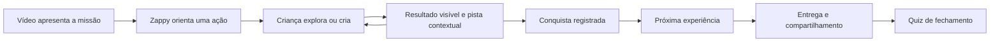

# Proposta para a experiência das aulas Kids: piloto Corre, Dino!

Revisão posterior para aprovação: [Proposta v5 — exploração direta e percurso das aulas](2026-09-12-exploracao-direta-aulas-kids-proposta-v5.md), acompanhada do [estudo do Brilliant](2026-09-12-brilliant-estudo-v5.md). Este documento preserva a análise inicial; a v5 consolida os ajustes aprovados durante a implementação e propõe a próxima evolução.

Proposta para discussão, preparada em 12/09/2026. Base: código local no commit `54d4ad09`, inventário dos 27 manifestos em `docs/aulas-interativas`, roteiro de animação, amostras de construção e gravidade, componentes de autoria, player, progressão e referências externas. As regras atuais podem ser alteradas para atender à experiência pretendida.

Direção definida pelo usuário durante a análise: **Corre, Dino! será o primeiro curso do piloto, abrangendo as 13 aulas e a evolução dos blocos, seções, admin, critérios e experiência do aluno.** Desafio e Meu Jeito entram depois. O aprofundamento incluiu as descobertas, explicações, objetivos e critérios dos 13 manifestos do Dino. Este documento apresenta o desenho proposto; não registra uma implementação já realizada.

**Recomendação:** organizar cada etapa de aprendizagem em torno de uma experiência que a criança controla. Vídeo apresenta a missão e explica o necessário; Zappy dá instruções curtas; a criança manipula um conceito ou cria na ferramenta; a plataforma reconhece uma ação significativa e oferece continuidade. Entrega e quiz passam a ter momentos próprios.

O inventário é dos arquivos locais, não das aulas publicadas. Não houve inspeção autenticada de staging/produção nem observação de crianças nesta análise. O validador local passou para os 27 manifestos; isso confirma consistência com os contratos atuais, não qualidade pedagógica.

## O que está causando a sensação de que a aula não está boa

A revisão anterior já retirou 143 cartões de perguntas e agrupou 226 seções em 96. Essa melhoria reduziu a fragmentação, mas o modelo de evidência continua conduzindo a autoria para perguntas. A questão principal agora é **o que a criança faz dentro da etapa e o que o sistema aceita como conclusão**.

| Inventário atual | Desafio | Corre, Dino! | Meu Jeito | Total |
| --- | ---: | ---: | ---: | ---: |
| Aulas | 6 | 13 | 8 | 27 |
| Seções | 24 | 47 | 25 | 96 |
| Blocos de texto | 66 | 111 | 64 | 241 |
| Diálogos do Zappy | 0 | 0 | 0 | 0 |
| Vídeos planejados | 36 | 51 | 31 | 118 |
| Atividades interativas | 15 | 23 | 25 | 63 |
| Seções com Estúdio compartilhado | 16 | 34 | 0 | 50 |
| Seções com atalho para ferramenta externa | 0 | 0 | 16 | 16 |

Dos 63 blocos interativos, 36 são perguntas curtas, 10 previsões, 7 ordenações/associações, 3 experimentos nativos e 7 experiências HTML. Portanto, 53 usam predominantemente alternativas ou peças textuais. Os 7 usos de HTML reutilizam cinco arquivos. Não há blocos nativos de quiz declarados nesses manifestos; as perguntas curtas são outro tipo de bloco. A importação pode preservar quizzes e outras atividades da aula de destino.

Em 26 das 27 primeiras seções não há vídeo planejado. Os vídeos se concentram na execução técnica, enquanto a descoberta do conceito depende principalmente de texto. Os 118 cartões ainda representam vídeos a produzir/vincular, conforme a documentação; não são evidência de 118 vídeos disponíveis ao aluno.

Os problemas podem ser nomeados assim:

| Problema | Evidência | Consequência para a experiência |
| --- | --- | --- |
| Orientação excessivamente verbal | 241 textos e nenhum diálogo nos manifestos | A criança precisa ler para descobrir o que fazer; o formato Kids existente não está sendo usado. |
| Descoberta com pouca manipulação do conceito | Em `prediction`, “Observar o resultado” revela um parágrafo | A criança escolhe uma alternativa, mas não vê sua ação produzir o fenômeno. |
| Critérios desalinhados com a atividade | Pinta externo avança por perguntas; projeto do Estúdio é conferido por estrutura | Saber a resposta pode liberar a etapa sem realizar a criação; ter um bloco pode não significar que o comportamento funciona. |
| Avaliação ocupando a exploração | Toda seção precisa de critério; HTML e experimentos usados como critério exigem conferência nativa | O professor acaba adicionando perguntas para satisfazer o contrato da plataforma. |
| Fechamento acoplado à entrega | A entrega obrigatória precisa estar na última seção, marcada como fechamento | Colocar quiz após a entrega exige mudar publicação e progressão, não apenas reordenar cartões. |
| Identificação insuficiente no editor | O cabeçalho do cartão mostra `blockLabel`, sem um marcador de tipo | O início de uma fala ou de um texto não permite reconhecer imediatamente seu formato. |
| Distância entre instrução e criação | Ferramentas externas abrem a página geral em outra aba; o lado a lado interno só aparece a partir de 1536 px | Há risco de perder contexto em notebooks e tablets; precisa ser observado em uso real. |

Na aula **Sua nave ganha movimento**, a criança responde sobre diferenças entre quadros e depois trabalha no Pinta externo. Já o arquivo `quadros.html` trata de limpar a tela entre desenhos e produzir rastros. São conceitos relacionados, mas são experiências diferentes. Falta a experiência de selecionar imagens, compará-las e reproduzi-las como uma sequência.

Há uma base útil para evoluir: diálogo do Zappy já renderizado, rascunho e prévia de autoria, persistência das explorações, histórico de evidências, projeto compartilhado entre seções, retomada e pedidos de ajuda contextualizados. A proposta deve aproveitar isso.

## O que aproveitar das referências

O **Brilliant** descreve um desenho de aprendizagem com conceitos pequenos, representações visuais, manipulação e feedback imediato. Também usa desafios antes de ensinar um procedimento. Isso inspira uma distinção: uma hipótese sobre algo visível pode despertar curiosidade; uma bateria de perguntas sobre informações ainda não apresentadas pode apenas criar uma barreira. Para o Sistema Zero, a hipótese inicial deve ser breve, opcional e sem nota. A aplicação principal dessa referência é fazer o conceito responder à ação da criança. [Método do Brilliant](https://brilliant.org/about/).

O **PhET** oferece uma referência especialmente útil para pouca leitura. Sua pesquisa sobre orientação embutida na interface utiliza possibilidades de ação, limites, sinais visuais e feedback para apoiar exploração com autonomia. Minha aplicação aqui é apresentar poucos controles e um objetivo concreto, ampliando a exploração aos poucos. Não basta disponibilizar um simulador e esperar que a criança encontre sozinha a relação relevante. [Podolefsky, Moore e Perkins](https://arxiv.org/abs/1306.6544), [pesquisa do PhET](https://phet.colorado.edu/en/research).

O exemplo de animação do **three.js** permite pausar, avançar um passo e modificar velocidade; os controles de pausa e avanço foram exercitados no navegador. É uma referência de controle sobre o fenômeno. A interface pedagógica proposta precisa de menos controles técnicos e de uma missão adequada à criança. Usar essa referência não exige que os experimentos sejam em 3D. [Exemplo de animação](https://threejs.org/examples/webgl_animation_skinning_blending.html).

A pesquisa de **aprendizagem multimídia** sustenta dividir explicações em segmentos controlados pelo aluno. Minha recomendação é usar vídeos curtos ligados a uma ação, com pausa e repetição, em vez de trocar cada texto por mais tempo obrigatório de reprodução. As durações abaixo são hipóteses de produção para o piloto, não limites científicos de atenção. [Mayer e Moreno, princípios de segmentação, preparação e modalidade](https://doi.org/10.1017/CBO9780511816819.012).

Uma pesquisa da **Carnegie Mellon** em curso on-line de psicologia também reforça a importância das atividades em relação ao consumo de materiais. Seu contexto não permite transportar um multiplicador de eficácia para crianças do Sistema Zero. A decisão a testar aqui é priorizar o tempo de criação e exploração, usando vídeo como apoio. [Learning Is Not a Spectator Sport](https://www.cmu.edu/dietrich/news/news-stories/2015/cmu-vs-moocs.html).

## Modelo de aula recomendado

Cada etapa de aprendizagem precisa conter uma ação central de **exploração** ou **criação**. Apresentação e explicação entram dentro dessas etapas. Entrega/compartilhamento e quiz são os momentos de fechamento. Não fixar o mesmo número de etapas em todas as aulas.

O ciclo de ação e feedback acontece dentro da etapa. Não transformar cada movimento, clique ou vídeo em uma nova seção com cadeado.

**Vídeo.** Na descoberta, apresenta o que será investigado, por que isso importa e como começar a mexer. Na criação, demonstra uma ação com o resultado esperado e devolve o controle. Como ponto de partida: convites de 20–45 segundos; explicações de 30–90 segundos; demonstrações divididas por ações coerentes, frequentemente de 1–3 minutos. Ajustar pelo conteúdo e pelo piloto. Não exigir percentual assistido para comprovar aprendizagem.

**Zappy.** Uma instrução por fala, junto do controle ou da atividade. Exemplo: “Toque em cada quadro. O que mudou no fogo?” Depois: “Agora aperte o play.” Falas reativas podem ser autoradas para momentos definidos; não dependem de geração por IA. Áudio acionável para ouvir a fala seria uma extensão útil — o bloco atual contém texto e pose, sem esse recurso. Legendagem, nomes de ferramentas e instruções consultáveis continuam disponíveis.

**Texto.** O bloco de texto continua sendo um formato normal na comunidade adulta. Na autoria Kids, vídeo e diálogo devem ocupar o caminho principal. Instruções escritas diretas usam Zappy; transcrições e referência ficam em apoio recolhível. Converter os 241 textos mecanicamente em balões produziria balões longos demais: separar o que precisa ser mostrado, falado e apenas consultado.

**Exploração.** A criança altera uma variável, uma posição, uma ordem ou uma configuração e vê o resultado. Toda experiência precisa de um contraste perceptível: com/sem, lento/rápido, antes/depois, alinhado/desalinhado. Um botão que apenas revela explicação não satisfaz sozinho esse papel.

**Criação.** Usar o próprio projeto ou asset, com liberdade nas escolhas artísticas. O critério só exige propriedades necessárias à tarefa. Se uma etapa intencionalmente prepara algo ainda invisível, a interface deve mostrar essa conquista intermediária: por exemplo, o objeto criado no mundo, mesmo antes de desenhá-lo na tela.

## Como os critérios passariam a funcionar

Separar **percurso realizado**, **resultado da criação**, **entrega** e **compreensão revisada**. Esses registros respondem a perguntas diferentes. A interface da criança mostra a próxima ação; o professor pode consultar exatamente qual evidência foi registrada.

| Situação | Critério proposto | O que ele permite afirmar |
| --- | --- | --- |
| Explorar quadros | Inspecionar os dois quadros diferentes e reproduzir a sequência | A criança realizou a comparação prevista. |
| Investigar gravidade | Executar um cenário sem gravidade e outro com gravidade, observando os estados de subida/retorno | A criança percorreu o contraste relevante. Dois cliques ou dois valores quaisquer não bastam. |
| Resolver um desafio manipulável | Ajustar uma configuração que satisfaça uma condição do modelo, como manter o corpo alinhado enquanto o fogo varia | A solução atende à condição daquele desafio. |
| Criar no Pinta | Salvar uma versão identificada do asset com as propriedades necessárias, como dois quadros e nome da animação | Existe uma criação recuperável e tecnicamente compatível. Não comprova qualidade artística. |
| Criar no Estúdio | Conferir a propriedade pertinente à etapa; observar o comportamento quando houver instrumento adequado | A estrutura ou o comportamento efetivamente verificado atende ao objetivo. |
| Entregar | Servidor confirma a versão enviada ao professor | A entrega existe, sem presumir que o professor já avaliou. |
| Compartilhar | Servidor confirma a publicação iniciada pela criança | O trabalho foi compartilhado. Publicação é uma ação distinta do envio ao professor. |
| Quiz final | Resolver questões sobre o que foi explorado/criado, com devolutiva e novas tentativas | Há evidência delimitada de compreensão naquele conjunto de questões. |

Registrar exploração não equivale a comprovar domínio. A aplicação seguinte e o quiz trazem outras evidências. Isso permite que a criança avance na descoberta sem acertar uma pergunta adicional em toda etapa.

Os critérios de exploração são específicos ao objetivo. Não adotar regras universais como “arraste três vezes”, “fique 30 segundos” ou “clique em tudo”. Em uma investigação de quadros, visualizar diferenças e reproduzi-las é pertinente. Em outra, a ação necessária será diferente.

Para a criança, mostrar instruções concretas: “Veja os dois quadros e aperte o play”. Após a confirmação: “Você colocou os desenhos em movimento!” Se falta algo: “Falta ver o segundo quadro”, com acesso ao local. Conclusão pode ser reconhecida automaticamente; **Continuar** permanece uma escolha da criança, para ela poder explorar mais.

Pistas devem responder ao estado: “Os dois fogos ainda estão iguais. Mude o segundo e teste de novo.” Evitar a devolutiva genérica de erro como única ajuda. O aluno mantém seu trabalho e pode rever o trecho pertinente ou pedir ajuda. A falha de salvamento precisa ter recuperação clara e não aparecer como erro de aprendizagem.

No quiz final, começar testando 2–4 questões curtas, preferencialmente com imagens ou uma pequena manipulação. Cada questão retoma uma experiência da aula; não pergunta sobre menus sem relação com o objetivo. Se houver bloqueio, liberar após resolver com feedback e novas tentativas, sem penalizar a exploração anterior ou exigir refazer toda a aula. Essa regra precisa ser explícita na autoria.

## Piloto: as 13 aulas de Corre, Dino!

O curso tem hoje 47 seções, 111 textos, nenhum diálogo do Zappy, 51 vídeos planejados e 23 blocos interativos. Nenhuma das 13 descobertas iniciais possui vídeo planejado. Todas as aulas têm continuidade no Estúdio incorporado, o que permite testar o novo modelo sem depender primeiro da integração com ferramentas externas.

Cada aula mantém sua conquista técnica. A descoberta passa a ser uma cena manipulável e a aplicação usa o projeto da criança. A tabela descreve o núcleo da exploração; os critérios de criação e entrega são configurados separadamente. Nas etapas de descoberta, a evidência comprova a experiência realizada, não domínio automático do conceito.

| Aula | Experiência de descoberta proposta | Evidência pertinente à exploração |
| --- | --- | --- |
| 1. Prepare o mundo do Dino | Criar um Dino nos “bastidores” de uma cena e ligar/desligar seu desenho. Ver lado a lado os objetos existentes e o que aparece no jogo. | Criou o objeto e observou a diferença entre existir e estar desenhado. No projeto real, terminar ainda invisível continua correto. |
| 2. O Dino aparece e corre | Mover as camadas floresta/Dino e ver o personagem ficar coberto ou aparecer. Ligar a passagem do cenário e observar a corrida. | Produziu as duas ordens e deixou o Dino visível na cena de desafio. |
| 3. Um salto que volta ao chão | Fazer o Dino saltar com e sem gravidade; depois variar apenas a força e comparar alturas. | Executou o contraste com/sem gravidade e experimentou dois saltos de alturas diferentes na aplicação. |
| 4. O som escuta o pulo | Alternar som ligado à tecla e som ligado ao evento de pulo. Acionar espaço/toque no chão e no ar. Um indicador visual acompanha o som. | Experimentou um comando sem salto e um salto por outro controle; conectou o som ao acontecimento na cena de desafio. |
| 5. Cactos no ritmo certo | Comparar nascimento a cada quadro com um relógio de intervalo ajustável. Os cactos aparecem e deixam espaços na pista. | Executou os dois modos e configurou um intervalo na cena. O critério não julga automaticamente qual dificuldade é “a melhor”. |
| 6. A faxina dos cactos invisíveis | Ver cactos saírem da pista e continuarem no grupo; ativar a limpeza e observar o total guardado estabilizar. | Comparou com/sem remoção. O contador diagnóstico do projeto é retirado no final da aula, como previsto. |
| 7. Cada coisa na sua tela | Alternar início/jogando e colocar o relógio dentro/fora de uma condição visual. Ver quando novos cactos surgem. | Configurou o relógio para agir durante a partida e observou a espera no início. Floresta sozinha continua sendo resultado esperado no projeto. |
| 8. Um convite para jogar | Testar uma tela que promete toque, mas responde apenas a Enter. Trocar a ligação do controle e experimentar novamente. | Fez a instrução e os controles combinarem no cenário. Toque e teclado podem ser simulados por botões acessíveis no dispositivo disponível. |
| 9. Bateu, terminou, recomeçou | Jogar uma mini rodada, provocar uma colisão e ligar as transições até conseguir reiniciar. | Percorreu início → jogando → fim → nova partida na montagem criada. |
| 10. Uma colisão mais justa | Aproximar Dino/cacto, mostrar os retângulos de colisão, ajustar a área e repetir o contato. | Comparou tamanhos e testou contato/separação. A escolha estética de “justiça” recebe orientação, sem gabarito único de tamanho. |
| 11. Quanto tempo você resistiu? | Avançar o relógio no início, na partida e no fim. Mover a regra de pontos para dentro da condição correta. | Configurou a contagem durante a partida e verificou que ela fica parada fora dela. |
| 12. Surpresas dentro de limites | Arrastar os limites de uma faixa de nascimento e sortear cactos; visualizar velocidade negativa numa reta e no deslocamento. | Gerou e comparou resultados da faixa escolhida; observou que −6 desloca mais para a esquerda por quadro que −5. |
| 13. Dificuldade que cresce com a partida | Avançar o tempo, observar a base −5 → −9 e os novos cactos nascerem mais rápidos; mostrar separadamente a variação sorteada. | Chegou ao limite e avançou de novo, observando que a base para em −9 e o sorteio ainda altera o vx final. |

Usar inicialmente seis famílias de modelos: **mundo/camadas, movimento/pulo, eventos/estados, nascimento/limpeza, colisão e faixas/velocidade**. São cenas reutilizáveis para os objetivos do curso. A composição deve permitir que uma nova aula configure uma família existente, sem programar tudo novamente.

Na aula 10, representar retângulos, como o jogo utiliza, facilita a ligação entre experimento e criação. Na aula 13, mostrar que o limite vale para a velocidade-base dos novos cactos; os já criados preservam a velocidade recebida. A cena precisa ensinar o mesmo comportamento do projeto.

Entregar a evolução ao professor acontece antes do quiz de cada aula. O compartilhamento do jogo completo no Mural ganha destaque na aula 13, antes do último quiz. Não criar uma obrigação de publicar 13 versões incompletas no mural. As entregas intermediárias continuam sendo evidência do percurso.

### Aula 3 como primeira experiência completa para revisão

| Etapa | Orientação | Ação da criança | Como concluir |
| --- | --- | --- | --- |
| 1. Faça o Dino voltar ao chão | Vídeo de cerca de 30 s apresenta o desafio. Zappy: “Faça o Dino pular. Depois ligue a gravidade e tente de novo.” | Executa o salto sem gravidade e com gravidade; vê o personagem em movimento, podendo pausar e comparar. | Registrou os dois cenários relevantes; não há pergunta de múltipla escolha para liberar a descoberta. |
| 2. Coloque o salto no seu jogo | Vídeos curtos mostram controle do Dino e aplicação da gravidade. Zappy orienta o próximo encaixe. | Continua o projeto da aula 2, coloca os blocos e executa o jogo. | Estrutura pertinente confirmada e execução observada conforme o instrumento implementado. O rótulo informa exatamente o que foi verificado. |
| 3. Escolha a altura do seu salto | Zappy: “Experimente um salto baixinho e um alto. Qual combina com a sua pista?” Vídeo curto mostra como comparar uma mudança por vez. | Mantém a gravidade e altera a força; joga e escolhe uma versão. | Comparou alturas e salvou a escolha. Não existe uma única força correta para personalização. |
| 4. Mostre seu salto ao professor | Zappy: “Teste mais uma vez e envie seu Dino.” | Executa o projeto e envia a versão escolhida. | Entrega confirmada; não depende de aguardar a leitura do professor. |
| 5. Feche a descoberta | Zappy apresenta um quiz curto e visual. | Reconhece a função da gravidade e prevê o efeito de alterar a força num exemplo diferente. | Resolve as questões com devolutiva e novas tentativas. |

A segunda e a terceira etapas devem se reunir se o piloto mostrar que a divisão interrompe uma única conquista. Cinco etapas são um storyboard inicial, não uma regra para o curso.

O salto no experimento e o salto no projeto precisam ser distinguíveis. A primeira cena ensina o conceito; a segunda pertence ao trabalho da criança. Progresso na cena não pode ser registrado como se o próprio jogo tivesse funcionado.

## Evolução dos blocos no piloto

Melhorar os blocos significa mudar seus comportamentos e seus contratos de autoria/evidência, além da apresentação. A proposta é evoluir o bloco interativo com modelos configuráveis, sem criar um tipo de bloco exclusivo para cada aula.

| Bloco | Evolução proposta para Corre, Dino! |
| --- | --- |
| **Vídeo** | Papel explícito no planejamento: apresentar missão, explicar conceito ou demonstrar ação. Trecho e título ligados à etapa; repetição fácil; legendas. Voltar ao vídeo deve preservar a exploração e o projeto. |
| **Zappy** | Falas curtas para início, próxima ação, pista e conquista. Posicionamento junto à atividade. As falas condicionais pertencem ao cenário; áudio sob demanda é uma extensão de acessibilidade a priorizar com a produção. |
| **Experimento** | Cena animada e manipulável, controles de pausa/reinício, comparações pertinentes, estado salvo, feedback contextual e regra própria de conclusão. A pergunta final adicional deixa de ser obrigatória. |
| **Ordenação/associação** | Peças visuais conectadas à cena: reordenar a floresta e o Dino muda a imagem; conectar evento e som muda o comportamento. Botões equivalentes ao arraste continuam disponíveis. |
| **Estúdio** | Mesmo projeto entre etapas, objetivo atual próximo à ferramenta, prévia de execução e resultados de verificação compreensíveis. Salvar, testar, concluir a etapa e entregar são ações distintas com uma sequência clara. |
| **Entrega** | Um momento do percurso referenciando a versão do projeto existente. Prévia do que será enviado, confirmação e possibilidade de reenviar. Pode anteceder o quiz. Não requer um segundo Estúdio nem outro projeto. |
| **Quiz** | Fechamento curto, enunciados e alternativas visuais, retomada do conceito explorado e devolutiva por resposta. O contrato atual tem enunciado e alternativas textuais; imagens e outras representações precisam ser acrescentadas ao contrato, à autoria e à renderização. |
| **Texto** | Formato de autoria adulta e material de apoio. Na sequência principal Kids, orientação em Zappy e explicação em vídeo. |

O admin precisa oferecer um lugar único para escolher o que encerra a etapa. Atualmente há `required` no bloco interativo e seleção em `completion.blockIds`; o serviço força a obrigatoriedade dos selecionados. No novo percurso, a seleção do critério da seção deve ser a fonte da exigência mostrada ao autor e ao aluno, evitando duas configurações independentes para a mesma decisão. Compatibilidade com aulas legadas pode ficar no processamento do contrato antigo.

Os resultados também precisam de nomes próprios: exploração registrada, desafio resolvido, projeto salvo, estrutura verificada, execução observada e entrega recebida. A progressão pode usar essas evidências sem reduzi-las a uma nota única. O professor consegue entender por que o aluno avançou.

## Exemplo para expansão posterior: Sua nave ganha movimento

Uma proposta de cinco etapas para a Aula 3 de O Jogo do Meu Jeito. As durações indicam apenas o vídeo de abertura de cada etapa. Os detalhes de desenho e as cores continuam livres.

| Etapa | Vídeo e Zappy | Ação central | Critério de avanço |
| --- | --- | --- | --- |
| 1. Faça os desenhos se mexerem | Vídeo de cerca de 30 s: “Vamos descobrir como dois desenhos fazem o fogo se mexer.” Zappy: “Toque em cada quadro. Depois aperte o play.” | Duas miniaturas de nave; tocar amplia cada imagem; play alterna os quadros; controle muda a velocidade. | Inspecionou os dois quadros e executou a sequência. |
| 2. Faça o fogo mexer sem a nave tremer | Vídeo de cerca de 30–45 s introduz o problema. Zappy: “Compare o corpo da nave nos dois quadros.” | Comparar exemplos estável/tremendo e reposicionar o segundo quadro com referência visual; reproduzir para ver a consequência. | Resolveu o desafio de alinhamento com fogo diferente. O modelo conhece os deslocamentos; não precisa julgar imagens arbitrárias. |
| 3. Anime a sua nave | Demonstrações curtas: duplicar, mudar o fogo, usar a referência anterior. Zappy apresenta apenas o passo atual. | Retomar o mesmo asset 32 × 32 no Pinta; criar dois quadros e a animação `voando`; experimentar a prévia. | Versão salva com os metadados exigidos e diferença entre os quadros; alinhar o corpo é orientação criativa, não julgamento visual automático. |
| 4. Entregue sua animação | Vídeo mostra a entrega. Zappy: “Veja sua animação mais uma vez e mande para o professor.” | Ver a prévia, enviar uma versão identificada e ter a opção de mostrar a criação no mural. | Envio confirmado. Compartilhar tem confirmação e registro próprios. |
| 5. Feche a descoberta | Instruções curtas do Zappy; leitura de enunciado disponível. | Quiz visual: escolher qual par produz movimento; reconhecer uma nave desalinhada; prever o efeito de reproduzir mais rápido. | Questões resolvidas com feedback e possibilidade de tentar novamente. |

A primeira exploração utiliza controles simples; a segunda acrescenta alinhamento. Não apresentar velocidade, alinhamento, pele de cebola, nome de animação e integração com o jogo de uma vez.

O jogador de quadros usa as mesmas imagens tanto na inspeção quanto na reprodução. A criança consegue pausar, retornar e passar quadro a quadro. Oferecer botões equivalentes ao arraste, controles por teclado e alvos adequados ao toque. A reprodução parte da ação do aluno; deve haver pausa e alternativa de avanço manual.

Essa aula hoje usa Pinta externo. Para realizar a proposta, o percurso precisa se vincular ao asset escolhido na galeria e recuperar sua versão, ou abrir esse mesmo asset na ferramenta integrada. A referência ao trabalho deve sobreviver à troca de seção e de aba. Não criar uma cópia independente só para obter um critério de conclusão.

O compartilhamento de uma animação do Pinta com prévia própria é uma capacidade a confirmar/implementar; o fluxo de Mural identificado no player atual está ligado ao Estúdio. Nas aulas intermediárias, a proposta é entregar a evolução e oferecer compartilhamento adequado ao trabalho. Nos marcos de projeto, “Entregue e mostre seu jogo” ganha destaque antes do quiz. A publicação nunca acontece automaticamente ao terminar a etapa.

## Biblioteca de experiências para os três cursos

Construir modelos reutilizáveis com cenários próprios das aulas. O professor escolhe imagens, personagens, parâmetros e missão; não precisa escrever HTML para cada descoberta.

| Modelo | O que a criança manipula e observa | Primeiros usos |
| --- | --- | --- |
| Quadros e reprodução | Seleciona imagens, reproduz, altera velocidade e compara alinhamento | Meu Jeito 3 e 5; apresentação de animações |
| Movimento e coordenadas | Move a nave/tiro, muda direção e acompanha o trajeto; rastros mostram estados anteriores | Desafio 1–2 |
| Pulo e gravidade | Aciona o salto, altera uma força e vê subida, queda e contato com o chão | Dino 3 |
| Camadas | Reordena figuras e vê imediatamente quem cobre quem | Dino 2; Meu Jeito 5 |
| Eventos e estados | Liga/desliga partida, aciona eventos e observa som, pontos, vidas e reinício | Desafio 4–5; Dino 4 e 7–11 |
| Ritmo, população e limites | Muda intervalos, observa objetos nascerem/saírem e compara densidade e velocidade | Desafio 3; Dino 5–6 e 12–13 |
| Colisão | Move personagens, mostra/oculta a área de contato e compara a batida | Desafio 3; Dino 10 |
| Imagem, luz e tamanho | Move uma luz, compara pixel/vetor no zoom e muda tamanho da imagem/instância separadamente | Meu Jeito 2, 4 e 6–7 |

O modelo de gravidade atual exibe trajetórias estáticas; o de população exibe barras; o de colisão mostra figuras fixas e áreas ajustáveis. São pontos de partida. Para Kids, propor primeiro Dino pulando, cactos aparecendo e personagens encostando; gráficos podem ser uma visualização complementar.

Há também missões de uso real da plataforma: na introdução, encontrar uma aula, abrir a ajuda e recuperar uma criação de treino; em Meu Jeito 1, importar e reencontrar o jogo; em Meu Jeito 8, testar, compartilhar e escolher uma mudança concreta. Essas missões substituem perguntas sobre o lugar onde se deveria clicar. O treino de ajuda não precisa enviar mensagens de verdade.

Evitar desenvolver um simulador específico para cada uma das 27 aulas. Começar pelas famílias necessárias ao Corre, Dino!, validar o padrão e depois acrescentar quadros, Pinta e integração de assets conforme a expansão para Meu Jeito. Molda poderá se integrar como mais uma ferramenta de criação quando existir.

## Autoria que ajuda o professor a construir a experiência

O editor deve partir de quatro decisões: **qual é a conquista, o que a criança vai fazer, como será orientada e qual evidência encerra a etapa**. Os blocos continuam existindo como material de composição.

Oferecer modelos de etapa: **Explorar um conceito**, **Criar na ferramenta**, **Entregar e compartilhar**, **Fechar com quiz**. Cada modelo propõe uma estrutura editável, sem acrescentar critérios obrigatórios automaticamente só porque um bloco foi adicionado.

Para cada bloco, mostrar **ícone + nome do tipo + título/resumo** no seletor e no cartão após a inclusão. Exemplos: balão / Zappy; câmera / Vídeo; controles / Experimento; paleta / Pinta; blocos / Estúdio; lista / Quiz; documento / Texto. Usar a mesma identificação na edição e na lista de critérios. Cor é complementar; o nome continua legível.

Exemplo de resumo no editor: “Experimento · Quadros da nave”, “Zappy · Agora aperte o play”, “Vídeo · Por que o fogo se mexe?”. O resumo do conteúdo não precisa disputar espaço com o reconhecimento do tipo.

O campo de conclusão pode dizer **Esta etapa termina quando…**, seguido de uma regra ligada à atividade principal: “comparar estes cenários”, “resolver esta montagem”, “salvar esta criação” ou “enviar este projeto”. Configurações técnicas ficam disponíveis em detalhe. Ao lado, mostrar a frase que a criança verá e o que o professor poderá concluir a partir da evidência.

Na autoria Kids, destacar vídeo, Zappy, experimentos e ferramentas; texto fica em apoio/uso avançado. Sinalizar etapas de aprendizagem sem criação ou experiência manipulável e textos longos usados como instrução principal. A regra editorial deve abranger também as instruções internas dos experimentos, para o texto não reaparecer dentro de outro bloco.

Ampliar a prévia para experimentar uma etapa incompleta, concluída e com erro recuperável de salvamento. A prévia atual permite navegar livremente e não exercita, sozinha, a sensação de bloqueio do aluno. A simulação deve continuar sem gerar progresso ou mensagens reais.

## Mudanças necessárias na plataforma

| Área | Mudança proposta | Limite importante |
| --- | --- | --- |
| Contrato de conclusão | Aceitar exploração realizada, desafio manipulável, criação salva, entrega e quiz como evidências distintas | Não classificar participação como domínio do conceito. |
| Atividades nativas | Estado tipado, condição de conclusão e feedback por cenário, reutilizados na autoria e no aluno | A regra conhece o objetivo; não se resume a contar eventos genéricos. |
| Experiências HTML | Manter isolamento e possibilidade de exploração livre | Um `participated()` emitido pelo iframe não vira prova automática de compreensão. |
| Pinta e ferramentas externas, na expansão | Vincular asset/projeto, versão salva, prévia e retorno à etapa | Um atalho aberto não comprova criação nem salvamento. Essa integração não é pré-requisito do piloto Dino. |
| Entrega e quiz | Permitir seção de entrega antes do fechamento; conclusão da aula considera ambos | Revisar validação de publicação, autorização do envio e progressão conjuntamente. |
| Player Kids | Atividade em destaque, instrução próxima, vídeo acessível, continuidade explícita | Testar notebooks e tablets; não depender de tela de 1536 px para orientar e criar. |
| Professor | Mostrar cenário explorado, desafio resolvido, criação/versão e ajuda utilizada | Os nomes do relatório precisam refletir o que foi de fato observado/verificado. |

Para modelos nativos, o servidor pode validar a configuração/solução segundo as regras do modelo. Os registros de interação continuam sendo evidência de percurso, com a limitação própria de ações reportadas pelo cliente. Não prometer que telemetria comprova atenção ou entendimento.

Na construção, verificações de estrutura devem continuar disponíveis quando o objetivo é estrutural. Objetivos comportamentais precisam de avaliação de execução adequada ou de evidência apresentada à revisão docente. A pergunta de compreensão não deve ser usada como substituto silencioso de um comportamento que a plataforma não consegue verificar. Avaliação subjetiva de estética fica com o professor; revisão assíncrona não deve bloquear toda a sequência por padrão.

O Estúdio já possui execução de verificações no cliente e sandbox (`activity/run.ts`); a publicação com aprovação de seção restringe o que aceita a checagens estruturais. Antes de expandir esse uso, conferir se o mecanismo consegue observar os eventos do Jogo 2D necessários ao Dino. O piloto deve instrumentar apenas os comportamentos exigidos por suas etapas e registrar a origem da evidência. Não é necessário construir agora um avaliador universal de jogos.

Uma dependência concreta é distinguir “testou o próprio projeto e o salvou” de “o salto desse projeto foi validado automaticamente”. O primeiro pode ser um critério formativo de percurso com registro explícito. O segundo só deve aparecer quando a execução ou reavaliação realmente permitir essa afirmação. Essa distinção libera a criação com critérios honestos sem trazer de volta a pergunta burocrática.

Evoluir os contratos com versão explícita. Na migração, preservar trabalhos, entregas, mídias vinculadas e histórico. Revisões editoriais não devem apagar conquistas anteriores. O importador atual preserva blocos omitidos; a nova reautoria precisa de uma comparação explícita para retirar cartões obsoletos do percurso sem perder o histórico.

## Alternativas e recomendação de execução

| Caminho | Vantagem | Limitação |
| --- | --- | --- |
| Revisão editorial usando apenas recursos atuais | Ícones, Zappy e redistribuição de vídeos podem melhorar a leitura rapidamente | Continua condicionada a perguntas para muitos avanços e à falta de evidência do Pinta externo. |
| **Biblioteca de experiências + novos critérios + piloto Corre, Dino!** | Muda a experiência central e cria um padrão reutilizável que pode ser observado com crianças | Exige mudanças nos blocos, contratos de progressão, autoria e integração com o Estúdio. **Recomendado.** |
| Ferramenta universal para o professor programar qualquer simulação | Grande liberdade futura | Aumenta muito autoria, manutenção e validação antes de sabermos quais experiências funcionam. |

**Primeira entrega de código e conteúdo:** infraestrutura mínima dos novos critérios, identificação dos blocos, composição Kids e Aula 3 completa com salto manipulável, Estúdio, entrega e quiz. Para revisão isolada, usar um projeto de entrada que corresponda ao final da Aula 2; isso não altera o percurso publicado nem substitui a continuidade real do aluno.

**Primeiro trecho contínuo:** adaptar as Aulas 1–3 e percorrê-las com um aluno novo, usando o mesmo projeto e as conquistas intermediárias. Testar a passagem entre aulas, pois uma aula isolada pode esconder problemas de continuidade. Antes de produzir todas as mídias, revisar esses storyboards e observar crianças usando esse trecho.

**Curso completo:** adaptar Aulas 4–9 com eventos, condições, população e reinício; depois Aulas 10–13 com colisão, placar, faixas e limites. O piloto solicitado só cobre o curso completo quando todas as 13 aulas tiverem o novo percurso e a última incluir entrega, Mural e quiz. Não aplicar globalmente os contratos novos antes de existir uma migração validada.

**Expansão:** após ajustar e validar Corre, Dino!, adaptar Desafio e Meu Jeito, incluindo o experimento de quadros e a vinculação do Pinta. A quantidade final de etapas e de vídeos deve resultar desse desenho, não ser uma meta herdada. Os 51 trechos do Dino são material de partida para reedição; faltam vídeos de missão e descoberta, e alguns trechos podem ser reunidos ou redistribuídos.

| Frente de implementação | Principais pontos do código | Entrega verificável |
| --- | --- | --- |
| Contratos e progressão | `packages/core/src/learning`, serviços de aprendizagem e publicação em `packages/members` | Exploração pode concluir sem pergunta; entrega pode vir antes do quiz; legado e histórico permanecem coerentes. |
| Blocos e cenas | `learning-activity.tsx`, `learning-experiment.tsx`, diálogo, vídeo, quiz e integração do Estúdio | Cena manipulável com retomada e critério do objetivo, orientação em Zappy e feedback contextual. |
| Admin | `learning-builder.tsx`, `lesson-structure-editor.tsx`, `section-completion-editor.tsx` e importação | Professor reconhece tipos e configura uma etapa com critério compreensível; prévia simula avanço e pendências. |
| Player | `lesson-sections.tsx`, renderização Kids e contexto da aula | Atividade e instrução próximas; projeto persistente; continuar, entregar e revisar sem ambiguidades em notebook/tablet. |
| Conteúdo e acompanhamento | Manifestos/roteiros Dino, mídias, painel docente e validação | Treze aulas reautoradas, evidências com nomes honestos e percurso completo observado. |

Verificações essenciais para o código futuro: concluir exploração sem pergunta, impedir avanço quando a ação pertinente falta, conservar o projeto ao mudar de etapa, recuperar após recarga/erro, enviar antes do quiz sem concluir a aula inteira, manter entrega ao retomar o quiz, preservar progresso legado e não registrar evidência durante prévia de autoria. Não basta validar JSON ou a aparência dos cartões.

## Como saber se a proposta melhorou a experiência

Começar com 5–8 participantes de diferentes idades dentro do público atual de 9–16 anos, como rodada qualitativa, não amostra para provar eficácia estatística. Observar especialmente a faixa mais nova e quem lê com menos fluência, sem infantilizar o tom para os mais velhos. Incluir notebook e tablet/toque. O PhET descreve entrevistas individuais de observação como parte do refinamento de suas simulações; a aplicação aqui é avaliar a experiência antes da expansão. [Processo de pesquisa do PhET](https://phet.colorado.edu/en/research).

Observar se a criança consegue identificar o que fazer, iniciar a interação sem leitura guiada por adulto, perceber o que mudou, ajustar uma tentativa, retomar o mesmo trabalho e distinguir salvar, entregar e compartilhar. Anotar os trechos em que ela para por causa da interface.

Para compreensão, pedir uma pequena transferência: após trabalhar o salto do Dino, apresentar uma bola que sobe sem voltar e pedir que a criança ajuste a cena; depois pedir um salto mais baixo mantendo a gravidade. Comparar a ação e uma explicação breve, respeitando como a criança consegue se expressar. Na expansão para animação, um caso equivalente é produzir movimento com quadros de outro personagem. Uma taxa maior de conclusão pode resultar apenas de critérios mais fáceis; precisa ser interpretada junto dessa transferência.

Registrar pedidos de ajuda, retornos ao vídeo, tentativas de continuar sem entender o requisito e tempo até a primeira ação significativa. Tempo com a aba aberta não é tempo de aprendizagem. Retornar ao vídeo ou usar pista não deve aparecer automaticamente como fracasso.

Condições de qualidade para expandir: nenhuma etapa de aprendizagem composta apenas de texto/pergunta; instruções diretas em Zappy e explicações em vídeo acessível; consequência visível em toda exploração; critério coerente com a ação; criação recuperável; entrega antes do quiz funcionando; revisão e novas tentativas claras. Falhas de retomada ou bloqueios sem saída impedem ampliar o piloto.

## Evidências locais e verificação

| Fonte | O que foi verificado |
| --- | --- |
| [README das aulas](../aulas-interativas/README.md) e [revisão pedagógica](../aulas-interativas/qa/revisao-pedagogica-2026-09-12.md) | Estado do pacote, revisão anterior, produção pendente, continuidade e limites declarados. |
| [Roteiro da animação](../aulas-interativas/o-jogo-do-meu-jeito/aula-03/roteiro.md) | Etapas atuais, perguntas, vídeos técnicos e uso do Pinta externo. |
| [Quadros HTML](../aulas-interativas/interacoes/quadros.html) | Experiência atual de limpeza/rastros, sem montagem e reprodução automática de imagens diferentes. |
| [Manifesto Dia 1](../aulas-interativas/desafio-primeiro-jogo/dia-1/manifesto.json) e [Dino 3](../aulas-interativas/corre-dino/aula-03/manifesto.json) | Composição das descobertas, posição de vídeos, textos e critérios. |
| [Editor do percurso](../../packages/admin/src/components/editor/lesson-structure-editor.tsx) | Resumo dos cartões e ausência de marcador do tipo nesse cabeçalho. |
| [Editor de conclusão](../../packages/admin/src/components/editor/section-completion-editor.tsx) | Seleção de critérios e verificações estruturais disponíveis. |
| [Construtor de atividades](../../packages/admin/src/components/editor/learning-builder.tsx) e [contratos dos blocos](../../packages/members/src/domain/course/lesson-block.ts) | Modelos de autoria, campos atuais de diálogo, vídeo e quiz. |
| [Atividade interativa](../../packages/member-shell/src/components/learning-activity.tsx) e [experimentos](../../packages/member-shell/src/components/learning-experiment.tsx) | Previsão revela texto; ordenação/associação textual; modelos gráficos atuais. |
| [Contrato de aprendizagem](../../packages/core/src/learning/index.ts), [progressão](../../packages/core/src/learning/section-progression.ts) e [serviço](../../packages/members/src/application/learning/section-progression.service.ts) | Evidências aceitas, conferência, obrigatoriedade de critério e posição da entrega. |
| [Player de seções](../../packages/member-shell/src/components/lesson-sections.tsx) e [diálogo](../../packages/member-shell/src/components/dialogue-block.tsx) | Ferramentas externas, organização responsiva, apresentação e capacidade atual do Zappy. |
| [Isolamento de HTML](../../packages/member-shell/src/components/learning-html.tsx) e [painel docente](../../packages/admin/src/components/professor/lesson-learning-panel.tsx) | Protocolo de participação, persistência e apresentação da evidência. |
| [Executor de atividades do Estúdio](../../packages/studio/src/activity/run.ts) | Verificações estruturais e execução em sandbox no cliente; não confirma por si só a instrumentação necessária ao piloto. |

Inventário realizado por leitura dos JSONs, agrupando tipos, modelos interativos e referências de ferramentas. Verificação executada nesta análise: `bun docs/aulas-interativas/qa/validar-manifestos.ts`, com saída de 27 aulas, 96 seções, 118 vídeos planejados, 16 etapas com 19 objetivos estruturais, sem erro. Código de produto e manifestos permaneceram inalterados; este arquivo registra a proposta.
