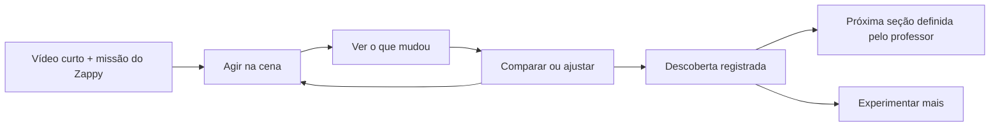

# Proposta revisada para as aulas Kids

A recomendação é evoluir o piloto Corre Dino para **explorações em que a criança atua sobre a cena, vê a consequência e usa a descoberta no próprio projeto**. A base implementada será aproveitada. O próximo investimento deve concentrar-se na qualidade de cada missão, na clareza dos gestos e na ligação entre explorar, criar e concluir.

Proposta preparada em 12/09/2026 e aprovada pelo professor para implementação, incluindo a composição livre das aulas. O [acompanhamento da implementação](2026-09-12-aulas-kids-v5-implementacao.md) distingue código, conteúdo, verificação e produção. A aprovação não equivale a publicação. A [pesquisa e o diagnóstico detalhado](2026-09-12-brilliant-estudo-v5.md) registram as fontes e os limites da análise.

## 1. O que permanece e o que muda

Os ajustes realizados durante a implementação fazem sentido e passam a ser parte explícita do desenho. A regra de que toda seção precisa ser exploração ou criação será aplicada às **etapas de aprendizagem de conceitos e de construção**. Caderno, orientação, ação na plataforma, entrega e quiz têm funções próprias.

**A aula não tem uma sequência fixa de tipos de seção.** O conteúdo e a intenção do professor determinam a ordem, a quantidade e a repetição das etapas. Uma aula pode alternar exploração e criação várias vezes, começar pela criação para depois investigar um problema ou conter somente os tipos pertinentes ao seu objetivo. Não há obrigação de começar com exploração, concentrar todas as descobertas no início ou ter uma única seção de cada tipo.

| Decisão | Proposta revisada |
| --- | --- |
| Corre Dino como piloto | Manter as 13 aulas e o mesmo projeto contínuo; os demais cursos vêm depois. |
| Composição de cada aula | Professor define a sequência conforme o conteúdo; exploração e criação podem se repetir e alternar, com critérios próprios em cada seção. |
| Vídeo para explicar, Zappy para instruir | Manter. Cada vídeo precisa preparar ou explicar uma ação concreta; a quantidade de vídeos não será uma meta. |
| Pouco texto no Kids | Manter, incluindo as instruções dentro dos blocos. Rótulos, legendas, transcrições e acessibilidade continuam necessários. |
| Descoberta com cena manipulável | Aprofundar: a cena passa a oferecer os principais gestos; o formulário de parâmetros deixa de ser a entrada normal. |
| Critérios próprios de exploração | Manter o sentido e mudar o reconhecimento: registrar acontecimentos pertinentes no modelo, sem obrigar uma reprodução genérica para qualquer descoberta. |
| Entrega antes do quiz | Manter. Enviar confirma a entrega e libera o fechamento; não aprova o quiz automaticamente. |
| Mural | Manter no marco final do projeto, com prévia e confirmação da criança. Compartilhar é distinto de entregar e não acontece automaticamente. |
| Legado | Preservar a adaptação aprovada, a migração gradual, os trabalhos e as conclusões anteriores. |
| Vídeo isolado | Manter 90% dos trechos assistidos quando o vídeo é o único bloco e foi escolhido como critério; no legado elegível, aplicação automática. |
| Caderno do curso | Manter abrir o livro **ou** baixar o PDF; sem obrigar ambos, sem quiz artificial e sem 90% do vídeo explicativo. |
| Trabalho fora da aula | Manter galeria do Pinta/Estúdio e confirmação de envio com cópia da versão escolhida. |
| Tour por ações | Manter verificação de avatar, quarto e tema salvos. A ação já realizada vale; abrir a tela não vale. |
| Verificação automática do jogo inteiro | Reavaliar a ambição. Manter checagens estruturais pertinentes e desenvolver somente verificações de comportamento que possam ser comprovadas. |
| Biblioteca universal de simulações | Adiar. Evoluir as famílias necessárias às 13 aulas, com escolhas simples de autoria. |
| Quadros/animação e outros cursos | Continuam na expansão posterior; não serão apresentados como parte concluída do Dino. |

As 60 seções e os 77 clipes planejados são o inventário atual do piloto, não números a preservar a qualquer custo. Recomenda-se revisar os storyboards antes de gravar tudo, reunir explicações repetidas e manter separadas as ações que a criança precisa praticar.

### Compor o percurso conforme o conteúdo

Um percurso possível para o salto é: explorar a aplicação da gravidade → aplicar no Estúdio → explorar a força do pulo → ajustar no mesmo Estúdio → entregar → fazer o quiz de fechamento. Uma aula seguinte pode começar no projeto existente, revelar um problema e introduzir a exploração naquele momento. Aulas de material ou orientação podem ter percursos bem mais curtos.

Cada retorno à ferramenta retoma o mesmo trabalho e apresenta o objetivo daquela seção. Concluir um pedaço do projeto não exige enviar uma nova entrega ao professor; a entrega permanece no momento escolhido para ela. Quando houver entrega e quiz final, sua posição respeita o fechamento aprovado, sem fixar a sequência de exploração e criação que os antecede.

Essa liberdade é de composição pelo professor. O aluno segue o percurso autorado para aquela aula, com os critérios de avanço correspondentes. Os modelos são pontos de partida editáveis, não um roteiro obrigatório para todas as aulas.

## 2. A referência do Brilliant e a adaptação ao Sistema Zero

O Brilliant descreve uma abordagem em que a interação torna a ideia perceptível: alterar a montagem modifica o resultado, e o resultado ajuda a orientar a próxima tentativa. Seus materiais também destacam sequenciamento, variação de problemas e prática com menos apoio. São referências de desenho; não demonstram, por si sós, eficácia no público do Sistema Zero. [Jogos de aprendizagem](https://blog.brilliant.org/hand-crafted-machine-made/), [sequenciamento e prática](https://brilliant.org/resources/choosing-brilliant/how-brilliant-teaches-math/).

A proposta aproveita cinco características: uma situação compreensível, uma ação clara, uma consequência próxima, uma pista pertinente e uma nova oportunidade de aplicar a ideia. O projeto da criança continua sendo o centro do curso. O professor em vídeo e o Zappy fazem a ponte entre a exploração e essa criação.

A pesquisa sobre descoberta apoiada recomenda preservar orientação e feedback. Assim, o caminho sugerido oferece uma missão curta e condições iniciais bem escolhidas, enquanto permite testar alternativas. A exploração livre pode continuar depois da descoberta principal. [Alfieri et al.](https://openresearch.surrey.ac.uk/esploro/outputs/journalArticle/Does-Discovery-Based-Instruction-Enhance-Learning/99515521902346).

As aulas completas do Brilliant encaminharam para cadastro e não foram percorridas com conta autenticada nesta análise. O estudo examinou seu catálogo, materiais oficiais e demonstrações públicas. Essa limitação é relevante para qualquer comparação entre o percurso completo dos dois produtos.

## 3. A nova seção de exploração

A seção será uma experiência contínua com pequenos momentos internos. Eles não viram automaticamente novas seções, novas telas ou novos cadeados. O ciclo abaixo descreve uma exploração e pode aparecer em diferentes pontos da aula. Não determina a estrutura da aula inteira, e seus momentos são ajustados ao conceito.

**Entrada.** A criança encontra a cena já montada e o problema visível. Um vídeo curto apresenta a missão e indica onde começar. O Zappy dá uma instrução acionável, como “Toque no Dino para fazê-lo pular”. A interação pode começar sem uma trava de vídeo.

**Primeira ação.** Há uma ou duas possibilidades principais perceptíveis. O efeito aparece imediatamente quando o conceito é estático; se depende de tempo, a própria ação inicia o acontecimento. Mover uma camada não exige Play. Acionar um salto precisa mostrar o movimento.

**Descoberta.** A cena convida a comparar uma condição relevante. Uma trajetória anterior, duas miniaturas ou um estado congelado tornam o contraste visível. A comparação conserva escala, ponto de partida e fatores que não estão sendo investigados.

**Aplicação curta.** Quando fizer sentido, aparece uma pequena variação: outro cacto, um obstáculo mais baixo, uma ligação diferente. A criança tenta usar a ideia com menos ajuda. Essa variação pode ser o próprio desafio obrigatório da seção ou uma extensão opcional; não será adicionada como terceiro requisito universal.

**Continuidade.** A conclusão é reconhecida quando a missão foi realizada e confirmada. “Continuar” leva à próxima seção definida pelo professor, que pode ser criação, outra exploração ou outro tipo pertinente; “Quero experimentar mais” mantém a cena disponível. A conclusão não fecha a atividade nem apaga tentativas.

O título informa uma conquista, por exemplo “Faça o Dino voltar ao chão”. O objetivo do professor pode continuar mais preciso: distinguir o impulso inicial da aplicação de gravidade. A criança não precisa ler essa formulação técnica para começar.

### Gestos e controles

| Operação | Como aparece na cena | Alternativa simples |
| --- | --- | --- |
| Mover | Objeto com contorno de seleção e área generosa para pegar | Tocar no objeto e depois no destino; setas quando pertinentes |
| Reordenar | Duas peças visuais em uma faixa de desenho, atualizando a cena | Selecionar a peça e tocar em “Antes/Depois” |
| Conectar | Portas de origem/destino e fio visível | Tocar na origem e no destino |
| Redimensionar | Alça na borda da área de colisão | Botões aumentar/diminuir ou posições marcadas |
| Acionar | Tocar no Dino, na tela do jogo, no botão de início ou no relógio | Botão semântico equivalente e teclado |
| Ajustar quantidade | Marcador no objeto pertinente: relógio, seta, faixa | Marcas clicáveis; valor numérico em “Ver detalhes” quando útil |

Os encaixes facilitam atingir o lugar pretendido, mas não escolhem a resposta correta pela criança. Uma ligação conceitualmente errada que possa ser testada deve produzir uma consequência compreensível.

Não se pretende eliminar todos os botões ou sliders. Um controle de velocidade na linha do tempo pode ser apropriado. O problema é apresentar todas as variáveis ao mesmo tempo e fora da situação. Os parâmetros avançados permanecem na autoria e, quando houver valor pedagógico, em “Experimentar mais”.

Cada arraste deve ter alternativa por toque sem arraste e acesso por teclado. A área de pegar será maior que o detalhe desenhado. O foco permanece visível, o gesto não exige velocidade e o dedo não cobre a informação necessária. [W3C: movimentos de arraste](https://www.w3.org/WAI/WCAG22/Understanding/dragging-movements.html).

### Consequências e pistas

A cena responde primeiro: a floresta cobre o Dino; o som toca sem novo salto; os cactos invisíveis continuam no grupo. A fala complementa o acontecimento com uma frase.

O Zappy terá pistas autoradas para situações reconhecidas, em três níveis possíveis: chamar atenção para um elemento, sugerir uma comparação e demonstrar uma ação parcial. A criança pode pedir ajuda; o sistema não interpreta silêncio como falta de entendimento nem interrompe cada tentativa.

O botão “Ouvir” permite escutar a instrução curta. A produção pode usar áudio gravado e revisado. A preferência de som será respeitada, e fala e vídeo não tocarão um sobre o outro. As orientações essenciais continuam disponíveis visualmente. A evolução do Koji reforça a utilidade de ajuda ligada à cena, mas um novo tutor generativo não é dependência deste piloto. [Brilliant: Koji](https://brilliant.org/help/features/how-does-koji-work/).

“Desfazer” restaura a última alteração. “Recomeçar esta experiência” reinicia o cenário atual, preservando descobertas confirmadas e o projeto da aula. Comparar testes mostra miniaturas e a variável alterada; os nomes “Teste 1” e “Teste 2” sozinhos não bastam.

### Diversão e vontade de continuar

A surpresa deve vir da ideia: o Dino existe e não aparece; um som toca sem ter ocorrido outro salto; um cacto invisível continua ocupando o grupo. A criança pode investigar essas situações e produzir a mudança que resolve a missão.

Depois de concluir, “E se…?” oferece uma variação curta e opcional. Na colisão, experimentar outro obstáculo; no salto, descobrir uma altura diferente. A exploração extra não vale como uma obrigação escondida e não precisa de uma recompensa para cada gesto.

Nas criações, preservar escolhas de aparência e dificuldade que não comprometem o objetivo. Uma comparação do projeto antes/depois ajuda a criança a perceber uma conquista sua. O encerramento mostra o jogo funcionando ou o objeto criado, com uma celebração breve que pode ser dispensada.

O Zappy usa um tom próximo e respeitoso, sem infantilizar adolescentes. Reconhece a descoberta concreta: “Agora o som acompanha o salto”. As tentativas não consomem vidas, não retiram conquistas e não acrescentam pressão de tempo. As recompensas existentes podem acompanhar os marcos, sem criar outro sistema de pontos nesta revisão.

## 4. Como ficariam as 13 descobertas do Dino

Cada linha é uma direção de desenho para os conceitos da aula, incluindo ação e critério. Não equivale obrigatoriamente a uma única seção de exploração: os conceitos podem ser distribuídos por duas ou mais descobertas, intercaladas com trechos de criação quando isso ajudar a aprender. As missões e sua posição no percurso serão refinadas em prévias jogáveis antes da produção definitiva.

| Aula | Experiência proposta | O que a criança faz | Evidência para avançar |
| --- | --- | --- | --- |
| **1. Existir e aparecer** | Dois espaços ligados: bastidores e tela do jogo. | Cria o Dino nos bastidores e conecta o comando de desenhar à tela. Pode desligar o desenho e ver que o objeto continua existindo. | Produziu e comparou o mesmo objeto existente sem desenho e com desenho. O projeto real da aula 1 ainda pode terminar invisível. |
| **2. Camadas** | Uma faixa visual de ordem de desenho e a cena atualizada ao lado/acima. | Troca a ordem da floresta e do Dino por arraste ou toque. Depois pode experimentar a limpeza entre quadros. | Observou as duas sobreposições e deixou o personagem visível. Limpeza/rastros entra em um segundo momento apenas se for objetivo obrigatório da etapa. |
| **3. Salto e gravidade** | Dino acionável e aplicação de gravidade; mais adiante, seta do impulso e marca da altura anterior. | Explora a aplicação da gravidade, aplica no Estúdio, volta a explorar a força e ajusta o próprio salto. | Cada descoberta registra seu contraste: aplicação da gravidade e retorno na primeira; alturas com gravidade constante na segunda. Cada trecho de criação tem seu objetivo; não se exige acertar um número secreto. |
| **4. Som do pulo** | Origem do som ligada visualmente à tecla ou ao acontecimento “pulou”. | Liga o fio ao evento e experimenta comandos no chão/no ar, com teclado ou botões equivalentes. | O modelo registra a diferença entre comando sem salto e salto real; a montagem final acompanha o salto por controles distintos. Som tem sinal visual equivalente. |
| **5. Ritmo dos cactos** | Máquina de cactos e relógio com marcações visuais. | Encaixa o relógio no nascimento e muda seu intervalo; observa lacunas na pista com a velocidade mantida. | Comparou criação a cada quadro com criação por intervalo e observou o espaçamento. Não precisa sobreviver por habilidade motora. |
| **6. Limpeza dos invisíveis** | A pista mostra sua borda; os bastidores mostram os objetos que ficaram fora da tela. | Coloca a regra de remoção na saída e acompanha novos cactos atravessando. | Comparou sair da tela com sair do grupo, vendo a regra retirar objetos automaticamente. Arrastar cada cacto para uma lixeira manual não satisfaz esse conceito. |
| **7. Estado do jogo** | Relógio fora/dentro da região “se jogando”, ligada à tela da partida. | Move o relógio para a condição e usa início/partida para verificar onde ele funciona. | Observou atividade indevida no início e a montagem corrigida esperando no início e funcionando na partida. |
| **8. Controles coerentes** | Um convite que diz “Toque ou Enter” e começa aceitando apenas um controle. | Tenta o toque real, conecta o controle ausente e testa os dois caminhos. | Iniciou pelos dois caminhos na montagem corrigida. Não escolhe “Toque” em um seletor para fingir que tocou. |
| **9. Colisão e reinício** | Uma rodada curta e ligações visuais entre início, jogando e fim. | Inicia, provoca a colisão com uma ação acessível e conecta/aciona “Jogar de novo”. | Percorreu o ciclo real de estados por ações. A nova partida reinicia os elementos necessários; esperar uma animação não vale como ter reiniciado. |
| **10. Área da colisão** | Dino/cacto manipuláveis e alças na área de contato. | Aproxima/afasta o cacto e ajusta a área, vendo o momento exato da batida. | Produziu contato e separação e comparou áreas diferentes. A mudança estática já é reconhecida, sem Testar adicional. A arte do Dino não muda junto com a área. |
| **11. Pontos** | Placar visível e peça “somar ponto” ligada ao relógio e à condição. | Coloca a soma dentro de “se jogando”, inicia/encerra e observa o valor permanecer parado fora da partida. | Verificou aumento na partida e ausência de aumento no início/fim, preservando o valor da rodada onde pertinente. Trocar de tela não zera silenciosamente o placar. |
| **12. Sorteios** | Um sorteador, faixa de nascimento e pista de comparação. | Aciona “Novo cacto”, vê marcas dos resultados e compara posição ou velocidade mantendo o outro fator. | Comparou resultados distintos e os limites, sem escolher o “resultado aleatório” num slider. Comparações guiadas garantem exemplos; a exploração livre permite repetições reais do sorteio. |
| **13. Aceleração com limite** | Relógio acionável, base de velocidade e placa de limite na mesma representação. | Avança o relógio, posiciona o limite e cria novos cactos antes/depois. | Observou base chegar a −9 e permanecer; viu a variação 0/1 produzir velocidade final diferente e os cactos anteriores manterem sua velocidade. |

O critério será ligado à missão, não a “arrastar N vezes”, “tentar durante N segundos” ou “tocar em tudo”. Quando for necessária uma solução, a interface explica o objetivo, aceita caminhos equivalentes e permite ajuda sem penalizar a criança.

A família de uma cena será reutilizada; seu gesto não precisa ser idêntico ao de todas as outras. Mundo/camadas, movimento, eventos, população, colisão e velocidade permanecem uma organização técnica útil.

## 5. Três exemplos para aprovação do desenho

### Aula 3 — Faça o Dino voltar ao chão

Neste exemplo, a aula intercala duas descobertas com dois trechos de criação. A divisão permite aplicar uma ideia antes de investigar a seguinte.

**Primeiro momento.** O vídeo convida: “Seu Dino sabe sair do chão. Vamos descobrir o que faz ele voltar?”. A cena já mostra o Dino; o Zappy orienta “Toque nele para pular”. O impulso inicial está fixo. A primeira tentativa ocorre sem aplicar a gravidade ao Dino. Um rastro e um indicador de posição permitem acompanhar a subida.

**Segundo momento.** O Zappy chama atenção para a aplicação de gravidade no personagem. A criança ativa essa aplicação e repete o salto. O mundo mantém o mesmo valor de gravidade; isso se conecta ao comando que falta no projeto. O salto retorna ao chão, e a comparação permanece visível. Uma explicação curta nomeia o que acabou de acontecer.

**Primeiro trecho no Estúdio.** Após a descoberta da gravidade, o Zappy conecta a ideia ao bloco real: “Agora aplique a gravidade ao seu Dino no Estúdio”. O vídeo demonstra o comando pertinente. A criança modifica o projeto das aulas anteriores, confere o objetivo dessa seção e testa o retorno ao chão.

**Segunda exploração.** Com a ideia anterior aplicada, a aula apresenta a seta do impulso inicial no modelo. A criança pode aumentá-la ou diminuí-la e comparar duas alturas com gravidade constante. Essa seta representa o impulso inicial; o personagem não fica pendurado, não é arrastado em voo nem recebe uma força contínua invisível. Uma marca baixa e outra alta oferecem destinos compreensíveis, sem exigir acertar um único pixel.

**Segundo trecho no Estúdio.** A criança retoma o mesmo projeto, agora para escolher e testar a força do pulo. O novo objetivo é próprio dessa seção; a conclusão da aplicação de gravidade é preservada. A entrega ao professor e o quiz vêm no fechamento desta aula, depois dos trechos de exploração e criação.

O enquadramento e o tempo precisam ser consistentes. Um objeto fora da tela terá posição indicada; a cena de comparação usará a mesma escala. O movimento terá relógio físico coerente e opção de desacelerar com indicação clara. Pausa e passos continuam disponíveis. Não normalizar saltos diferentes para aparentarem sempre a mesma duração.

### Aula 10 — Onde a batida acontece?

A criança aproxima o cacto do Dino. Ao ocorrer contato, a cena congela esse instante por escolha do aluno ou mostra um marcador que pode ser revisto. As áreas ficam visíveis junto das figuras.

Ela pega uma alça da área do Dino e ajusta sua largura. O desenho permanece igual. Ao repetir a aproximação, vê que a batida pode acontecer antes ou depois. A comparação A/B usa o mesmo cacto e a mesma posição.

O Zappy pode dizer “O desenho não mudou. O que mudou foi a área que o jogo usa para perceber a batida”. Para avançar, basta realizar os contrastes previstos; “colisão justa” não será um gabarito estético secreto.

Uma variação opcional troca o tamanho visual do obstáculo e convida a investigar novamente. A missão não vira um jogo de reflexos nem exige sobreviver a uma corrida.

### Aula 12 — O cacto não nasce sempre igual

A criança aciona um sorteador e vê um novo cacto nascer. Uma faixa mostra onde ele pode aparecer; as últimas amostras ficam marcadas. A primeira comparação usa casos guiados, identificados como exemplos, para não depender da sorte de obter valores diferentes.

Depois, a criança pode sortear livremente. Resultados repetidos são permitidos e explicados, pois fazem parte do acaso. O progresso não fica preso esperando um resultado raro.

Posição e velocidade são investigadas separadamente. Na velocidade, a representação explicita “base −5” e “descontar 0 ou 1”: as saídas possíveis são −5 e −6. A seta de movimento mostra ambas para a esquerda e compara deslocamentos no mesmo intervalo. Não serão introduzidos decimais no sorteio inteiro.

A criança passa ao Estúdio para aplicar o mesmo mecanismo. A descoberta não promete que escolherá a sequência exata de cactos durante o jogo.

## 6. As outras seções da aula

### Criação no Estúdio e no Pinta

A etapa precisa mostrar a conquista atual e a parte relevante da orientação perto da ferramenta. Vídeos longos serão divididos por ações coerentes; vários passos de uma mesma conquista podem ficar na mesma seção.

Quando a aula voltar à criação depois de outra exploração, a ferramenta retoma o mesmo projeto com um novo objetivo contextual. A autoria reutiliza a referência ao espaço de trabalho; acrescentar uma seção de criação não duplica o bloco do projeto nem cria outra entrega. As verificações de cada seção consideram seu objetivo, sem confundir o progresso parcial com o envio final.

No notebook, o lado a lado deve depender da largura útil de cada painel. A proposta inicial é testar uma coluna de orientação de aproximadamente 320–400 px e uma área de criação com pelo menos 640 px úteis, ajustando com uso real. Em 1280/1366 px, recolher navegação secundária e permitir redimensionar. Apenas reduzir o breakpoint pode tornar o Estúdio apertado.

Em tablets e telas estreitas, usar orientação compacta e modos “Ver exemplo / Criar”, preservando o projeto, a posição do vídeo e o acesso imediato ao passo atual. A passagem de modo não remonta o editor nem cria outro projeto. A cena de descoberta, por sua vez, ocupa a largura principal.

A sequência fica legível: criar → conferir o objetivo → testar o comportamento → continuar. Salvar rascunho, conferir estrutura, rodar e enviar recebem nomes distintos.

As verificações estruturais continuam adequadas para metas como colocar o comando no evento correto. O professor verá essa evidência com esse nome. Para afirmar que “o Dino saltou e voltou”, será necessária instrumentação do projeto real com contrato próprio; um clique em Play não autoriza essa afirmação.

A primeira revisão não depende de um avaliador universal. Um estudo técnico restrito à aula 3 deve decidir se é viável observar seu comportamento com confiabilidade. Caso não seja, a interface mantém a verificação estrutural e o teste orientado para revisão docente, sem inventar aprovação de execução.

### Entrega e compartilhamento

A seção mostra o que será enviado: projeto, miniatura, quantidade e versão quando disponíveis. Em criações externas, a galeria mantém seleção múltipla do Pinta e um projeto do Estúdio. O envio confirmado mantém o trabalho na ferramenta e libera a próxima seção prevista; quando houver quiz final, ele permanece no fechamento.

No marco final, a mesma seção oferece “Mostrar meu jogo no mural”, com prévia e confirmação própria. O resultado enviado ao professor e o publicado precisam ficar distinguíveis, principalmente se houver uma edição entre as duas ações.

Recomenda-se que a entrega seja obrigatória e que a publicação no Mural seja um convite destacado. Se a intenção pedagógica for tornar o compartilhamento obrigatório em uma aula específica, isso deverá ser configurado como critério explícito, com evidência do servidor. A presença do botão não conta como publicação.

As entregas intermediárias não precisam repetir um tutorial inteiro. Um vídeo comum pode ensinar o envio na primeira vez; depois, o vídeo da aula destaca o que conferir na criação e o Zappy orienta a ação final.

### Quiz de fechamento

Manter duas ou três questões curtas como ponto de partida editorial, ligadas à experiência vivida. Preferir imagens, estados da cena ou pequenos trechos visuais de projeto. A interação da descoberta não se repete integralmente dentro do quiz.

Os distratores devem representar uma confusão plausível. Na aula 3, distinguir “força inicial do pulo” de “gravidade aplicada” é mais informativo que opor gravidade à cor do céu.

Uma resposta incorreta oferece explicação curta e acesso ao exemplo pertinente. A nova tentativa mantém a entrega e as outras seções concluídas. No piloto, evitar cooldown punitivo e não reiniciar o quiz inteiro quando uma questão isolada pode ser retomada.

O suporte atual a conteúdo visual no enunciado deve ser aproveitado antes de criar outro motor de quiz. A autoria deve permitir conferir a imagem e a leitura da pergunta, e não exigir que o professor descubra uma sintaxe técnica para montar a alternativa.

Para retenção, uma aula posterior pode recuperar uma ideia com uma situação breve. Isso entra no conteúdo da própria aula, sem acrescentar uma sequência diária de tarefas obrigatórias.

### Caderno do curso

Apresentar para que o caderno serve e quando será usado. Vídeo curto, Zappy, livro 3D e download convivem na mesma seção. A escolha “Ler aqui” abre o material; “Baixar PDF” recebe o arquivo.

O critério permanece abrir/começar a folhear **ou** baixar com sucesso. Não é preciso terminar a leitura, responder perguntas ou baixar depois de ler. Acesso confirmado deve dar uma mensagem simples e permitir continuar.

O caderno deve permanecer fácil de reencontrar como material do curso, com uma única referência ao arquivo. Encontrar uma atividade específica pode ser um convite útil, sem se transformar em um novo requisito oculto. A apresentação 3D precisa ter alternativa de leitura quando não carregar; o download continua visível durante falhas.

### Orientação apenas em vídeo

É um tipo válido para boas-vindas, tour e instrução pontual. Manter os 90% somente no caso aprovado. A interface informa esse critério e soma os trechos reproduzidos; não interpreta arrastar a barra como assistir.

Quando a seção pede uma ação real, essa ação será seu critério. O vídeo explica e permanece consultável, sem uma segunda trava de 90%. Não se criará uma exploração artificial apenas para preencher uma regra editorial.

### Missões de uso da plataforma

Uma seção pode apresentar uma missão como “Deixe seu avatar com a sua cara”. O botão leva à personalização; ao voltar, “Verificar minha ação” consulta o perfil salvo. Se a personalização já existia, a seção reconhece isso e oferece a prévia, sem pedir mudança cosmética só para repetir o exercício.

A lista de ações permanece limitada a capacidades reais: avatar, quarto e tema. Hoje o tema é Padrão/Pink; cor de destaque não é uma opção independente. Uma nova ação só entra no catálogo quando houver estado confiável a consultar e uma explicação clara do que será conferido.

## 7. Critérios de avanço claros e proporcionais

| Tipo de seção | Evidência adequada | O que não deve ser inferido |
| --- | --- | --- |
| Exploração de contraste | Acontecimentos/configurações relevantes e resultados comparados | Domínio do conceito por tempo de tela ou quantidade de cliques |
| Desafio na cena | Solução válida nas regras do modelo | Que o projeto real da criança também foi corrigido |
| Criação | Estrutura pertinente e trabalho recuperável; comportamento somente quando observado por mecanismo adequado | Qualidade artística ou funcionamento completo por presença de um bloco |
| Entrega | Versão recebida pelo servidor | Aprovação manual já realizada |
| Compartilhamento, se configurado | Publicação confirmada pelo servidor | Que enviar ao professor também publicou |
| Quiz | Respostas resolvidas conforme critério autorado | Domínio geral de programação |
| Vídeo isolado | 90% dos trechos reproduzidos | Atenção inviolável ou compreensão |
| Material | Acesso ao livro ou recebimento do PDF | Leitura integral |
| Ação da plataforma | Estado salvo correspondente à missão | Que abrir a tela alterou o perfil |

A seção será a fonte única da obrigatoriedade na autoria nova. O formato antigo `required` poderá continuar sendo lido para compatibilidade, mas não aparecerá como uma segunda decisão independente para a mesma etapa.

Na cena, o critério será avaliado no momento adequado: contato geométrico ao aproximar, retorno ao chão ao terminar o salto, transição ao acionar reinício. A observação do estado estático não precisa esperar 4,5 segundos. Eventos de teclado e toque equivalentes contam da mesma forma.

A interface continua respondendo durante o salvamento. Se a confirmação falhar, mantém a descoberta local, informa a pendência e permite reenviar. Não libera o próximo marco com base em uma confirmação inexistente, nem exige refazer a exploração para tentar salvar de novo.

O servidor valida estrutura, revisão e regras do modelo conforme o contrato. Telemetria originada no navegador continua sendo evidência limitada; não se promete prova inviolável de aprendizagem.

## 8. Admin e acompanhamento do professor

O editor partirá da conquista e da missão. O professor escolhe uma família, uma missão disponível, imagens/elementos permitidos, condição inicial e orientação. Limites numéricos e comportamentos avançados ficam em detalhes.

O professor pode inserir, repetir e reordenar tipos de seção conforme o conteúdo. O editor não força um modelo global “exploração → criação → entrega → quiz”, nem limita uma aula a uma exploração. A prévia acompanha exatamente a ordem autorada. Validações conferem referências, critérios e dependências efetivas, preservando os casos especiais e o fechamento aprovado.

O resumo da seção deve informar: “A criança vai…”, “Ela poderá mexer em…” e “Avança quando…”. A frase exibida ao aluno aparece na mesma área. Ícone, nome do tipo e resumo do bloco continuam visíveis.

A autoria terá avisos úteis para texto longo, descoberta sem ação relevante, vídeo repetido, critérios incompatíveis, gestos sem alternativa e mídia ainda não disponível. Avisos editoriais sugerem melhoria; impedimentos técnicos impedem publicar configurações inválidas ou impossíveis.

A prévia terá dois usos explícitos: conferir livremente os materiais e ensaiar o percurso como aluno de teste. No ensaio, o professor pode conferir estado inicial, tentativa incompleta, pista, conclusão, retomada e falha de salvamento. A simulação não envia mensagens, trabalhos nem progresso real.

O painel do professor deve resumir as novas explorações em linguagem legível: contraste realizado, montagem final, pistas utilizadas, conclusão e revisão da cena. Não será necessário interpretar arrays de parâmetros. Miniaturas de comparação podem ajudar quando forem fiéis aos dados, sem gerar imagens desnecessárias para cada clique.

O piloto continuará oferecendo modelos editáveis e revisados. Criar qualquer simulação por código/IA não será uma obrigação do professor.

## 9. Compatibilidade e migração

A apresentação legada aprovada permanece: vídeo e ferramenta na primeira seção, quiz na segunda quando existir; somente vídeo na primeira quando não houver ferramenta; texto/caderno juntos quando esse for o conteúdo. A ausência de quiz não gera uma seção vazia.

A revisão da exploração não será aplicada automaticamente a aulas publicadas. Cada aula do piloto ganha uma revisão autorada e passa por publicação gradual. A estrutura anterior continua disponível até a nova revisão estar pronta.

Projetos, entregas e marcos concluídos serão preservados. Respostas antigas não serão reinterpretadas silenciosamente como ações da nova cena. Se o novo estado não for compatível, a tentativa em andamento poderá reabrir a descoberta com aviso, mantendo o projeto e as conquistas já confirmadas.

Reutilizar IDs de aula/projeto e histórico de entregas. Versionar modelo, missão e formato da evidência. Uma mudança de significado em “salto concluído” exige revisão de contrato, não apenas troca de uma legenda.

## 10. Alternativas e recomendação de entrega

| Caminho | Benefício | Limitação |
| --- | --- | --- |
| **Revisar as cenas por missões e gestos, aproveitando a base — recomendado** | Melhora a experiência central e permite conferir cada avanço com o professor. | Exige desenho específico das missões e revisão do reconhecimento das ações. |
| Apenas trocar selects por botões bonitos | Menor mudança de interface. | Mantém a lógica configurar/rodar, o atraso de reconhecimento e pouca ação direta. |
| Construir um ambiente totalmente livre ou um tutor generativo universal | Grande liberdade potencial. | Amplia a autoria e a validação antes de confirmar quais interações ajudam as crianças. |

A recomendação divide o trabalho em entregas verificáveis, mantendo a abrangência das 13 aulas:

**1. Três referências de qualidade.** Criar prévias jogáveis das aulas 2, 3 e 10: ordenar, acionar/comparar e manipular áreas. Incluir toque/teclado, pistas, comparação e recuperação. Revisar com o professor antes de multiplicar o padrão.

**2. Percurso real de início.** Desenhar a sequência própria das aulas 1–3 e conferir o mesmo projeto atravessando alternâncias de exploração e criação, até a entrega e o quiz quando previstos. Incluir a aula 3 com duas descobertas intercaladas com dois trechos do mesmo projeto. Resolver a autoria única dos critérios, a prévia do percurso e a orientação em notebook.

**3. Completar o curso.** Adaptar as aulas 4–13, com atenção a eventos reais, relógio, estado, sorteio e limites. Revisar o painel docente e os quizzes. Conferir a entrega/Mural final antes da produção e publicação.

**4. Produção e homologação.** Fechar a lista de gravações após revisar as interações. Produzir vídeos/áudios, vincular mídias, publicar em ambiente de teste e observar alunos. Só então ativar gradualmente o curso.

**5. Expansão.** Levar o padrão para Desafio e Meu Jeito. Acrescentar quadros/animação, propriedades do asset no Pinta e entregas de mapas com dependências quando essas aulas exigirem. Molda permanece futuro.

Ficam fora desta aprovação inicial: um editor universal de simuladores, um novo tutor generativo, julgamento automático de estética e migração editorial de todos os cursos. O estudo restrito de comportamento no Estúdio é incluído; a implantação de cada verificação depende de evidência técnica de que ela mede o que promete.

## 11. Como verificar se ficou melhor

A qualidade será avaliada em três dimensões: funcionamento, compreensão e vontade de continuar. Uma não substitui a outra.

Na revisão técnica/pedagógica, cada missão terá caminho válido, erro plausível, pista útil e resultado correto. As comparações conservarão unidades e escala; o acaso não bloqueará a conclusão. Não haverá gesto obrigatório dependente de precisão, velocidade ou áudio.

No percurso, conferir recarga, troca de seção, troca de perfil, falha de rede, repetição de envio e retomada do quiz. Aulas já concluídas permanecem abertas. A migração será ensaiada com trabalhos existentes, além de perfis novos.

Um caso obrigatório de validação será exploração A → criação A → exploração B → criação B, reutilizando o mesmo projeto. Conferir persistência do trabalho, objetivos independentes, retomada dos dois contextos e ausência de entrega antecipada obrigatória. Também conferir aulas com outras composições, para que o contrato não imponha presença, quantidade ou ordem universal dos tipos.

Na observação, começar com 6–8 crianças de diferentes prontidões, incluindo a faixa mais nova e participantes que leem com menos fluência. Usar notebook e toque. É uma rodada qualitativa, não amostra para estimar eficácia estatística. O tamanho é uma decisão prática para o piloto.

Observar se a criança identifica onde agir, entende a consequência, muda sua tentativa por uma razão e consegue explicar ou demonstrar a ideia no próprio projeto. Na aula 3, apresentar depois outra situação de salto e pedir uma alteração coerente, sem repetir a mesma receita.

Perguntar o que foi divertido, confuso ou cansativo. Observar a escolha de continuar explorando quando já pode avançar, sem transformar isso em obrigação. Retornar ao vídeo e pedir ajuda podem ser estratégias produtivas, não sinais automáticos de fracasso.

A aprovação para ampliar o padrão exige ausência de bloqueios críticos e evidência qualitativa de que a missão é compreensível. Se a criança completa os gestos mas não reconhece a relação no projeto, a exploração precisa ser revista.

## 12. O que esta aprovação autoriza

Aprovar esta proposta significa aprovar o redesenho das explorações do Dino por missões e manipulação direta; a revisão de Zappy, comparação, critérios e precisão das cenas; os ajustes de criação/entrega/quiz; e as pendências de autoria, prévia, relatório e notebook descritas aqui.

A composição flexível faz parte desse escopo: cada aula terá a sequência que seu conteúdo exigir, incluindo explorações e trechos de criação intercalados. Nenhum exemplo deste documento estabelece uma sequência fixa para todas as aulas.

Também significa preservar os casos aprovados para aulas legadas, vídeo isolado, caderno, ações e galeria. Os próximos resultados deverão ser apresentados distinguindo claramente código implementado, conteúdo roteirizado, mídia pronta, percurso homologado e publicação.

O piloto será considerado completo quando as 13 aulas estiverem com o percurso revisado, mídia vinculada, projeto contínuo preservado, entrega/quiz funcionando e marco final do Mural conferido. A aprovação de um desenho ou a passagem de testes de código não será apresentada como se essa entrega completa já tivesse ocorrido.
